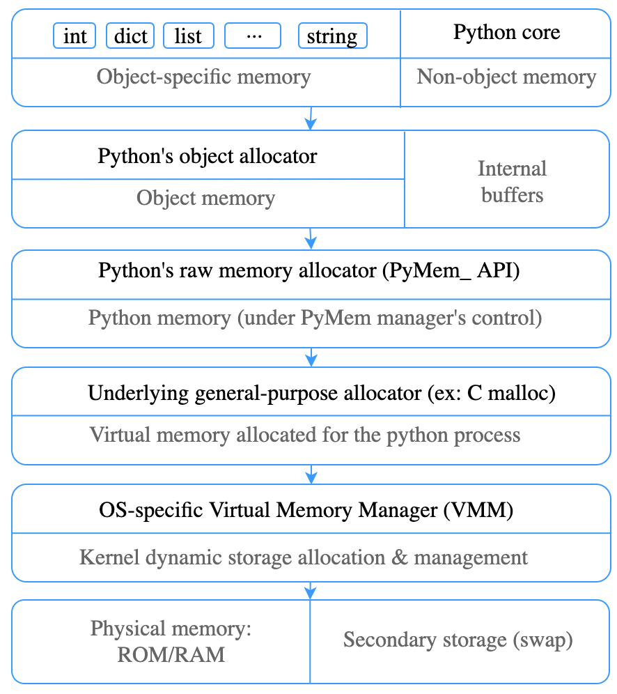

# Memory Management

Created: 2019-08-11 19:00:33 +0500

Modified: 2020-10-22 21:51:36 +0500

---

Everything in Python is an object. Some objects can hold other objects, such as lists, tuples, dicts, classes, etc. Because of dynamic Python's nature, such approach requires a lot of small memory allocations. To speed-up memory operations and reduce fragmentation Python uses a special manager on top of the general-purpose allocator, called PyMalloc.

We can depict the whole system as a set of hierarchical layers:



## Object allocation

Methods and variables are created in**Stack memory**. A stack frame is created whenever methods and variables are created. These frames are destroyed automatically whenever methods are returned.

Objects and instance variables are created in**Heap memory**. As soon as the variables and functions are returned, dead objects will be garbage collected.

## Small object allocation

To reduce overhead for small objects (less than 512 bytes) Python sub-allocates big blocks of memory. Larger objects are routed to standard C allocator. Small object allocator uses three levels of abstraction ---arena,pool, andblock.

## Block

Block is a chunk of memory of a certain size. Each block can keep only one Python object of a fixed size. The size of the block can vary from 8 to 512 bytes and be a multiple of eight (i.e., 8-byte alignment). For convenience, such blocks are grouped in 64 size classes.

## Pool

A collection of blocks of the same size is called a pool. Normally, the size of the pool is equal to the size of a [memory page](https://en.wikipedia.org/wiki/Page_(computer_memory)), i.e., 4Kb. Limiting pool to the fixed size of blocks helps with fragmentation. If an object gets destroyed, the memory manager can fill this space with a new object of the same size.

Pools of the same sized blocks are linked together using [doubly linked list](https://en.wikipedia.org/wiki/Doubly_linked_list)(thenextpoolandprevpoolfields). Theszidxfield keeps the size class index, whereasref.countkeeps the number of used blocks. Theare na indexstores the number of an arena in which Pool was created.

Therefore, If a block is empty instead of an object, it stores an address of the next empty block. This trick saves a lot of memory and computation.

Each pool has three states:

- used --- partially used, neither empty nor full
- full --- all the pool's blocks are currently allocated
- empty --- all the pool's blocks are currently available for allocation

In order to efficiently manage pools Python uses an additional array calledusedpools. It stores pointers to the pools grouped by class. As we already know, all pools of the same block size are linked together. To iterate over them, we just need to know the start of the list. If there are no pools of such size, then a new pool will be created on the first memory request.

## Arena

The arena is a chunk of 256kB memory allocated on the heap, which provides memory for 64 pools.

All arenas are linked using [doubly linked list](https://en.wikipedia.org/wiki/Doubly_linked_list)(thenextarenaandprevarenafields), it helps to manage them. Thentotalpoolsandnfreepoolsare storing information about currently available pools.

Thefreepoolsfield points to the linked list of available pools.

There is nothing complicated in the implementation of the arena. Think of it as a list of containers, which automatically allocates new memory for pools when needed.

## Memory deallocation

Python's small object manager rarely returns memory back to the Operating System.

An arena gets fully released If and only if all the pools in it are empty. For example, it can happen when you use a lot of temporary objects in a short period of time.

Speaking of long-running Python processes, they may hold a lot of unused memory because of this behavior.

## Code

```python
import sys

sys._debugmallocstats()
```

<https://rushter.com/blog/python-memory-managment>

## Others

<https://adamj.eu/tech/2019/09/19/working-around-memory-leaks-in-your-django-app>
