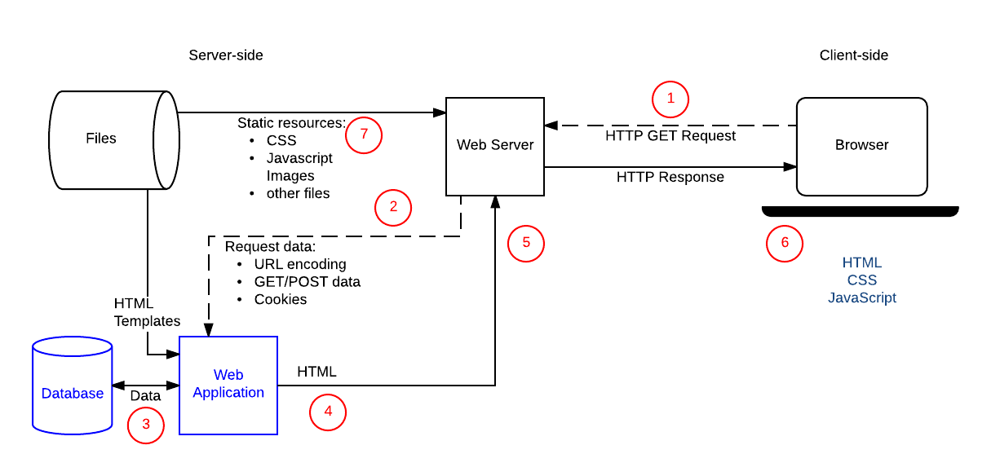

# Overview

Created: 2017-10-26 17:47:09 +0500

Modified: 2022-05-20 20:29:33 +0500

---

<https://www.djangoproject.com/start/overview

Django is a powerful web development framework built on top of Python

Why Django - With Django, you can take Web applications from concept to launch in a matter of hours. Django takes care of much of the hassle of Web development, so you can focus on writing your app without needing to reinvent the wheel. It's free and open source.

**Django Features**

1.  Components
    -   a lightweight and standalone web server for development and testing
    -   a form serialization and validation system that can translate between[HTML](https://en.wikipedia.org/wiki/HTML)forms and values suitable for storage in the database
    -   a template system that utilizes the concept of[inheritance](https://en.wikipedia.org/wiki/Inheritance_(object-oriented_programming))borrowed from object-oriented programming
    -   a[caching](https://en.wikipedia.org/wiki/Web_cache)framework that can use any of several cache methods
    -   support for[middleware](https://en.wikipedia.org/wiki/Middleware)classes that can intervene at various stages of request processing and carry out custom functions
    -   an internal dispatcher system that allows components of an application to communicate events to each other via pre-defined signals
    -   an[internationalization](https://en.wikipedia.org/wiki/Internationalization_and_localization)system, including translations of Django's own components into a variety of languages
    -   a[serialization](https://en.wikipedia.org/wiki/Serialization)system that can produce and read[XML](https://en.wikipedia.org/wiki/XML)and/or[JSON](https://en.wikipedia.org/wiki/JSON)representations of Django model instances
    -   a system for extending the capabilities of the template engine
    -   an interface to Python's built-in[unit test](https://en.wikipedia.org/wiki/Unit_test)framework

2.  Bundled Applications
    -   an extensible authentication system
    -   the dynamic administrative interface
    -   tools for generating[RSS](https://en.wikipedia.org/wiki/RSS_(file_format))and[Atom](https://en.wikipedia.org/wiki/Atom_(standard))syndication feeds
    -   a site's framework that allows one Django installation to run multiple websites, each with their own content and applications
    -   tools for generating[Google Sitemaps](https://en.wikipedia.org/wiki/Google_Sitemaps)
    -   built-in mitigation for[cross-site request forgery](https://en.wikipedia.org/wiki/Cross-site_request_forgery),[cross-site scripting](https://en.wikipedia.org/wiki/Cross-site_scripting),[SQL injection](https://en.wikipedia.org/wiki/SQL_injection),[password cracking](https://en.wikipedia.org/wiki/Password_cracking)and other typical web attacks, most of them turned on by default
    -   a framework for creating[GIS](https://en.wikipedia.org/wiki/Geographic_information_system)applications

Template namespacing

Path - polls/templates/polls/index.html

Render()

Get_object_or_404()

Namespacing URL names

Writing forms

Using F() to avoid race condition

Generic views()

TestCases using TestCase

migrations

**Customizing the admin form**

**from django.contrib import** admin

**from .models import** Question

**class QuestionAdmin**(admin.ModelAdmin):
fieldsets = [
(**None**, {'fields': ['question_text']}),
('Date information', {'fields': ['pub_date']}),
]

admin.site.register(Question, QuestionAdmin)

**ChoiceInline(admin.StackedInline):**

Model = Choice

Extra = 3

StackedInline can be replaced with TabularInline for table view

**Anatomy of a Dynamic Site**

**Starting a new project**

This will properly initialize a new project in the same directory, without creating a recursive file path.

$ django-admin.py startproject samplesite .

**Django User Model**
-   **The username field is case-sensitive:**john.doe and John.Doe are two different usernames
-   **The username field validates against unicode letters:**joao, joão, Джон, or 約翰 are all valid username options
-   **The email field is not unique:**More than one user can have the same email address
-   **A user without password cannot initiate a password reset:**If you accept user creation without defining an initial random password, your user might be unable to reset and get the first password
-   **Swapping the default user model is very difficult after you created the initial migrations:** Replacing the user model has many benefits, but you need to do it at the beginning of the project

**Common Python web project's deployment stack**
-   Nginx: Static file serving, SSL termination, reverse proxy
-   Memcached: Caching
-   Celery: Background task runner
-   Redis or RabbitMQ: Queue for Celery
-   uWSGI: Python WSGI server

<https://simpleisbetterthancomplex.com/article/2021/07/08/what-you-should-know-about-the-django-user-model.html>

<https://simpleisbetterthancomplex.com/tutorial/2021/06/27/how-to-start-a-production-ready-django-project.html>

<https://www.youtube.com/watch?v=Z5WQMSdcYv8>

<https://www.freecodecamp.org/news/django-for-everybody-learn-the-popular-python-framework-from-dr-chuck

[Django (3.0) Crash Course Tutorials | Customer Management App](https://www.youtube.com/playlist?list=PL-51WBLyFTg2vW-_6XBoUpE7vpmoR3ztO)
-   CRUD with model forms
-   Inline formsets

<https://www.freecodecamp.org/news/create-a-social-media-app-with-django>

