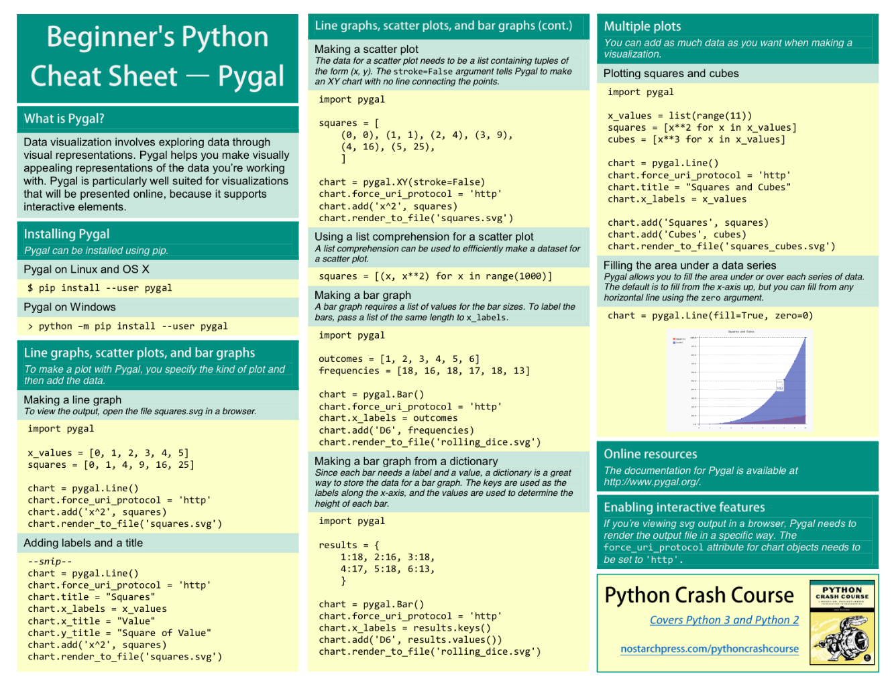
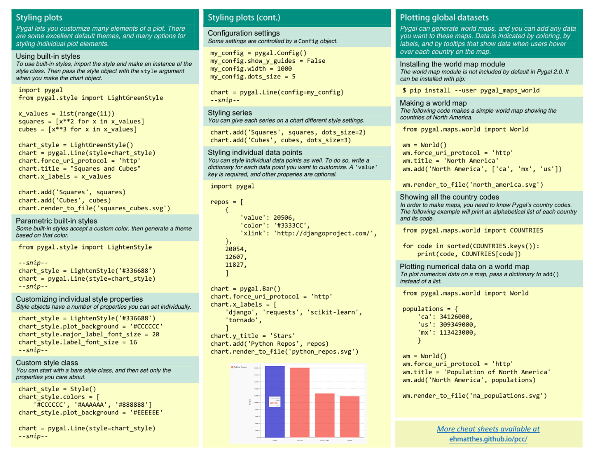

# Libraries

Created: 2018-02-19 00:20:46 +0500

Modified: 2022-02-10 22:28:02 +0500

---

nose packages

**Pypy**

PyPy is a[fast](http://speed.pypy.org/),[compliant](https://pypy.org/compat.html)alternative implementation of the[Python](http://python.org/)language (2.7.13 and 3.5.3). It has several advantages and distinct features:
-   **Speed:**thanks to its Just-in-Time compiler, Python programs often run[faster](http://speed.pypy.org/)on PyPy.[(What is a JIT compiler?)](http://en.wikipedia.org/wiki/Just-in-time_compilation)
    "If you want your code to run faster, you should probably just use PyPy." --- Guido van Rossum (creator of Python)
-   **Memory usage:**memory-hungry Python programs (several hundreds of MBs or more) might end up taking[less space](http://morepypy.blogspot.com/2009/10/gc-improvements.html)than they do in CPython.
-   **Compatibility:**PyPy is[highly compatible](https://pypy.org/compat.html)with existing python code. It supports[cffi](https://cffi.readthedocs.org/)and can run popular python libraries like[twisted](https://twistedmatrix.com/)and[django](https://www.djangoproject.com/).
-   **Stackless:**PyPy comes by default with support for[stackless mode](https://pypy.org/features.html#stackless), providing micro-threads for massive concurrency.

**Django-model-utils**
-   Django model mixins and utilities.
-   Fields
    -   StatusField
    -   MonitorField
    -   SplitField
-   Models
    -   TimeFramedModel
    -   TimeStampedModel
    -   StatusModel
    -   SoftDeletableModel
-   Model Managers
    -   InheritanceManager

This manager should be attached to a base model class in a model-inheritance tree. It allows queries on that base model to return heterogenous results of the actual proper subtypes, without any additional queries.
-   QueryManager
-   SoftDeletableManager
-   Mixins

-   Miscellaneous Utilities
    -   Choices
    -   Field Tracker
-   <https://django-model-utils.readthedocs.io/en/latest/managers.html>

**PyFlame**

<https://medium.com/build-smarter/blazing-fast-python-40a2b25b0495>

<https://github.com/uber-archive/pyflame>

Profiler - <https://www.youtube.com/watch?v=m_a0fN48Alw>

**py-spy**

py-spy is a sampling profiler for Python programs. It lets you visualize what your Python program is spending time on without restarting the program or modifying the code in any way. py-spy is extremely low overhead: it is written in Rust for speed and doesn't run in the same process as the profiled Python program. This means py-spy is safe to use against production Python code.

<https://github.com/benfred/py-spy>

**FII Memory profiler**

<https://gitlab.com/pythonspeed/filprofiler>

<https://pythonspeed.com/articles/memory-profiler-data-scientists

**HorusLP**

HorusLP is a Python optimization library designed to help you architect algorithm development workflows. It has a simple, declarative API and very little boilerplate.

<https://www.toptal.com/algorithms/horuslp-python-optimization-library>

<https://www.toptal.com/python/horuslp-gurobi-optimization>

**tqdm**

A Fast, Extensible Progress Bar for Python and CLI

<https://github.com/tqdm/tqdm>

**Pendulum**

Nativedatetimeinstances are enough for basic cases but when you face more complex use-cases they often show limitations and are not so intuitive to work with.Pendulumprovides a cleaner and more easy to use API while still relying on the standard library. So it's stilldatetimebut better.

<https://github.com/sdispater/pendulum>

<https://pendulum.eustace.io

**pyqt**

PyQt is one of the most popular Python bindings for the Qt cross-platform C++ framework

<https://wiki.python.org/moin/PyQt>

<https://www.tutorialspoint.com/pyqt/index.htm>

**Pyro**

Pyro is a library that enables you to build applications in which objects can talk to each other over the network, with minimal programming effort. You can just use normal Python method calls, with almost every possible parameter and return value type, and Pyro takes care of locating the right object on the right computer to execute the method. It is designed to be very easy to use, and to generally stay out of your way. But it also provides a set of powerful features that enables you to build distributed applications rapidly and effortlessly. Pyro is a pure Python library and runs on many different platforms and Python versions.

<https://github.com/irmen/Pyro4>

**CookieCutter**

A command-line utility that creates projects fromcookiecutters(project templates), e.g. creating a Python package project from a Python package project template.

<https://cookiecutter.readthedocs.io/en/1.7.2/first_steps.html>

<https://github.com/cookiecutter/cookiecutter>

**Python-magic**

python-magic is a Python interface to the libmagic file type identification library. libmagic identifies file types by checking their headers according to a predefined list of file types. This functionality is exposed to the command line by the Unix commandfile.

<https://pypi.org/project/python-magic

**GUI**

Tkinter ► GUI

<https://docs.python.org/3/library/tki>...

wxPython ► GUI toolkit

<https://wxpython.org

PyQt ► GUI toolkit

<https://pypi.org/project/PyQt5

**Web**

Requests ► HTTP library/Web

<https://requests.readthedocs.io/en/ma>...

Scrapy ► webscraping

<https://scrapy.org

BeautifulSoup ► parsing/webscraping <https://www.crummy.com/software/Beaut>...

Zappa ► server-less application on API Gateway and Amazon Web Services Lambda

<https://github.com/Miserlou/Zappa>

**Other**

Poetry ► manage python packaging and dependencies

<https://python-poetry.org

Pywin32 ► Interact with Windows

<https://github.com/mhammond/pywin32>

Kivy ► Mobile Apps

<https://kivy.org/#home>

Loguru ► python logging

<https://github.com/Delgan/loguru>

Babel - the Python Internationalization Library - <https://github.com/python-babel/babel>

<https://tryolabs.com/blog/2019/12/10/top-10-python-libraries-of-2019

<https://dev.to/squash/16-amazing-python-libraries-you-should-be-using-now-2020-updated-2aja>

**schedule**

Python job scheduling for humans.

An in-process scheduler for periodic jobs that uses the builder pattern for configuration. Schedule lets you run Python functions (or any other callable) periodically at pre-determined intervals using a simple, human-friendly syntax.

<https://github.com/dbader/schedule>

<https://schedule.readthedocs.io/en/stable

**pyglet**

3d animation and game creation engine

<http://pyglet.org

**pygame**

<https://www.pygame.org

![Beginner's Python Cheat Sheet - Pygame What is pygame? right Pygame is a for making games Python, Making games is fun. and it's a great way to expand ywr Skills and pygame takes care of many of the tasks games. which lets you foCug the aspects of your game that make it interesting Installing Pygame P an systems. but Sligtlt/y P WY" n a. and a Of M don V *Our sysfwn. Pygame on Lin rect(screen, S wdo apt-get install ne libsd12-dev libsdl S pip - hvhttø; /bitbucket on OS X rms to 3. S install he sdl_ttf S pip • hg+httg: y' /bitbucket. pygame on fie. fie. -m pip install - , midbotton Testing your installation Pyrw M my imp&t gygane center Starting a game Lip an Wp a An empty game window as ps def ) ze up pg. init() pg.displ y. Stu•t Ale True: event in gg.qUIT: Refresh sc pg. display-flip() Setting a calstom window size = (1200, 8øø) scæ --- Pygame rect objects (cont.} Useful attributes hme a Individual and y søø)) . top , centerl width, Tuples center Creating a rect object øg.Rect(1bØ, color = lag, løø) Working with images . cent height lee, 3, IS) bullet_reet) Setting a Custom Color are de a o' CL255 bgßlor - 23B, 230) (bg_color) Pygame rect objects Many e be Rimpvß Shave. Simplifies ronceaO'y game Pygame has a that easy Getting ræt object the center Of Screen a game images are it's wtmap (bmp) Vnage files, witn mg, und Loading an image ship = pg. luge _ load( •Lnages/shig&p•) Gettitg the rect frcm an image Positioning ima* the Python Crash Course Covers python 3 Md python 2 n asta hp res s com/pythoocra rse ](media/Libraries-image1.png)

![Working with images (cont.) Drawing an image to the screen me In-we * ship to screen ship_rect) The blitme() method is the def ship at rrent self_rect) Responding to keyboard input as key presses and You top. to km/ presses aliens, ---t can lif v t key pg.K-LEFT; ship. Responding to mouse events S registers mouse to the mm-ase button for in n eve t.get(); ship, the position useMS --- Clicking a button the a if start ) Hiding the mouse pygame groups has a Group makes a gmup a' A gmup Ike 8 fist, with extra funchCnaMy that S and filling a group sprite import Sprite, def def def bullets - Bullet() bullets Lcnping through the items in a group a grasp u e s. prLtg(): r bullet in b 11 t s bullet Caning a nup bullets. update ( ) Pygame groups (cont.) Renu:rhng an item from a g.rmp Detecting collisions YO u Can a COåidCS With any a single and a Ehe if pg. sprite, spritecollideany(ship, aliens); ships_left 1 Collisions two collisions - pg. ide( ons) • for in n . eve t.get(); - pg.KEYDhN: if event. k ey Pn key pg.K_SPACE; elif eve t. t key pg.K-q; to released keys key, KEYup is if event. type pg_KEYUP: if y e pg.K_RtGfT; = False Pygame documentation The 'or 'he at home page 'or The TOSC o,' the are Dams about o' Pygame. soc*' as Class the rages, score Rendering text can we e of a Can Share players. and digp'a»• a Displaying a message a "ze 48 of gel We " play again?" "S _col or ( reg, lag, lee) - (Be, 230, 23B) f 48) ug_image = f. rend ( s = ug_ina center screen. center Mure cheat sheets available at ](media/Libraries-image2.png)

<https://humberto.io/blog/exploring-pygame-5-movement-and-collision

**pygal**

**jinja2**

Jinja2 is a full-featured template engine for Python. It has full unicode support, an optional integrated sandboxed execution environment, widely used and BSD licensed.

<https://palletsprojects.com/p/jinja

