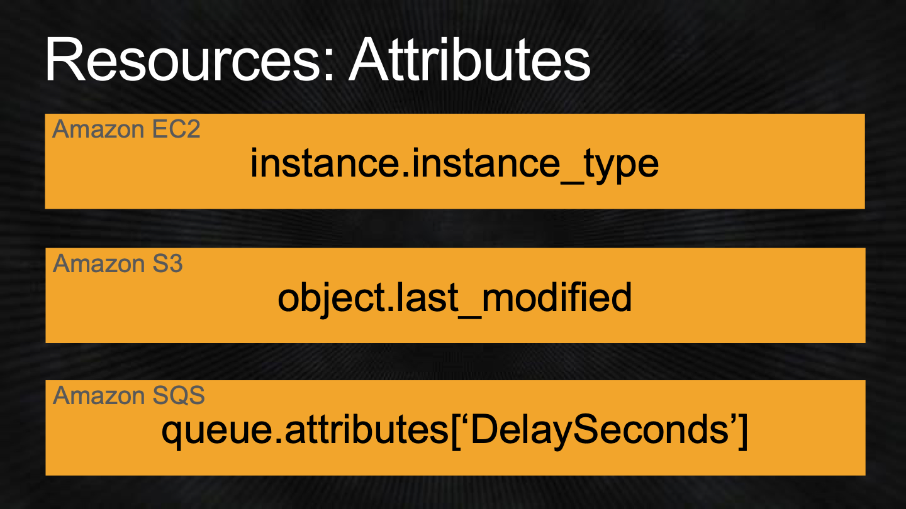
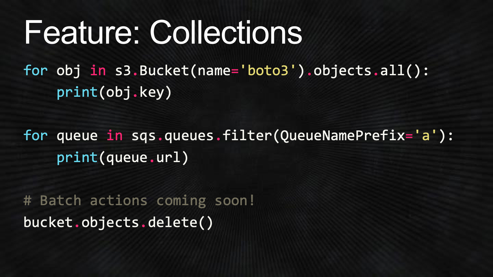

# Slides

Created: 2020-03-16 12:17:40 +0500

Modified: 2022-11-09 15:40:28 +0500

---

## Boto3
-   AWS SDK for Python developers
    -   Software development kit
    -   Interact with AWS easily through Python
-   Supports Python 2 & 3
-   Data-driven from the group up
-   Up-to-date service API support
-   Consistent interface
-   Modern object-oriented API

Feature: Resources
-   Generated from JSON resource description
-   Object-oriented API for AWS
-   Identifiers & attributes
-   Actions
-   References
-   Sub-resources
-   Collections

## Project Example

## Add a Little Glue
-   Directory watcher
-   Main function
    -   Upload / start job / wait / download / delete
-   Amazon S3 cleanup functionality
-   Amazon SQS cleanup
