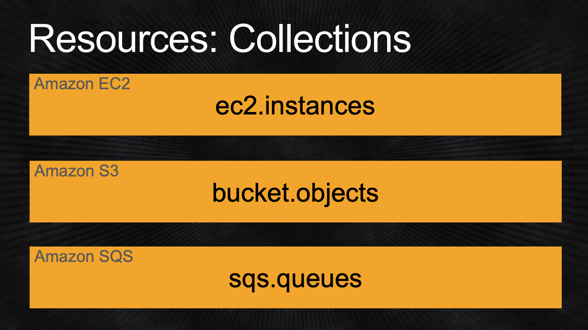
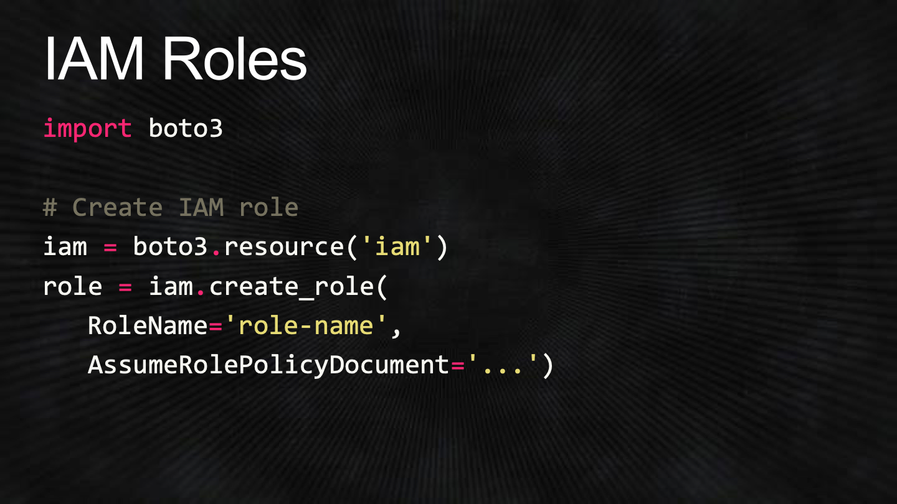

# Slides

Created: 2020-03-16 12:17:40 +0500

Modified: 2022-11-09 15:40:28 +0500

---

**Boto3**
-   AWS SDK for Python developers
    -   Software development kit
    -   Interact with AWS easily through Python
-   Supports Python 2 & 3
-   Data-driven from the group up
-   Up-to-date service API support
-   Consistent interface
-   Modern object-oriented API

{width="6.302083333333333in" height="3.5416666666666665in"}

{width="6.302083333333333in" height="3.5416666666666665in"}

{width="6.302083333333333in" height="3.5416666666666665in"}

![Feature: Clients import bot03 bot03 client( 'sqs') sqs sqs . list _ queues (QueueNamePrefix- ' test ' ) response print (response[ 'QueueUr1s ' ] ](media/boto-&-boto3_Slides-image4.png){width="6.302083333333333in" height="3.5416666666666665in"}

{width="6.302083333333333in" height="3.5416666666666665in"}

{width="6.302083333333333in" height="3.5416666666666665in"}

![Feature: Client Pagination bot03. client( ' s3') # Get a paginator and iterate through each page s3 . get_paginator( ' list _ objects ' ) paginator paginator. paginate(Bucket= ' my-bucket ' ) : for page in page[ 'Contents ' ] : for obj in ' Key' l) ](media/boto-&-boto3_Slides-image7.png){width="6.302083333333333in" height="3.5416666666666665in"}

{width="6.302083333333333in" height="3.5416666666666665in"}

![Feature: Client Waiters bot03 client( 'ec2') ec2 # Get a waiter and wait for instance to be ready ec2 get_waiter( ' instance_running' ) waiter waiter. wait ' i-abc123 ' ] ) print('lnstance is ready! ') ](media/boto-&-boto3_Slides-image9.png){width="6.302083333333333in" height="3.5416666666666665in"}

Feature: Resources
-   Generated from JSON resource description
-   Object-oriented API for AWS
-   Identifiers & attributes
-   Actions
-   References
-   Sub-resources
-   Collections

{width="6.302083333333333in" height="3.5416666666666665in"}

{width="6.302083333333333in" height="3.5416666666666665in"}

![Resources: Attributes Amazon EC2 instance.instance_type Amazon S3 object.last_modified Amazon SQS queue.attributes['DelaySeconds'] ](media/boto-&-boto3_Slides-image12.png){width="6.302083333333333in" height="3.5416666666666665in"}

{width="6.302083333333333in" height="3.5416666666666665in"}

{width="6.302083333333333in" height="3.5416666666666665in"}

{width="6.302083333333333in" height="3.5416666666666665in"}

{width="6.302083333333333in" height="3.5416666666666665in"}

{width="6.302083333333333in" height="3.5416666666666665in"}

{width="6.302083333333333in" height="3.5416666666666665in"}

**Project Example**

{width="6.302083333333333in" height="3.5416666666666665in"}

{width="6.302083333333333in" height="3.5416666666666665in"}

{width="6.302083333333333in" height="3.5416666666666665in"}

{width="6.302083333333333in" height="3.5416666666666665in"}

{width="6.302083333333333in" height="3.5416666666666665in"}

{width="6.302083333333333in" height="3.5416666666666665in"}

{width="6.302083333333333in" height="3.5416666666666665in"}

{width="6.302083333333333in" height="3.5416666666666665in"}

{width="6.302083333333333in" height="3.5416666666666665in"}

{width="6.302083333333333in" height="3.5416666666666665in"}

![Amazon S3 Downloading import bot03 # Download a file s3 Bucket( 'Bot03') bucket bucket Object( ' output. mp4' ) obj data = obj get()['Body'] read() ](media/boto-&-boto3_Slides-image29.png){width="6.302083333333333in" height="3.5416666666666665in"}

{width="6.302083333333333in" height="3.5416666666666665in"}

{width="6.302083333333333in" height="3.5416666666666665in"}

{width="6.302083333333333in" height="3.5416666666666665in"}

![Amazon SNS Topic & Amazon SQS Queue # Subscribe an SQS queue to the topic topic subscribe( Protocol= ' sqs' , Endpoint-queue attributes[ 'QueueArn' ] ) ](media/boto-&-boto3_Slides-image33.png){width="6.302083333333333in" height="3.5416666666666665in"}

{width="6.302083333333333in" height="3.5416666666666665in"}

{width="6.302083333333333in" height="3.5416666666666665in"}

{width="6.302083333333333in" height="3.5416666666666665in"}

{width="6.302083333333333in" height="3.5416666666666665in"}

{width="6.302083333333333in" height="3.5416666666666665in"}

![Transcoding Pipeline & Jobs # Create a new transcoding job transcoder. create_job ( job Pipelineld-response[ 'Pipeline' ] [ 'Id ' ] , Input-{ 'Key': 'input .mov' , Outputs={ ](media/boto-&-boto3_Slides-image39.png){width="6.302083333333333in" height="3.5416666666666665in"}

**Add a Little Glue**
-   Directory watcher
-   Main function
    -   Upload / start job / wait / download / delete
-   Amazon S3 cleanup functionality
-   Amazon SQS cleanup

