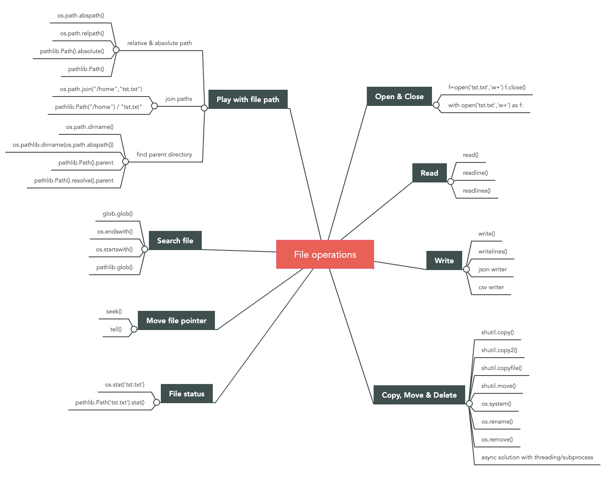
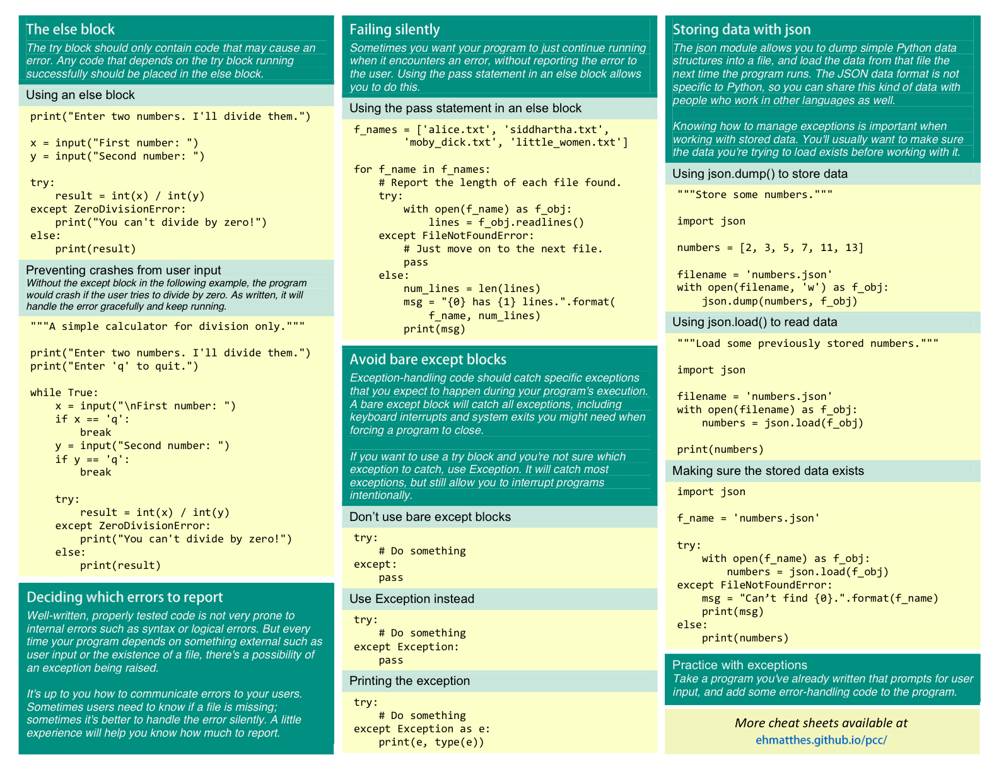

# File IO

Created: 2018-02-14 11:05:12 +0500

Modified: 2020-08-24 00:14:44 +0500

---

<https://towardsdatascience.com/knowing-these-you-can-cover-99-of-file-operations-in-python-84725d82c2df>

**Modes**

r - readonly (Default)

w - write mode

a - append mode

**Read input from a file**

fo = open('test.txt', 'r')

print(fo.readline())

**Reading a file and storing its lines**

filename = 'test.txt'

with open(filename) as file_object:

lines = file_object.readlines()

for line in lines:

print(line)

**Writing to a file**

with open('test.txt', 'w') as file_object:

file_object.write('I love programming.')

**Appending to a file**

with open('test.txt', 'a') as file_object:

file_object.write('nI love making games.')

**Open a csv file and convert it into list**

weather_data = []

f = open("la_weather.csv", "r")

data = f.read()

rows = data.split("n")

for row in rows:

weather_data.append(row.split(','))

![Beginner's Python Cheat Sheet --- Files and Exceptions What are files? What are exceptions? Your in from files, a they can write data to files, Reading from files allows you to work with a wide variety Of to files allows users to pick up where they left Ott the next the run your program You Can write text to files. and you can store Python structures such as lists in data Excæptions are special objects that help your programs respond to errors in appropriate ways. For if your to a fie that doesn't exist. can use exceptions display an infomative mess-a* instead Of havlng the program crash. Reading from a file To 8 ---is hie 'hen o,' me You Can O' read with makes has Reading an entire fle at once with as f_obj; = f_ob3. print Reading line by line rsrrVO GO • Siddhar&.txt' with f_ab3: line Reading from a file (cont) Storing the bnes in a list • txt' as lines _ for line in Writing to a file •v' open" 'ONS you Mite Be. Ee this the of 'he the *'argument Writing to an empty file = •progrmlng.txt• progrmins") Writing multi* to an empty = •progrmlng.txt• Appending to a file = •progrming.txt' •a • ) as also love with data. apps a rile paths it hie You c*"' a using a pan an path Opening a file from a subfolder f_path •text_files/alice.txt• with as f_obj; for in File paths (cont.} Opening a file using an absolute path s f_ob3: O*Nng a file on pans. with a The try-except block think Mite a t.'XCepf 'O exception be try fry exæpf in a Handling the ZeroDivisionError exception print (5,'0) print ( e 'u' can •t divide by zero") the F*NotFoundError exception • Siddhartha.txt• with a FileNotFoundError an-t file print ( "g) Knmving which exception to handle Can be hard 'O 'O Try e "y Python Crash Course Covers python 3 Md python 2 n asta hp res ](media/File-IO-image2.png)

