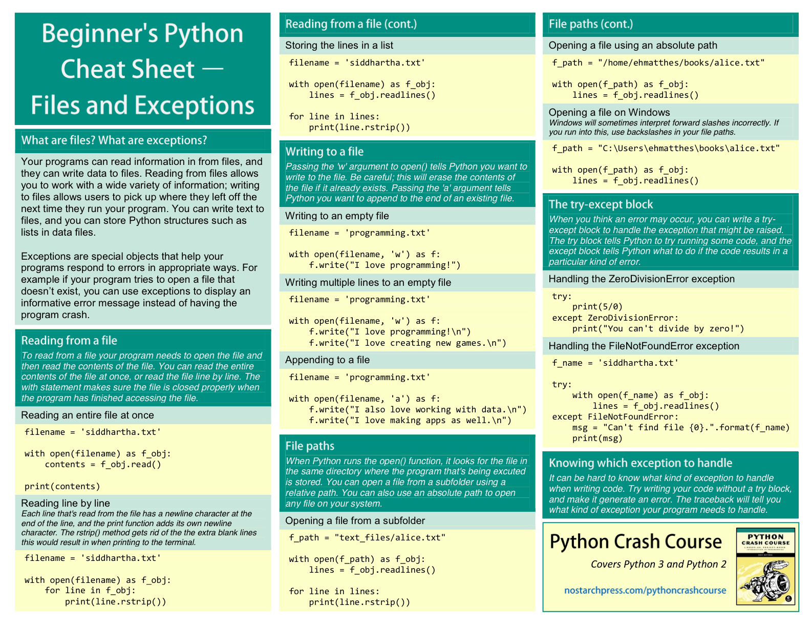

# File IO

Created: 2018-02-14 11:05:12 +0500

Modified: 2020-08-24 00:14:44 +0500

---

<https://towardsdatascience.com/knowing-these-you-can-cover-99-of-file-operations-in-python-84725d82c2df>

## Modes

r - readonly (Default)

w - write mode

a - append mode

## Read input from a file

fo = open('test.txt', 'r')

print(fo.readline())

## Reading a file and storing its lines

filename = 'test.txt'

with open(filename) as file_object:

lines = file_object.readlines()

for line in lines:

print(line)

## Writing to a file

with open('test.txt', 'w') as file_object:

file_object.write('I love programming.')

## Appending to a file

with open('test.txt', 'a') as file_object:

file_object.write('nI love making games.')

## Open a csv file and convert it into list

weather_data = []

f = open("la_weather.csv", "r")

data = f.read()

rows = data.split("n")

for row in rows:

weather_data.append(row.split(','))

