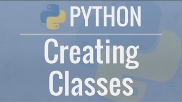

# OOPS

Created: 2018-02-23 14:48:58 +0500

Modified: 2022-05-05 22:23:09 +0500

---

In Python, everything is an object, and can be handled as such. This is what is meant when we say, for example, that functions are first-class objects. Functions, classes, strings, and even types are objects in Python: like any object, they have a type, they can be passed as function arguments, and they may have methods and properties. In this understanding, Python is an object-oriented language.

## The four major principles of object orientation are:

1.  **Encapsulation**

2.  **Data Abstraction**

3.  **Polymorphism**

4.  **Inheritance**

## Analogies - House and Houses, recipe and cake

## Concepts
-   Instance methods need a class instance and can access the instance through self .
-   Class methods don't need a class instance. They can't access the instance ( self ) but they have access to the class itself via cls .
-   Static methods don't have access to cls or self . They work like regular functions but belong to the class's namespace.
-   Static and class methods communicate and (to a certain degree) enforce developer intent about class design. This can have maintenance benefits.

## Create a static method

If self is not used in a method, than that method can be made static using the decorator @staticmethod

Ex -

@staticmethod

## def site(obj):

## return obj.device.owner

## Python 3 Classes

class MyClass:

def method(self):

return 'instance method called', self

@classmethod

def classmethod(cls):

return 'class method called', cls

@staticmethod

def staticmethod():

return 'static method called'

## Three types of methods

1.  Instance Method

Normal methods that are associated with each class instance and an object is needed to access this methods (denoted by self)

Through the self parameter, instance methods can freely access attributes and other methods on the same object.

This gives them a lot of power when it comes to modifying an object's state.

Not only can they modify object state, instance methods can also access the class itself through the self.__class__ attribute. This means instance methods can also modify class state.

2.  Class Method

@classmethod decorator used to create a classmethod

This takes cls as a parameter

3.  Static Method

@staticmethod decorator used to create a staticmethod

This takes neither a self nor a cls parameter

Therefore a static method can neither modify object state nor class state. Static methods are restricted in what data they can access - and they're primarily a way to namespace your methods.

>>> obj = MyClass()

>>> obj.staticmethod()

>>> MyClass.staticmethod()

In Python its possible to call staticmethod() on object

## Using Factory Method to create different types of classes using constructor

We can use class methods as factory functions for different types of classes

Ex:

class Pizza:
def __init__(self, ingredients):

self.ingredients = ingredients

def __repr__(self):

return f'Pizza({self.ingredients!r})'

@classmethod

def margherita(cls):
return cls(['mozzarella', 'tomatoes'])

@classmethod

def prosciutto(cls):
return cls(['mozzarella', 'tomatoes', 'ham'])

Note how I'm using the cls argument in the margherita and prosciutto factory methods instead of calling the Pizza constructor directly.

OOPS Concepts
-   Always define your data attributes in __init__.
-   Class attributes are shared across all instances

## class Platypus(Mammal):

latin_name = "deep"

lst = ['sood']

Global List is shared and act as a static variable
-   super is used to call a method from a superclass
-   Python relies on convention and documentation instead of enforcement

No enforced private attributes, use a single underscore to signal that an attribute is not intended for public use (encapsulation)

-   Special / magic methods start and end with two underscores ("dunder") and customize standard Python behavior (e.g. operator overloading)
-   **Properties** allow you to add behavior to data attributes

## class My2Vector(object):

## def __init__(self, x, y):

self._x = x
self._y = y

## def get_x(self):

## print "returning x, which is {}".format(self._x)

## return self._x

## def set_x(self, x):

## print "setting x to {}".format(x)

self._x = x

x = property(get_x, set_x)

v1 = My2Vector(1, 2)

x = v1.x *# uses the getter, which prints the value*

v1.x = 4 *# uses the setter, printing the value*

-   Multiple inheritance (deriving from multiple classes)
-   Class decorators
-   Abstract Base Classes
-   Metaclasses

<https://www.datacamp.com/community/tutorials/python-metaclasses>

[Python OOP Tutorials - Working with Classes](https://www.youtube.com/playlist?list=PL-osiE80TeTsqhIuOqKhwlXsIBIdSeYtc)

