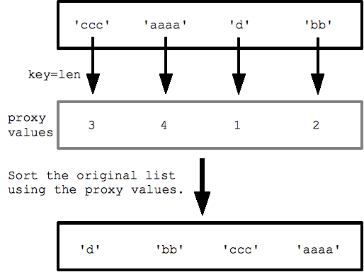

# Sorting

Created: 2018-03-12 00:19:53 +0500

Modified: 2020-01-21 00:14:04 +0500

---

Sort items in a list in alphabetical order, or reverse alphabetical order.

lowercase and uppercase letters may affect the sort order.

1.  sort() method

Changes the order of a list permanently

lst.sort()

lst.sort(reverse=True)

2.  sorted() function

Returns a copy of the list, leaving the original list unchanged.

print(sorted(lst))

print(sorted(lst, reverse=True))

**Guarenteed to be stable**

3.  Reversing the order of a list

lst.reverse()

4.  2-D list sort with given column

students.sort(key=lambda x:x[1])

5.  Sorting a dictionary with value in descending order and if equal sort by key in ascending order

>>> dic = {'z': 5, 'b': 2, 'a': 2}

>>> {k:v for k, v in sorted(dic.items(), key=lambda item: (-item[1], item[0]))}

{'z': 5, 'a': 2, 'b': 2}

6.  Custom sorting with key=

For more complex custom sorting, sorted() takes an optional "key=" specifying a "key" function that transforms each element before comparison. The key function takes in 1 value and returns 1 value, and the returned "proxy" value is used for the comparisons within the sort.

For example with a list of strings, specifying key=len (the built in len() function) sorts the strings by length, from shortest to longest. The sort calls len() for each string to get the list of proxy length values, and then sorts with those proxy values.

strs = ['ccc', 'aaaa', 'd', 'bb']

print sorted(strs, key=len) ## ['d', 'bb', 'ccc', 'aaaa']

{width="4.15625in" height="3.1145833333333335in"}

As another example, specifying "str.lower" as the key function is a way to force the sorting to treat uppercase and lowercase the same:

## "key" argument specifying str.lower function to use for sorting

print sorted(strs, key=str.lower) ## ['aa', 'BB', 'CC', 'zz']

**You can also pass in your own MyFn as the key function, like this:**

## Say we have a list of strings we want to sort by the last letter of the string.

strs = ['xc', 'zb', 'yd' ,'wa']

## Write a little function that takes a string, and returns its last letter.

## This will be the key function (takes in 1 value, returns 1 value).

def MyFn(s):

return s[-1]

## Now pass key=MyFn to sorted() to sort by the last letter:

print sorted(strs, key=MyFn) ## ['wa', 'zb', 'xc', 'yd']

