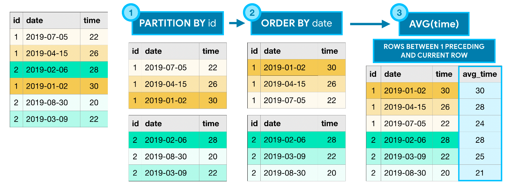

# Aggregation / Analytical Queries / SQL Analytics

Created: 2021-04-29 11:05:40 +0500

Modified: 2022-08-16 15:42:02 +0500

---

## Aggregate functions perform calculations based on sets of rows

Unlike aggregate functions, **analytic functions** return a (potentially different) value for each row in the original table.

All analytic functions have an**OVER**clause, which defines the sets of rows used in each calculation.

TheOVERclause has three (optional) parts:

- The**PARTITION BY**clause divides the rows of the table into different groups
- The**ORDER BY**clause defines an ordering within each partition.
- The final clause (ROWS BETWEEN 1 PRECEDING AND CURRENT ROW) is known as a**window frame**clause. It identifies the set of rows used in each calculation. We can refer to this group of rows as a**window**. (Actually, analytic functions are sometimes referred to as**analytic window functions**or simply**window functions**!)

There are many ways to write window frame clauses:

- ROWS BETWEEN 1 PRECEDING AND CURRENT ROW- the previous row and the current row.
- ROWS BETWEEN 3 PRECEDING AND 1 FOLLOWING- the 3 previous rows, the current row, and the following row.
- ROWS BETWEEN UNBOUNDED PRECEDING AND UNBOUNDED FOLLOWING- all rows in the partition.

## Functions

AVG

SELECT AVG(column_name)
FROM table_name;

AVG()is an aggregate function that returns the average value for a numeric column.

COUNT

SELECT COUNT(column_name)
FROM table_name;

COUNT()is a function that takes the name of a column as an argument and counts the number of rows where the column is notNULL.

To count all rows - SELCT COUNT(*) FROM table_name;

DIFFERENCE

SELECT MAX(POPULATION) - MIN(POPULATION)

FROM CITY;

MAX

SELECT MAX(column_name)
FROM table_name;

MAX()is a function that takes the name of a column as an argument and returns the largest value in that column.

MIN

SELECT MIN(column_name)
FROM table_name;

MIN()is a function that takes the name of a column as an argument and returns the smallest value in that column.

ROUND

SELECT ROUND(column_name, integer)
FROM table_name;

ROUND()is a function that takes a column name and an integer as an argument. It rounds the values in the column to the number of decimal places specified by the integer.

SUM

SELECT SUM(column_name)
FROM table_name;

SUM()is a function that takes the name of a column as an argument and returns the sum of all the values in that column.

GROUP BY

SELECT COUNT(*)
FROM table_name
GROUP BY column_name;

SELECT ROUND(imdb_rating), COUNT(name) FROM movies GROUP BY 1 ORDER BY 1;

Here, the1refers to the first column in our SELECT statement, ROUND(imdb_rating)

GROUP BYis a clause in SQL that is only used with aggregate functions. It is used in collaboration with theSELECTstatement to arrange identical data into groups.

TheGROUP BYstatement comes after anyWHEREstatements, but beforeORDER BYorLIMIT

## Examples

SELECT

CONCAT(HOUR(create_date),

':00-',

HOUR(create_date) + 1,

':00') AS Hours,

COUNT(*) AS `usage`

FROM

communication_log

WHERE

channel = 'sms'

AND create_date BETWEEN '2021-08-25 00:00:00' AND NOW()

GROUP BY HOUR(create_date);

SELECT create_date, count(*)

FROM communication_log

WHERE

channel = 'sms'

AND create_date BETWEEN '2021-08-25 00:00:00' AND NOW()

GROUP BY hour( create_date ) , day( create_date );

SELECT YEAR(create_date),

MONTH(create_date),

count(id)

FROM st_customer_detail

GROUP BY YEAR(create_date),

MONTH(create_date)

ORDER BY YEAR(create_date) DESC, MONTH(create_date) DESC;

SELECT

template_id, COUNT(*) AS template_count

FROM

(SELECT

customer_id, template_id, COUNT(*) AS count

FROM

communication_log

WHERE

channel = 'sms' AND is_success = 1

AND create_date BETWEEN NOW() - INTERVAL 16 HOUR AND NOW()

GROUP BY customer_id , template_id) inner_query

WHERE

count > 2

GROUP BY template_id

ORDER BY template_count DESC;

## # Department wise bifurcation

select a.channel, a.department, a.name, count(*) from (
SELECT ct.department, ct.channel, ct.name
FROM communication_log cl
LEFT JOIN communication_templates ct ON cl.template_id = ct.name
WHERE cl.id BETWEEN 422020686 AND 435852382
AND is_success = '1'
GROUP BY cl.id
) a group by a.channel, a.department, a.name;
