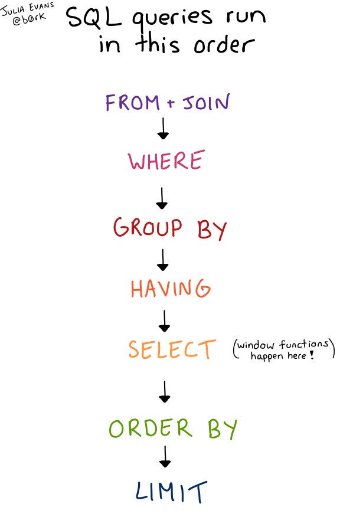

# Intro

Created: 2018-03-13 11:09:49 +0500

Modified: 2021-11-29 20:06:48 +0500

---

SQL, 'Structured Query Language', is a programming language designed to manage data stored in relational databases. SQL operates through simple, declarative statements. This keeps data accurate and secure, and helps maintain the integrity of databases, regardless of size.

The SQL language is widely used today across web frameworks and database applications. Knowing SQL gives you the freedom to explore your data, and the power to make better decisions. By learning SQL, you will also learn concepts that apply to nearly every data storage system.

## SQL is a declarative language, you tell the system what do you want, and system figures it out how to give it to you.

SQL is a special-purpose programming language designed for managing information in a relational database management system (RDBMS). The word relational here is key; it specifies that the database management system is organized in such a way that there are clear relations defined between different sets of data.

Typically, you need to extract, transform, and load data into your RDBMS before you're able to manage it using SQL,

<http://www.helenanderson.co.nz/sql-concepts-from-a-to-z

SQL Queries Order - **FWGHSOL**

<https://jvns.ca/blog/2019/10/03/sql-queries-don-t-start-with-select

## How to describe tables

## City

| **Field**   | **Type**     |
|-------------|--------------|
| ID          | NUMBER       |
| NAME        | VARCHAR2(17) |
| COUNTRYCODE | VARCHAR2(3)  |
| DISTRICT    | VARCHAR2(20) |
| POPULATION  | NUMBER       |

## Insights
-   **ORDER BY can be done on only those columns that are in SELECT**

## Critique of SQL

SQL's shortcomings can be grouped into these categories:
-   lack of proper orthogonality --- SQL is hard to compose;
-   lack of compactness --- SQL is a large language;
-   lack of consistency --- SQL is inconsistent in syntax and semantics;
-   poor system cohesion --- SQL does not integrate well enough with application languages and protocols.

## SQL Naming Conventions

<https://launchbylunch.com/posts/2014/Feb/16/sql-naming-conventions

## Order

SELECT... FROM... WHERE... GROUP BY... HAVING... ORDER BY... LIMIT...

## Is this a valid query?

SELECT city, COUNT(*) FROM census WHERE COUNT(*) > 5

GROUP BY city ORDER BY COUNT(*) DESC

## no, GROUP BY happens after WHERE, so you can't use aggregations in a WHERE

Use HAVING COUNT(*) > 5 instead

## References

## Course

<https://www.codecademy.com/courses/learn-sql/lessons/manipulation/exercises/sql>

## What is RDBMS

<https://www.codecademy.com/articles/what-is-rdbms-sql>

## SQL Commands

<https://www.codecademy.com/articles/sql-commands?r=master>

## Games

<https://mystery.knightlab.com

<https://selectstarsql.com

<https://littlekendra.com/course-category/sqlchallenges

<https://github.com/WebDevSimplified/Learn-SQL>

## Others

<https://dev.to/helenanders26/sql-201-10-ways-to-tweak-slow-running-queries-3pkb>

<https://sql-steps.wizardzines.com

<https://hakibenita.com/sql-dos-and-donts>

<http://bytepawn.com/how-i-write-sql-code.html#how-i-write-sql-code>
