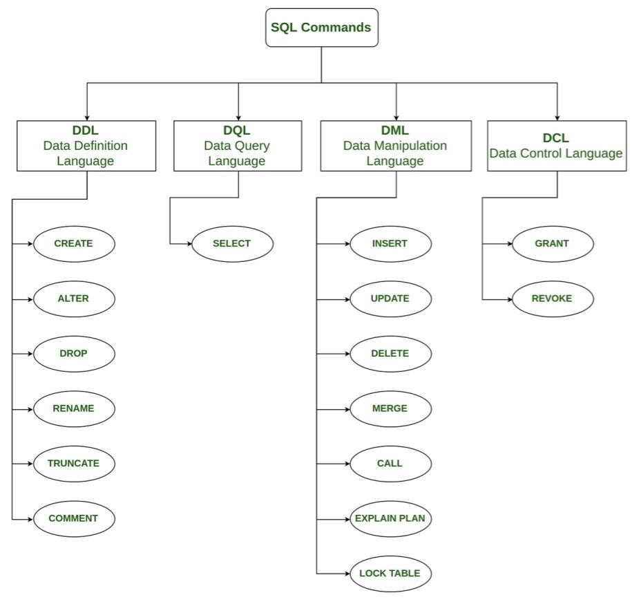

# SQL Commands

Created: 2018-03-13 18:58:43 +0500

Modified: 2021-12-01 16:17:51 +0500

---

## Types

1. DDL -- Data Definition Language

2. DQl -- Data Query Language

3. DML -- Data Manipulation Language

4. DCL -- Data Control Language

## QUERIES

SHOW

SHOW CREATE TABLE *tbl_name*

SHOW CHARACTER SET;

SHOW GLOBAL VARIABLES where Variable_Name='innodb_buffer_pool_size';

AND

SELECT column_name(s)
FROM table_name
WHERE column_1 = value_1
AND column_2 = value_2;

ANDis an operator that combines two conditions. Both conditions must be true for the row to be included in the result set.

AS

SELECT column_name AS 'Alias'
FROM table_name;

ASis a keyword in SQL that allows you to rename a column or table using analias.

BETWEEN

SELECT column_name(s)
FROM table_name
WHERE column_name BETWEEN value_1 AND value_2;

TheBETWEENoperator is used to filter the result set within a certain range. The values can be numbers, text or dates.

SELECT *

FROM movies

WHERE name BETWEEN 'D%' and 'G%';

This will select all movies that starts with D, E, F and not G.

CASE

[CASE](https://postgresweekly.com/link/77475/cb6defc36e)expression is essentially the 'if/then' of the SQL world. Given one value,CASEcan return another of your choice -- but did you know you're able to use it inORDER BYclauses to define custom orders based upon other values?

Here's a simple use case. Let's say you have a table listing employees and their job titles:

<table>
<colgroup>
<col style="width: 100%" />
</colgroup>
<thead>
<tr class="header">
<th>
id | name. | title

-------------------

1 | Oscar | Cleaner

2 | Carol | CEO

3 | Jimbo | CFO

4 | Bobby | Assistant
</th>
</tr>
</thead>
<tbody>
</tbody>
</table>

| If you wanted to have some sort of order based upon job titles, you could use CASE like so: |
|------------------------------------------------------------------------|

<table>
<colgroup>
<col style="width: 100%" />
</colgroup>
<thead>
<tr class="header">
<th>
SELECT * FROM employees ORDER BY

CASE

WHEN title = 'CEO' THEN 1

WHEN title = 'CFO' THEN 2

WHEN title = 'CTO' THEN 2

ELSE 3

END;
</th>
</tr>
</thead>
<tbody>
</tbody>
</table>

(Work in MS SQL Server not in Oracle)

SELECT name,

CASE

WHEN genre = 'romance' THEN 'Chill'

WHEN genre = 'comedy' THEN 'Chill'

ELSE 'Intense'

END AS 'Mood'

FROM movies;

SELECT

CASE

WHEN Grades.Grade < 8 THEN NULL

ELSE Students.Name

END AS 'Student_Name',

Grades.Grade, Students.Marks

FROM Students

JOIN Grades

ON Students.Marks BETWEEN Grades.Min_Mark and Grades.Max_Mark

ORDER BY Grades.Grade DESC, Students.Name, Students.Marks;

HAVING

SELECT column_name, aggregate_function(column_name)

FROM table_name

WHERE column_name operator value

GROUP BY column_name

HAVING aggregate_function(column_name) operator value

HAVINGstatement always comes afterGROUP BY, but beforeORDER BYandLIMIT.

IN

SELECT column_name(s)

FROM table_name

WHERE column_name

IN (value1,value2,..)

OR

SELECT column_name
FROM table_name
WHERE column_name = value_1
OR column_name = value_2;

ORis an operator that filters the result set to only include rows where either condition is true.

ORDER BY

SELECT column_name
FROM table_name
ORDER BY column_name ASC|DESC;

SELECT Name

FROM STUDENTS

WHERE Marks > 75

ORDER BY RIGHT(NAME, 3), ID ASC;

ORDER BYis a clause that indicates you want to sort the result set by a particular column either alphabetically or numerically.

LIKE

SELECT column_name(s)
FROM table_name
WHERE column_name LIKE pattern;

LIKEis a special operator used with theWHEREclause to search for a specific pattern in a column.

SELECT * FROM movies WHERE name LIKE 'Se_en';

# MY SQL

SELECT DISTINCT CITY

FROM STATION

WHERE

CITY LIKE 'a%' OR

CITY LIKE 'e%' OR

CITY LIKE 'i%' OR

CITY LIKE 'o%' OR

CITY LIKE 'u%';

# MS SQL SERVER

SELECT DISTINCT CITY

FROM STATION

WHERE

CITY LIKE '%[aeiou]';

Here _ in a wildcard for substituting any value

%is a wildcard character that matches zero or more missing letters in the pattern

LIMIT

SELECT column_name(s)
FROM table_name
LIMIT number;

LIMITis a clause that lets you specify the maximum number of rows the result set will have.

WHERE

SELECT column_name(s)
FROM table_name
WHERE column_name operator value;

WHEREis a clause that indicates you want to filter the result set to include only rows where the followingconditionis true.

## COMBINING TABLES

INNER JOIN / JOIN

SELECT column_name(s) FROM table_1
JOIN table_2
ON table_1.column_name = table_2.column_name;

An inner join will combine rows from different tables if thejoin conditionis true.

LEFT JOIN

SELECT column_name(s)

FROM table_name1

LEFT JOIN table_name2

ON table_name1.column_name=table_name2.column_name

RIGHT JOIN

SELECT column_name(s)

FROM table_name1

RIGHT JOIN table_name2

ON table_name1.column_name=table_name2.column_name

FULL JOIN

SELECT column_name(s)

FROM table_name1

FULL JOIN table_name2

ON table_name1.column_name=table_name2.column_name

OUTER JOIN

SELECT column_name(s) FROM table_1
LEFT JOIN table_2
ON table_1.column_name = table_2.column_name;

An outer join will combine rows from different tables even if the the join condition is not met. Every row in thelefttable is returned in the result set, and if the join condition is not met, thenNULLvalues are used to fill in the columns from therighttable.

CROSS JOIN

Sometimes, we just want to combine all rows of one table with all rows of another table.

For instance, if we had a table ofshirtsand a table ofpants, we might want to know all the possible combinations to create different outfits.

SELECT shirts.shirt_color, pants.pants_color FROM shirts CROSS JOIN pants;

SELECT month,

COUNT(*)

FROM newspaper

CROSS JOIN months

WHERE start_month <= month

AND end_month >= month

GROUP BY month;

UNION

# This will add all rows of table_name2 on top of table_name1

SELECT column_name(s) FROM table_name1

UNION

SELECT column_name(s) FROM table_name2

UNION ALL

The SQL UNION ALL operator is used to combine the result sets of 2 or more SELECT statements. It does not remove duplicate rows between the various SELECT statements (all rows are returned).

Each SELECT statement within the UNION ALL must have the same number of fields in the result sets with similar data types.

## What is the difference between UNION and UNION ALL?

- [UNION](https://www.techonthenet.com/sql/union.php)removes duplicate rows.
- UNION ALL doesnotremove duplicate rows.

SELECT column_name(s) FROM table_name1

UNION ALL

SELECT column_name(s) FROM table_name2

WITH

WITH previous_query AS (

SELECT customer_id,

COUNT(subscription_id) AS 'subscriptions'

FROM orders

GROUP BY customer_id

)

SELECT customers.customer_name,

previous_query.subscriptions

FROM previous_query

JOIN customers

ON previous_query.customer_id = customers.customer_id;

## Can be nested

WITH

query1 AS (SELECT column1 FROM table1 WHERE condition1),

query2 AS (SELECT column2 FROM table2 WHERE condition2)

...

## SQL Server Clauses

## Over Clause

## Partition By clause

ThePARTITION BYclause is a subclause of theOVERclause. ThePARTITION BYclause divides a query's result set into partitions. The[window function](http://www.sqltutorial.org/sql-window-functions/)is operated on each partition separately and recalculate for each partition.

## MYSQL

Using % for mod (In oracle use **mod()** function)

SELECT DISTINCT CITY FROM STATION WHERE ID%2 = 0;

LENGTH

SELECTLENGTH("SQL Tutorial")ASLengthOfString;

CEIL

SELECT CEIL((AVG(salary)) - (AVG(REPLACE(salary, '0', '')))) AS avg_salary FROM employees;

SELECT @@innodb_buffer_pool_size;

Information Schema MySQL

select * from information_schema.CHARACTER_SETS;

select * from information_schema.COLLATIONS;

select * from information_schema.COLLATION_CHARACTER_SET_APPLICABILITY;

select * from information_schema.COLUMNS;

select * from information_schema.EVENTS;

select * from information_schema.FILES;

select * from information_schema.KEY_COLUMN_USAGE;

select * from information_schema.PARAMETERS;

select * from information_schema.PARTITIONS;

select * from information_schema.REFERENTIAL_CONSTRAINTS;

select * from information_schema.ROUTINES;

select * from information_schema.SCHEMATA;

select * from information_schema.STATISTICS;

STATISTICS.CARDINALITY

select * from information_schema.TABLES;

TABLES.AUTO_INCREMENT

TABLES.AVG_ROW_LENGTH

TABLES.CHECKSUM

TABLES.CHECK_TIME

TABLES.CREATE_TIME

TABLES.DATA_FREE

TABLES.DATA_LENGTH

TABLES.INDEX_LENGTH

TABLES.MAX_DATA_LENGTH

TABLES.TABLE_ROWS

TABLES.UPDATE_TIME

select * from information_schema.TABLE_CONSTRAINTS;

select * from information_schema.TRIGGERS;

select * from information_schema.VIEWS;
