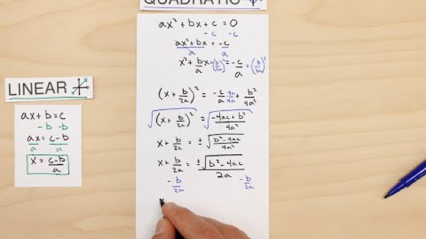

# 2.2 Complex Numbers

Created: 2018-05-23 20:53:10 +0500

Modified: 2018-12-09 20:43:49 +0500

---

1.  Principle Square root

2.  sq. root(a.b) = sq. root(a) * sq. root(b), iff a and b both are not negative3.  **Complex Number => i^2^ = - 1**

    a.  Real part

    b.  Imaginary part

    c.  Principle Square Root4.  Complex Plane

    a.  The horizontal number line (what we know as thexxx-axis on a Cartesian plane) is thereal axis.

    b.  The vertical number line (theyyy-axis on a Cartesian plane) is theimaginary axis.

5.  Number Systems

    a.  Counting number system ( greater than 0)

    b.  Integer number system (positive and negative numbers)

    c.  Rational number system (fractions)

    d.  Real number system (decimals)

    e.  Complex number system

6.  Pure imaginary

7.  Adding and subtracting complex numbers

8.  Multiplying complex number

9.  (a - bi)(a+bi) = a^2^+b^2^**Imaginary Numbers**

[Imaginary Numbers are Real](https://www.youtube.com/playlist?list=PLiaHhY2iBX9g6KIvZ_703G3KJXapKkNaF)

1.  Introduction

2.  History

3.  Cardan's Problem

4.  Bombelli's Solution

5.  Numbers are Two Dimensional

6.  The Complex Plane

7.  Comple Multiplication

8.  Math Wizardry

9.  Closure

10. Complex Functions

11. Wandering in 4 Dimensions

12. Riemann's Solution

13. Riemann Surfaces
