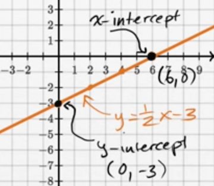

# Others

Created: 2018-07-02 00:39:29 +0500

Modified: 2018-07-02 00:40:09 +0500

---

**Slope**

**Intercept**

Thex-intercept is the point where a line crosses thex-axis, and they-intercept is the point where a line crosses they-axis.

{width="3.75in" height="3.2604166666666665in"}