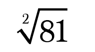
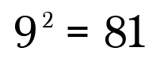
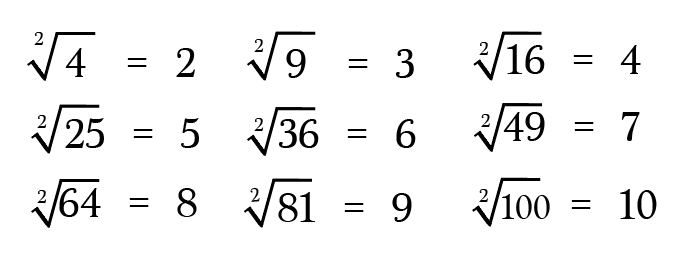
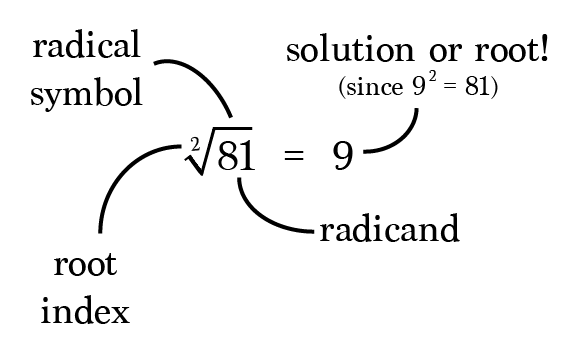
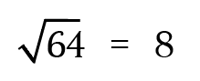
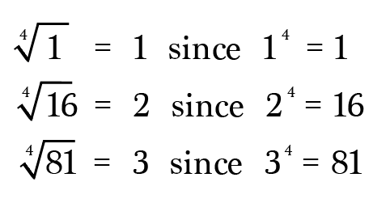
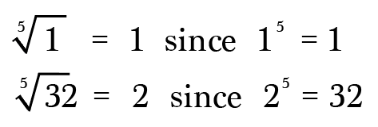

# Root

Created: 2018-04-02 00:06:21 +0500

Modified: 2018-04-02 00:07:33 +0500

---

Roots get back the base number from the solution of an exponential equation.

Square Roots, Cube Roots andMore

Suppose instead of finding the square of 9, which is 81, we wanted to find out what number multiplied with itself equals 81.

In other words,*what is the**square root**of 81?*

{width="2.0in" height="1.09375in"}

This equals 9 because nine squared is eighty-one.

{width="2.0416666666666665in" height="0.8125in"}

**We can take the square root of any non-negative number**, but only perfect square numbers yield whole number results. So familiarize yourself with those first. Here are a few to get you started:

{width="7.15625in" height="2.6875in"}

Now for some terminology.

{width="5.9375in" height="3.6666666666666665in"}

The root index is*optional*on square roots. Square roots are often written:

{width="2.28125in" height="0.9166666666666666in"}

The index is only necessary to distinguish between higher indexed roots, such as cube roots, fourth roots, fifth roots, etc.

**Cube roots**ask you to find the number that when multiplied with itself**three**times yields the radicand, like these:

{width="5.3125in" height="3.96875in"}

**Fourth roots**ask you to find the number that when multiplied with itself**four**times yields the radicand.

{width="5.020833333333333in" height="2.6041666666666665in"}

**Fifth roots**ask you to find the number that when multiplied with itself**five**times yields the radicand.

{width="4.927083333333333in" height="1.65625in"}

Again, you can take*any root of any non-negative number*(and in certain cases of negative numbers as well), but for many numbers you'll need a calculator since the answers are irrational.

