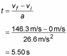
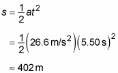

# Distance Speed and Time

Created: 2018-02-17 23:38:26 +0500

Modified: 2018-09-26 23:25:48 +0500

---

# HOW TO CALCULATE TIME AND DISTANCE FROM ACCELERATION AND VELOCITY

In a physics equation, given a constant[acceleration](http://www.dummies.com/education/science/physics/how-to-calculate-acceleration/)and the change in velocity of an object, you can figure out both the[time involved and the distance traveled](http://www.dummies.com/education/math/basic-math/calculating-speed-time-and-distance/). For instance, imagine you're a drag racer. Your acceleration is 26.6 meters per second2, and your final speed is 146.3 meters per second. Now find the total distance traveled. Got you, huh? "Not at all," you say, supremely confident. "Just let me get my calculator."

You know the acceleration and the final speed, and you want to know the total distance required to get to that speed. This problem looks like a puzzler, but if you need the time, you can always solve for it. You know the final speed,vf,and the initial speed,vi(which is zero), and you know the acceleration,a.Becausevf-- vi= at,you know that

Now you have the time. You still need the distance, and you can get it this way:

The second term drops out becausevi= 0, so all you have to do is plug in the numbers:

In other words, the total distance traveled is 402 meters, or a quarter mile. Must be a quarter-mile racetrack.

# 

# HOW TO CALCULATE ACCELERATION

In physics terms, acceleration,a, is the amount by which your velocity changes in a given amount of time. Given the initial and final velocities,viandvf, and the initial and final times over which your speed changes,tiandtf, you can write the equation like this:

In terms of units, the equation looks like this:

Distance per time squared? Don't let that throw you. You end up with time squared in the denominator because you divide velocity by time. In other words,accelerationis the rate at which your velocity changes, because rates have time in the denominator. For acceleration, you see units of meters per second2, centimeters per second2, miles per second2, feet per second2, or even kilometers per hour2.

It may be easier, for a given problem, to use units such as mph/s (miles per hour per second). This would be useful if the velocity in question had a magnitude of something like several miles per hour that changed typically over a number of seconds.

Say you become a drag racer in order to analyze your acceleration down the dragway. After a test race, you know the distance you went --- 402 meters, or about 0.25 miles (the magnitude of your displacement) --- and you know the time it took --- 5.5 seconds. So what was your acceleration as you blasted down the track?

Well, you can relate displacement, acceleration, and time as follows:

and that's what you want --- you always work the algebra so that you end up relating all the quantities you know to the one quantity youdon'tknow. In this case, you have

(Keep in mind that in this case, your initial velocity is 0 --- you're not allowed to take a running start at the drag race!) You can rearrange this equation with a little algebra to solve for acceleration; just divide both sides byt2and multiply by 2 to get

Great. Plugging in the numbers, you get the following:

Okay, the acceleration is approximately 27 meters per second2. What's that in more understandable terms? The acceleration due to gravity,g,is 9.8 meters per second2, so this is about 2.7 g's --- you'd feel yourself pushed back into your seat with a force about 2.7 times your own weight.

