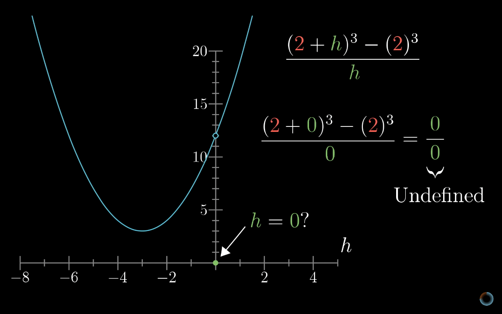
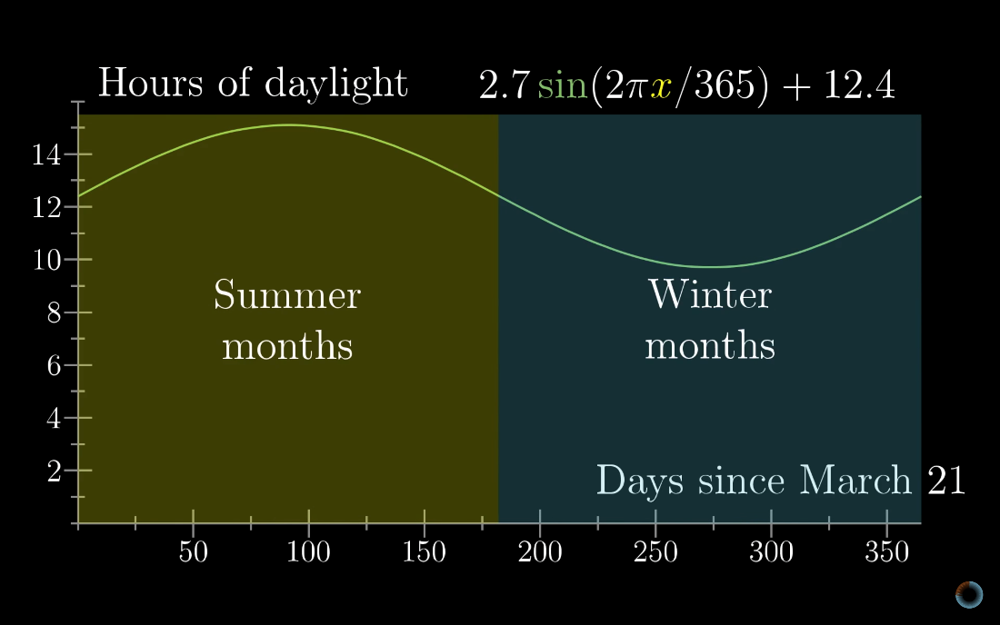

# Essence of Calculus - 3Blue1Brown

Created: 2018-05-28 16:14:32 +0500

Modified: 2021-03-27 01:05:55 +0500

---

1.  Introduction

2.  The paradox of the derivative

3.  Derivative formulas through geometry

4.  Visualizing the chain rule and product rule

5.  Derivatives of exponentials (What's so special about Euler's number e)

6.  Implicit differentiation, what going on here?

7.  Limits, L'Hopital's rule, and epsilon delta definitions

8.  Integration and the fundamental theorem of calculus

9.  What does area have to do with slope?

10. Higher order derivatives

11. Taylor series

12. The other way to visualize derivatives (What they won't teach you in calculus)

1.  **Introduction**
-   Derivative formulas
-   Product rule, chain rule
-   Implicit differentiation
-   Integral and derivatives are opposite
-   Taylor series

{width="5.0in" height="3.3333333333333335in"}

{width="5.0in" height="3.125in"}

{width="5.0in" height="3.125in"}

2.  **The paradox of the derivative**

{width="5.0in" height="3.125in"}

{width="5.0in" height="3.125in"}

{width="5.0in" height="3.125in"}

{width="5.0in" height="3.125in"}

{width="5.0in" height="3.125in"}

{width="5.0in" height="3.125in"}

{width="5.0in" height="3.125in"}

{width="5.0in" height="3.125in"}

3.  **Derivative formulas through geometry**
    -   **The Power Rule**

{width="5.0in" height="4.145833333333333in"}

{width="5.0in" height="4.833333333333333in"}

{width="5.0in" height="3.125in"}

{width="5.0in" height="2.59375in"}

{width="5.0in" height="2.4791666666666665in"}

{width="5.0in" height="2.4791666666666665in"}

4.  **Visualizing the chain rule and product rule**

    1.  **Sum Rule**

{width="5.0in" height="3.4479166666666665in"}

{width="5.0in" height="3.125in"}

{width="5.0in" height="3.125in"}

2.  **Product Rule**

{width="5.0in" height="3.125in"}

{width="5.0in" height="3.125in"}

{width="5.0in" height="2.5in"}

3.  **Function composition / Chain Rule**

{width="5.0in" height="4.354166666666667in"}

{width="5.0in" height="3.125in"}

{width="5.0in" height="2.625in"}

5.  **Derivatives of exponentials**

{width="5.0in" height="1.7708333333333333in"}

For smaller and smaller choices of dt value 2^0.000001^ -1 / 0.000001 approaches a specific number. Unlike other functions all the values of dt is separate from the value of t itself

{width="5.0in" height="4.03125in"}

{width="5.0in" height="1.5208333333333333in"}

{width="5.0in" height="1.75in"}

{width="5.0in" height="3.125in"}

{width="5.0in" height="3.125in"}

{width="5.0in" height="3.2916666666666665in"}

{width="5.0in" height="0.9270833333333334in"}

{width="5.0in" height="3.125in"}

{width="5.0in" height="0.8958333333333334in"}

We write some contant times t, as e to some constants time t, because rate of change of some thing (like population) is dependent on the size of that thing (i.e. the size of population). Other example, if we put a cup of water in a cool room, the rate at which water cools is proportional to difference in temperature of room and water, or otherwise **the rate at which that difference changes is proportional to itself.** If we invest our money the amount of interest depends on the amount of money invested.

6.  **Implicit differentiation, what going on here?**

{width="5.0in" height="3.125in"}

{width="5.0in" height="2.7604166666666665in"}

{width="5.0in" height="3.125in"}

{width="5.0in" height="3.125in"}

{width="5.0in" height="3.125in"}

{width="5.0in" height="3.125in"}

-   Multivariate Calculus

7.  **Limits**
    -   **Formal definition of a derivative**

{width="5.0in" height="3.125in"}

**h = dx**

-   **(ε, 𝛿) definition of a limit (epsilon - delta)**

{width="5.0in" height="3.125in"}

{width="5.0in" height="3.125in"}

{width="5.0in" height="3.125in"}

-   **L'Hôpital's rule**

{width="5.0in" height="3.125in"}

{width="5.0in" height="3.125in"}

{width="5.0in" height="3.125in"}

{width="5.0in" height="3.125in"}

{width="5.0in" height="3.125in"}

{width="5.0in" height="3.125in"}

{width="5.0in" height="3.125in"}

8.  **Integration and the fundamental theorem of calculus**

{width="5.0in" height="3.125in"}

{width="5.0in" height="2.9791666666666665in"}

{width="5.0in" height="3.125in"}

{width="5.0in" height="3.125in"}

{width="5.0in" height="3.125in"}

{width="5.0in" height="3.125in"}

{width="5.0in" height="3.125in"}

9.  **What does area have to do with slope?**

{width="5.0in" height="3.125in"}

{width="5.0in" height="3.125in"}

{width="5.0in" height="3.125in"}

{width="5.0in" height="3.125in"}

Finding the average of a continuous thing.

{width="5.0in" height="3.125in"}

{width="5.0in" height="3.125in"}

{width="5.0in" height="3.125in"}

{width="5.0in" height="3.125in"}

{width="5.0in" height="3.125in"}

{width="5.0in" height="3.125in"}

{width="5.0in" height="3.125in"}

{width="5.0in" height="3.125in"}

{width="5.0in" height="3.125in"}

10. **Higher order derivatives**

{width="5.0in" height="3.125in"}

{width="5.0in" height="3.125in"}

{width="5.0in" height="4.052083333333333in"}

11. **Taylor series**
    -   **Powerful tool for approximating functions**
    -   **Taking non-polynomial functions, and finding polynomials that approximate them near some input. Polynomials are much easier to deal with than other functions**

{width="5.0in" height="3.125in"}

{width="5.0in" height="3.125in"}

{width="5.0in" height="3.125in"}

{width="5.0in" height="3.125in"}

{width="5.0in" height="3.125in"}

{width="5.0in" height="3.125in"}

{width="5.0in" height="1.6041666666666667in"}

{width="5.0in" height="1.8020833333333333in"}

{width="5.0in" height="2.8229166666666665in"}

{width="5.0in" height="3.125in"}

{width="5.0in" height="3.125in"}

-   Lagrange error bounds
-   Convergence tests

12. **What they won't teach you in calculus**
    -   **Derivative is the slope of a graph**
    -   **Integral is a certain area under that graph**
    -   **Multivariable calculus**
    -   **Complex analysis**
    -   **Differential geometry**
    -   **Polymorphic Function**
    -   **Jacobian Determinant**

{width="5.0in" height="3.125in"}

**References**

[Essence of calculus](https://www.youtube.com/playlist?list=PLZHQObOWTQDMsr9K-rj53DwVRMYO3t5Yr)

{width="5.0in" height="2.8020833333333335in"}

