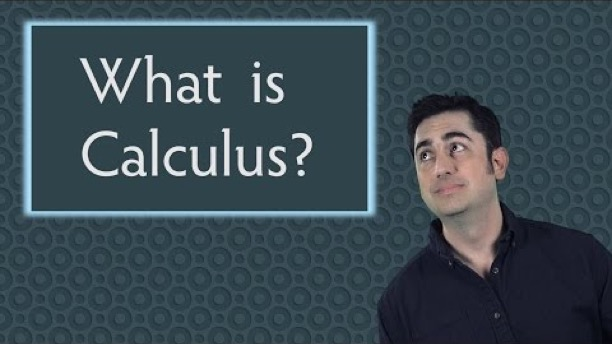

# Intro

The word Calculus comes from Latin meaning "small stone", Because it is like understanding something by looking at small pieces.
Differential Calculuscuts something into small pieces to find how it changes.

Integral Calculusjoins (integrates) the small pieces together to find how much there is.

## Limits

Limits are all about approaching. Sometimes you can't work something out directly, but you can see what it should be as you get closer and closer!

## Derivatives (Differential Calculus)

The Derivative is the "rate of change" or slope of a function at a point.

Intuition - How steep is a function/graph at a point.

## Integration (Integral Calculus)

Integration can be used to find areas, volumes, central points and many useful things.

Intuition - What is the area under the graph over a region

## Differential Equations

In our world things change, anddescribing how they changeoften ends up as a Differential Equation: an equation with afunctionand one or more of itsderivatives.

## Derivative Rules

- Product Rule
- Quotient Rule
- Chain Rule

## Integral Rules

- U-substitution
- Integration by parts
- Partial fraction decomposition

## Higher Dimensions

- Partial derivatives
- Double Integral

## Scalar Field - If a function has 3 inputs and 1 output

## Vector Field - If a function has 3 inputs and 1 vector output

## References

<https://www.khanacademy.org/math/calculus-1>

Precalculus - <https://www.youtube.com/watch?v=eI4an8aSsgw>

[What is Calculus? (Mathematics)](https://www.youtube.com/watch?v=w3GV9pumczQ)

<https://www.freecodecamp.org/news/learn-calculus-2-in-this-free-7-hour-course>

- Area Between Curves
- Volumes of Solids of Revolution
- Volumes Using Cross-Sections
- Arclength
- Work as an Integral
- Average Value of a Function
- Proof of the Mean Value Theorem for Integrals
- Integration by Parts
- Trig Identities
- Proof of the Angle Sum Formulas
- Integrals Involving Odd Powers of Sine and Cosine
- Integrals Involving Even Powers of Sine and Cosine
- Special Trig Integrals
- Integration Using Trig Substitution
- Integrals of Rational Functions
- Improper Integrals - Type 1
- Improper Integrals - Type 2
- The Comparison Theorem for Integrals
- Sequences - Definitions and Notation
- Series Definitions
- Sequences - More Definitions
- Monotonic and Bounded Sequences Extra
- L'Hospital's Rule
- L'Hospital's Rule on Other Indeterminate Forms
- Convergence of Sequences
- Geometric Series
- The Integral Test
- Comparison Test for Series
- The Limit Comparison Test
- Proof of the Limit Comparison Test
- Absolute Convergence
- The Ratio Test
- Proof of the Ratio Test
- Series Convergence Test Strategy
- Taylor Series Introduction
- Power Series
- Convergence of Power Series
- Power Series Interval of Convergence Example
- Proofs of Facts about Convergence of Power Series
- Power Series as Functions
- Representing Functions with Power Series
- Using Taylor Series to find Sums of Series
- Taylor Series Theory and Remainder
- Parametric Equations
- Slopes of Parametric Curves
- Area under a Parametric Curve
- Arclength of Parametric Curves
- Polar Coordinates
