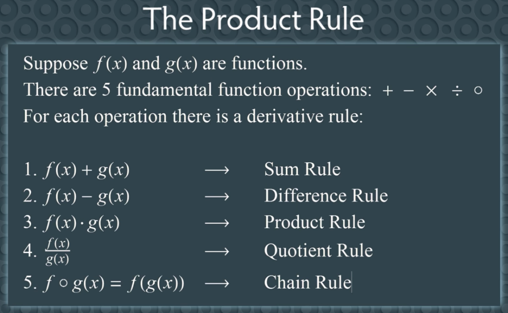
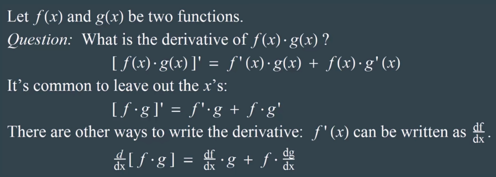
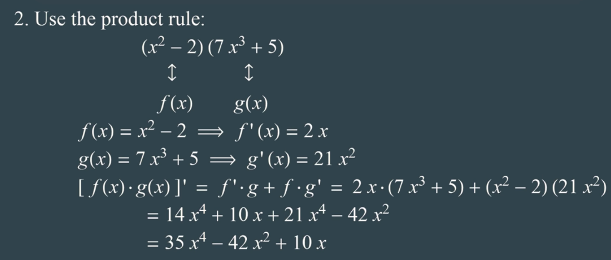
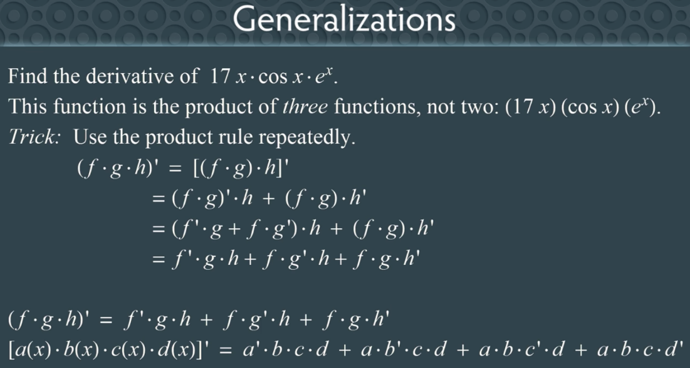
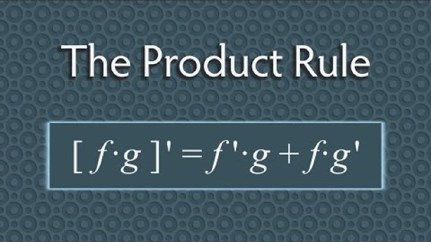

# Product Rule for Derivatives

Created: 2018-12-05 00:20:24 +0500

Modified: 2018-12-05 00:33:06 +0500

---

{width="5.0in" height="3.0833333333333335in"}

Fifth is *function composition*
![1. Sum Rule: 2. Difference Rule: 3. Product Rule: 4. Quotient Rule: 5. Chain Rule: f' (x) • g(x) + f (x) • g' (x) [ LIE.)] ' --- --- (x) [ g(x) 12 [f 0 g(x) ] ' = f' (g(x)) •g' (x) ](media/Product-Rule-for-Derivatives-image2.png){width="5.0in" height="1.4895833333333333in"}
3.  Product Rule

{width="5.0in" height="1.78125in"}
{width="5.0in" height="2.5520833333333335in"}
{width="5.0in" height="2.1354166666666665in"}
![Caution Common mistake: [f = f' •g' Tip: Write down what you think is the formula, then test it! Test: Let f (x) = x2 and g(x) = x3 f (x) • g(x) = x2 • x3 = x5 [x5]' --- 5x4 Now test the formula: (2 x) • (3 x2) = 6 x3 * 5 x4 This formula is wrong! ](media/Product-Rule-for-Derivatives-image6.png){width="5.0in" height="3.1354166666666665in"}
{width="5.0in" height="2.6770833333333335in"}
{width="5.0in" height="2.1354166666666665in"}
**References**

[Product Rule for Derivatives (Calculus)](https://www.youtube.com/watch?v=8Qw2aPjqW9c)
{width="5.0in" height="2.8020833333333335in"}
