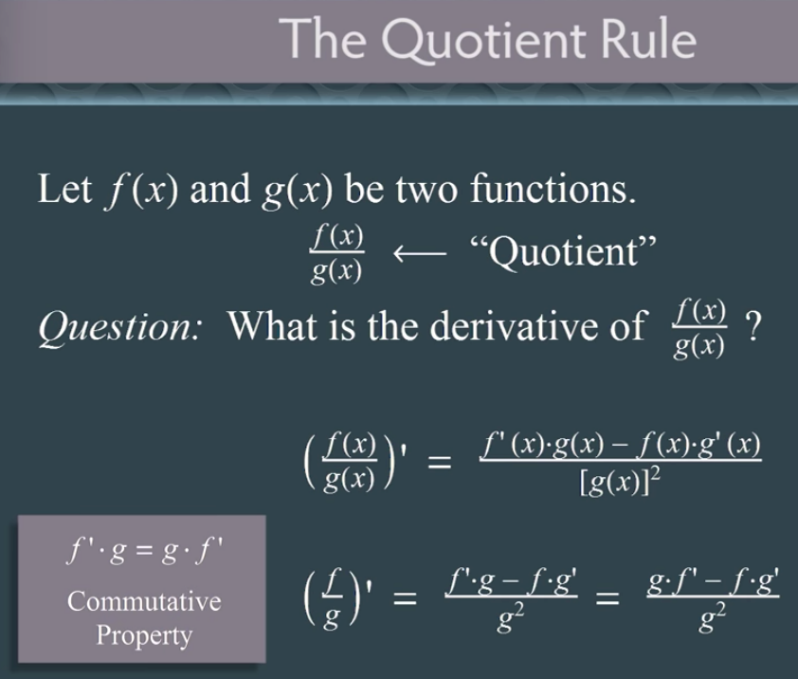
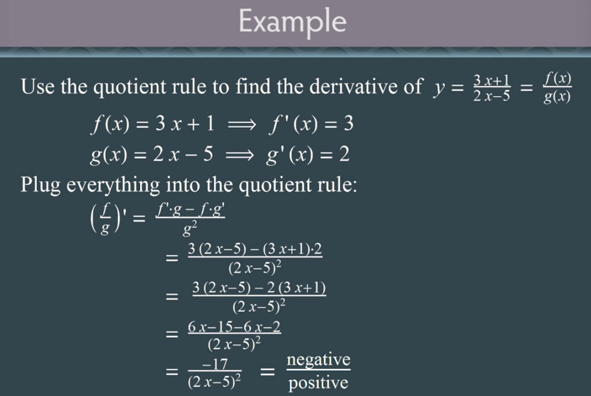
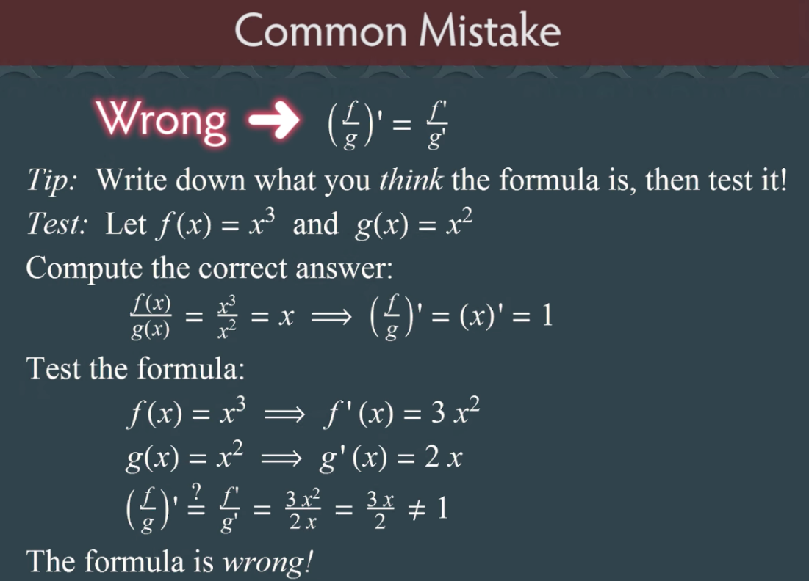
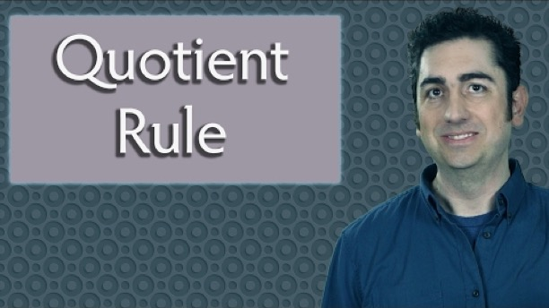

# Quotient Rule

Created: 2018-12-05 00:30:46 +0500

Modified: 2018-12-05 00:51:08 +0500

---

{width="3.6354166666666665in" height="3.0833333333333335in"}

{width="5.0in" height="3.3541666666666665in"}

{width="5.0in" height="3.59375in"}

**References**

[The Quotient Rule (Calculus)](https://www.youtube.com/watch?v=OPjN7Gvb4-8)

{width="4.760416666666667in" height="2.6770833333333335in"}

