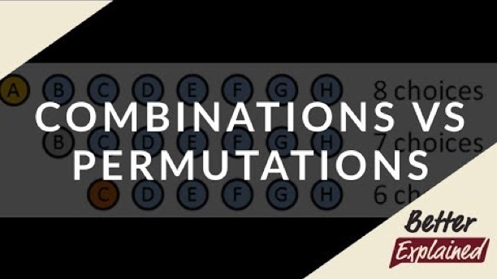

# Permutation and Combination

Created: 2018-04-10 19:30:16 +0500

Modified: 2020-04-26 01:55:05 +0500

---

Permutation - Order matters

Combination - Order doesn't matter
permutation sounds complicated, doesn't it? And it is. With permutations, every little detail matters. Alice, Bob and Charlie is different from Charlie, Bob and Alice (insert your friends' names here).

Combinations, on the other hand, are pretty easy going. The details don't matter. Alice, Bob and Charlie is the same as Charlie, Bob and Alice.

Permutations are for lists (order matters) and combinations are for groups (order doesn't matter).

A joke: A "combination lock" should really be called a "permutation lock". The order you put the numbers in matters. (A true "combination lock" would accept both 10-17-23 and 23-17-10 as correct.)

Combinations sound simpler than permutations, and they are. You have fewer combinations than permutations.

## References

<https://www.freecodecamp.org/news/permutation-and-combination-the-difference-explained-with-formula-examples>
<https://betterexplained.com/articles/easy-permutations-and-combinations/#!parentId=756>

[Easy Combinations and Permutations | BetterExplained](https://www.youtube.com/watch?v=bAk_7p5gAWc)

