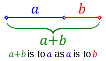

# Golden Ratio - phi

Created: 2018-06-01 00:24:37 +0500

Modified: 2018-06-01 00:30:49 +0500

---

Two quantities are in the**golden ratio**if their[ratio](https://en.wikipedia.org/wiki/Ratio)is the same as the ratio of their[sum](https://en.wikipedia.org/wiki/Summation)to the larger of the two quantities. Expressed algebraically, for quantities*a*and*b*with*a*>*b*>0,

{width="2.6666666666666665in" height="1.0208333333333333in"}

where the Greek letter[phi](https://en.wikipedia.org/wiki/Phi_(letter))(ϕorφ) represents the golden ratio. It is an[irrational number](https://en.wikipedia.org/wiki/Irrational_number)with a value of:

{width="4.895833333333333in" height="0.9479166666666666in"}

The Geometric Relationship -

{width="2.2916666666666665in" height="1.3125in"}

The golden ratio is also called the**golden mean**or**golden section**(Latin:*sectio aurea*).Other names include**extreme and mean ratio**,**medial section**,**divine proportion**,**divine section** (Latin:*sectio divina*),**golden proportion**,**golden cut**,and**golden number**.

