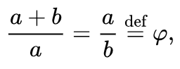
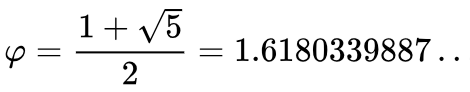

# Golden Ratio - phi

Created: 2018-06-01 00:24:37 +0500

Modified: 2018-06-01 00:30:49 +0500

---

Two quantities are in the**golden ratio** if their [ratio](https://en.wikipedia.org/wiki/Ratio) is the same as the ratio of their [sum](https://en.wikipedia.org/wiki/Summation) to the larger of the two quantities. Expressed algebraically, for quantities*a*and*b*with*a*>*b*>0,

where the Greek letter [phi](https://en.wikipedia.org/wiki/Phi_(letter))(ϕorφ) represents the golden ratio. It is an [irrational number](https://en.wikipedia.org/wiki/Irrational_number) with a value of:

The Geometric Relationship -

The golden ratio is also called the**golden mean**or**golden section**(Latin:*sectio aurea*).Other names include**extreme and mean ratio**, **medial section**, **divine proportion**, **divine section** (Latin:*sectio divina*), **golden proportion**, **golden cut**, and**golden number**.
