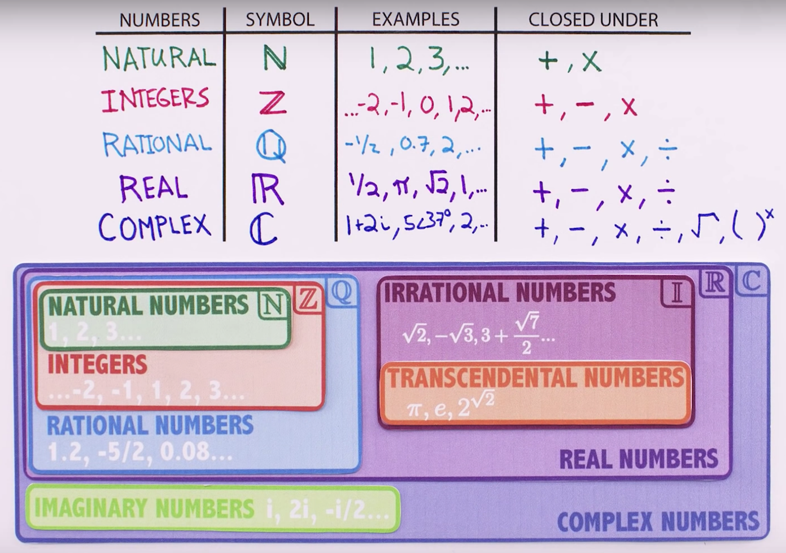

# Numbers

Created: 2018-04-03 00:32:25 +0500

Modified: 2021-03-27 11:31:57 +0500

---

**Types of numbers**

1.  Natural numbers (N) - 1,2,3, ...

The counting numbers
2.  Whole numbers - 0,1,2,3, ...

The counting numbers including 0
3.  Integer numbers (Z) - ... ,-3,-2,-1,0,1,2,3, ...

Positive and negative counting numbers as well as 0

1.  Even and odd integers

2.  Prime number

3.  Composite number

4.  Polygonal numbers
4.  Rational numbers (Q) -

The numbers that can be represented as ratio of an integer to a non-zero integer.

All integers are rational but the converse is not true.
5.  Real numbers (R) -

Numbers that have decimal representations that have a finite or infinite sequence of digits to the right of the decimal point. They can be positive, negative, or zero. All rational numbers are real, but the converse is not true.
6.  Irrational numbers (I) -

Real numbers that are not rational
7.  Imaginary numbers -

Numbers that equal the product of a real number and the square root of --1. The number 0 is both real and imaginary.
8.  Complex numbers (C) -

Includes real numbers, imaginary numbers, and sums and differences of real and imaginary numbers.
## Algebraic Numbers

1.  Algebraic numbers

Any number that is the[root](https://en.wikipedia.org/wiki/Root_of_a_function)of a non-zero[polynomial](https://en.wikipedia.org/wiki/Polynomial)with rational coefficients.

2.  Transcendental number

Any real or complex number that is not algebraic. Examples include[*e*](https://en.wikipedia.org/wiki/E_(mathematical_constant))and[*π*](https://en.wikipedia.org/wiki/Pi).

3.  Trignometric number

Any number that is the sine or cosine of a rational multiple of pi.

4.  Quadratic surd

An algebraic number that is the root of a[quadratic equation](https://en.wikipedia.org/wiki/Quadratic_equation). Such a number can be expressed as the sum of a rational number and the[square root](https://en.wikipedia.org/wiki/Square_root)of a rational.

5.  Constructible number

A number representing a length that can be constructed using a[compass and straightedge](https://en.wikipedia.org/wiki/Compass_and_straightedge_constructions). These are a[subset](https://en.wikipedia.org/wiki/Subset)of the algebraic numbers, and include the quadratic surds.

6.  Algebraic integer

An algebraic number that is the root of a[monic polynomial](https://en.wikipedia.org/wiki/Monic_polynomial)with integer coefficients.
9.  Hypercomplex numbers -

include various number-system extensions:[quaternions](https://en.wikipedia.org/wiki/Quaternion)(H),[octonions](https://en.wikipedia.org/wiki/Octonion)(O),[sedenions](https://en.wikipedia.org/wiki/Sedenion)(S),[tessarines](https://en.wikipedia.org/wiki/Tessarine),[coquaternions](https://en.wikipedia.org/wiki/Coquaternion), and[biquaternions](https://en.wikipedia.org/wiki/Biquaternion).
10. p-adic numbers -

Various number systems constructed using limits of rational numbers, according to notions of "limit" different from the one used to construct the real numbers.
**Number Representations**

1.  Decimal

2.  Binary

3.  Roman numerals

4.  Fractions

5.  Scientific notation

6.  Knuth's up-arrow notation and Conway chained arrow notation
**Non Standard Numbers**

1.  Transfinite numbers

Numbers that are greater than any natural number.

2.  Ordinal number

Finite and infinite numbers used to describe the [order type] of[well-ordered sets](https://en.wikipedia.org/wiki/Well-ordered_set).

3.  Cardinal numbers

Finite and infinite numbers used to describe the[cardinalities](https://en.wikipedia.org/wiki/Cardinality)of[sets](https://en.wikipedia.org/wiki/Set_(mathematics)).

4.  Infinitesimals

Nilpotent numbers. These are smaller than any positive real number, but are nonetheless greater than zero. These were used in the initial development of[calculus](https://en.wikipedia.org/wiki/Calculus), and are used in[synthetic differential geometry](https://en.wikipedia.org/wiki/Synthetic_differential_geometry).

5.  Hyperreal numbers

The numbers used in[non-standard analysis](https://en.wikipedia.org/wiki/Non-standard_analysis). These include infinite and infinitesimal numbers which possess certain properties of the real numbers.

6.  Surreal numbers

A number system that includes the hyperreal numbers as well as the ordinals. The surreal numbers are the largest possible[ordered field](https://en.wikipedia.org/wiki/Ordered_field).
**Important Constants / Numbers**

A**mathematical constant**is a key[number](https://en.wikipedia.org/wiki/Number)whose value is fixed by an unambiguous definition, often referred to by a symbol (e.g., an[alphabet letter](https://en.wikipedia.org/wiki/Letter_(alphabet))), or by mathematicians' names to facilitate using it across multiple[mathematical problems](https://en.wikipedia.org/wiki/Mathematical_problem).^[[1]](https://en.wikipedia.org/wiki/Mathematical_constant#cite_note-1)[[2]](https://en.wikipedia.org/wiki/Mathematical_constant#cite_note-2)^Constants arise in many areas of[mathematics](https://en.wikipedia.org/wiki/Mathematics), with constants such as[*e*](https://en.wikipedia.org/wiki/E_(mathematical_constant))and[*π*](https://en.wikipedia.org/wiki/Pi)occurring in such diverse contexts as[geometry](https://en.wikipedia.org/wiki/Geometry),[number theory](https://en.wikipedia.org/wiki/Number_theory), and[calculus](https://en.wikipedia.org/wiki/Calculus).
Euler's Number - 2.71828182845

Pi - 3.14159 265 359

sqrt(2) - 1.4142135
<https://en.wikipedia.org/wiki/List_of_mathematical_constants>
**Aleph Numbers (א)**

In[mathematics](https://en.wikipedia.org/wiki/Mathematics), and in particular[set theory](https://en.wikipedia.org/wiki/Set_theory), thealeph numbersare a sequence of numbers used to represent the[cardinality](https://en.wikipedia.org/wiki/Cardinality)(or size) of[infinite sets](https://en.wikipedia.org/wiki/Infinite_set)that can be[well-ordered](https://en.wikipedia.org/wiki/Well-ordered). They are named after the symbol used to denote them, the[Hebrew](https://en.wikipedia.org/wiki/Hebrew_alphabet)letter[aleph](https://en.wikipedia.org/wiki/Aleph)(א) (though in older mathematics books the letter aleph is often printed upside down by accident,partly because a[monotype](https://en.wikipedia.org/wiki/Monotype)matrix for aleph was mistakenly constructed the wrong way up).
<https://en.wikipedia.org/wiki/Aleph_number>
**Euler's Number (e - 2.71828182845)**

e is the natural language of growth

e is the epitome of the universal growth
<https://www.youtube.com/watch?v=AuA2EAgAegE&ab_channel=Numberphile>

<https://www.youtube.com/watch?v=yTfHn9Aj7UM&ab_channel=BetterExplained>
**Euler's Identity**

Most beautiful equation - e^iπ^+ 1 = 0
The five contants are:
-   The[number 0](https://www.livescience.com/27853-who-invented-zero.html).
-   The number 1.
-   The[numberπ](https://www.livescience.com/29197-what-is-pi.html), an irrational number (with unending digits) that is the ratio of the circumference of a circle to its diameter. It is approximately 3.14159...
-   The numbere, also an irrational number. It is the base of[natural logarithms](https://www.livescience.com/50940-logarithms.html)that arises naturally through study of compound interest and[calculus](https://www.livescience.com/50777-calculus.html). The numberepervades math, appearing seemingly from nowhere in a vast number of important equations. It is approximately 2.71828....
-   The[numberi](https://www.livescience.com/42748-imaginary-numbers.html), defined as the square root of negative one: √(-1). The most fundamental of the imaginary numbers, so called because, in reality, no number can be multiplied by itself to produce a negative number (and, therefore, negative numbers have no real square roots). But in math, there are many situations where one is forced to take the square root of a negative. The letteriis therefore used as a sort of stand-in to mark places where this was done.
