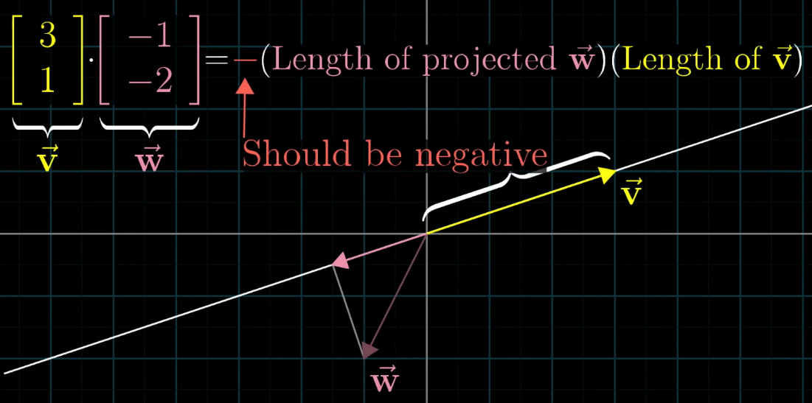
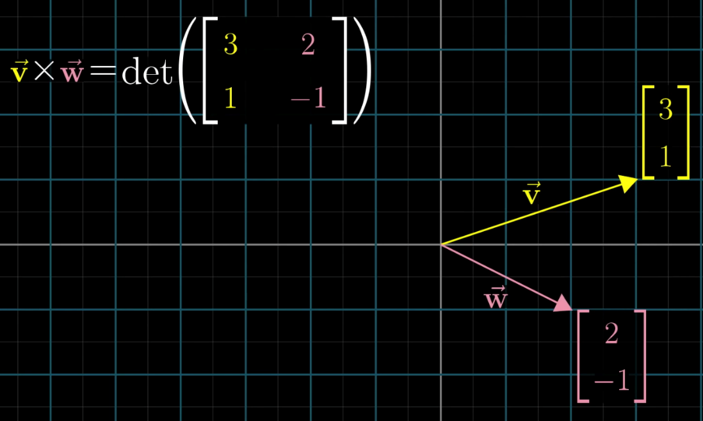

# 3Blue1Brown

Created: 2018-05-26 12:43:19 +0500

Modified: 2018-12-30 18:49:26 +0500

---

1.  Vectors

2.  Linear combinations, span and basis vectors

3.  Linear transformations and matrices

4.  Matrix multiplication as composition

5.  Three dimensional linear transformation

6.  The determinant

7.  Inverse matrices, column space, rank and null space

8.  Non square matrices

9.  Dot product and duality

10. Cross product

11. Cross product in the light of linear transformations

12. Change of basis

13. Eigenvectors and eigenvalues

14. Abstract vector spaces
1.  **Vectors**

    a.  Vector addition (adding two vectors)

    b.  Scalar multiplication (increasing the length of a vector by a given number)

2.  **Linear combinations, span and basis vectors**

called as i hat and j hat

## Linearly dependent vectors - If one vector can be removed without changing the span of the vectors. i.e. one of the vectors can be expressed as a linear combination of the other vector.

## Basis -** The **basis of a vector space is a set of linearly independent vectors that span the full space.
3.  **Linear Transformations and Matrices**

For transformations to be linear, there are two property
-   All lines must remain line and not get curved
-   Origin must remain fixed in place

Grid lines remain parallel and evenly spaced
4.  **Matrix Multiplication as composition**

If you apply a rotation transformation followed by a shear transformation, the combined effect is a composition of both rotation and shear transformation

In matrix multiplication, order matters

But Matrix multiplication is associative i.e. (AB)C = A(BC)
5.  **Three dimensional linear transformations**

6.  **The determinant**

-   If one area changes by some factor than every area changes by that factor.
-   The determinant of a transformation is the change in area of a grid after applying linear transformation
-   The factor by which a linear transformation changes any area is called the determinant of that transformation.
-   Negative determinant tells that orientation of space is inverted.
-   In 3 dimensions, determinant tells us how much volume gets scaled.

Volume of the parallelepiped

7.  **Inverse matrices, column space, rank and null space**
    -   **Gaussian Elimination**
    -   **Row echelon form**
    -   **Linear system of equations**

-   Inverse Transformation

A^-1^ A = [[1 0] [0 1]] Identity Transformation (changes nothing)

Until det(A) not equal to 0, A^-1^ exists-   Rank - Number of dimensions in the output
    -   Rank 1 - One dimensional line
    -   Rank 2 - Two dimensional plane
    -   Rank 3 - Three dimensional 3d space
-   Set of all possible outputs of the matrix is called the "column space" of the matrix A
-   Full rank - When this rank is as high as it can be meaning it equals the number of column, we call the matrix full rank
-   Null Space Kernel - All the vectors that squishes into origin when transformation takes place

In Ax = v, when v happens to be the zero vector, null space gives all of the possible solution to the linear equation
8.  **Non Square Matrices as transformations between dimensions**
    -   **A 2x3 matrix i.e. there are 2 rows and 3 columns represent that the transformation starts in 3 dimension and the landing space is represented in 2 dimension**

9.  **Dot products and duality**

Matching coordinates, multiplying pair and adding them together.

If we projected vector w onto the line that passes through the origin and the tip of vector v, multiplying the length of this projection, by the length of v, we have the dot product.

-   If vectors are pointing in the same direction, then the dot product is positive
-   If vectors are perpendicular to each other, there dot product is 0
-   If vectors are pointing in the opposing direction, then there dot product is negative
-   Order doesn't matter, V.W = W.V
-   Dot product is a very useful geometric tool for understanding projections, and for testing whether or not vectors tend to point in the same direction
10. **Cross Products**

If v is to the right of w, than cross product is positive

If v is to the left of w, than cross product is negative

-   Cross product of two perpendicular vectors are greater than the vectors that are pointing in very similar direction
-   If we scale a vector by a factor of a, than area of parallelogram also scales up by a factor of a

Cross product of two vectors is a vector that is the area of the parallelogram and is perpendicular to the parallelogram and in the direction of the thumb of the right hand rule.

11. **Cross Product in the light of linear transformations**

12. **Change of basis**
    -   **Coordinate system**
    -   **Alternate coordinate system**
    -   **How do you translate between coordinate systems**
    -   **Matrix multiplication by "Inverse change of basis matrix"**
    -   **How to translate a matrix**
        -   **Start with any vectors written in Jennifer's language**
        -   **Translate it to our language using change of basis matrix**
        -   **Apply transformation matrix in our language, this tells us where that vector lands but still in our language**
        -   **Apply the inverse change of basis matrix to get the transformed vector but in Jennifer's language**

13. **Eigenvectors and eigenvalues**

Eigenvectors - the vectors that doesn't change its span after a transformation. The factor by which they are changed (either stretched or squished) during the transformation is eigenvalue.

-   Negative eigenvalue corresponds to flipping during transformation
-   There could be no eigenvectors in a transformation

Ex - Rotation by 90 degrees

Since there are no real numbers, therefore there are no eigenvectors for this transformation-   A transformation can have a single eigenvalue with a lot of eigenvector

Ex - Scaling by some scalar eg. 2, there is only one eigenvalue of 2, but all the vectors have that value.-   Diagonal matrix - all values other than diagonal is 0

All the basis vectors are eigenvectors, with the diagonal entries of this matrix being there eigenvalues-   Eigenbasis

We can change our coordinate system so that our eigenvectors are our basis vectors

14. **Abstract Vector Spaces**

-   Additivity - If you add two vectors and then perform a transformation, the result is same vector for the transformed addition of vectors and the previous addition vector.
-   Scaling - Is if you scale a vector v by some number, then apply the transformation, you get the same ultimate vector as if you scale the transformed version of v by that same amount.
-   Linear transformations preserve addition and scalar multiplication

## References

[Essence of linear algebra](https://www.youtube.com/playlist?list=PLZHQObOWTQDPD3MizzM2xVFitgF8hE_ab)

