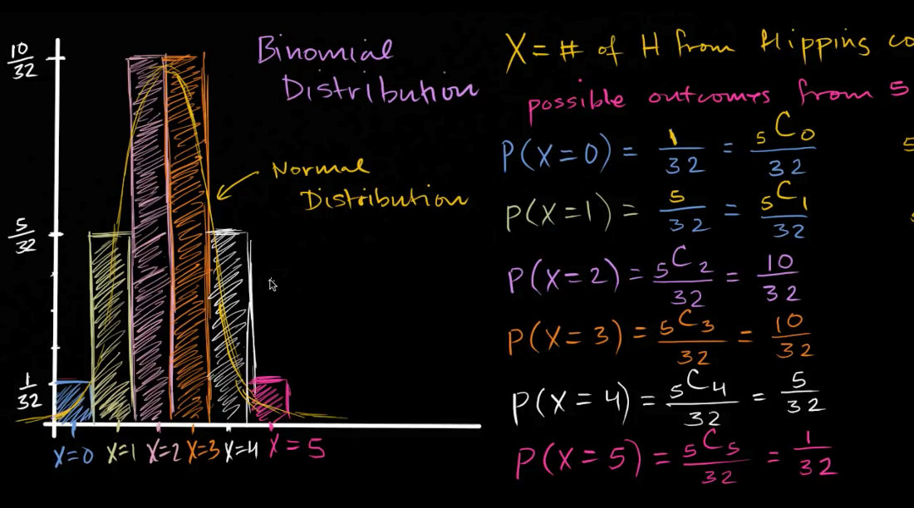
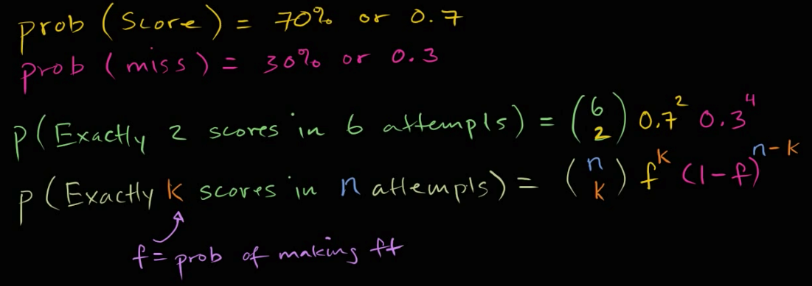
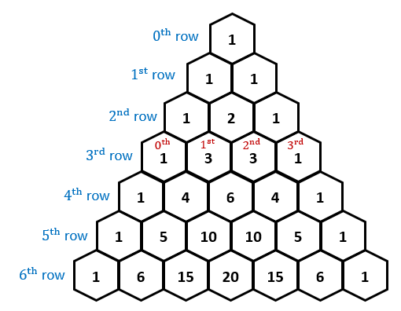

# Binomial Random Variables

Created: 2018-05-14 19:49:19 +0500

Modified: 2021-10-20 20:45:05 +0500

---

1.  Binomial Random Variables

The conditions of a binomial random variable are -
-   Made up of independent trials
-   Each trial can be classified as either success or failure
-   Fixed number of trials
-   Probability of success on each trial is constant
Ex - X = Number of heads after 10 flips of a coin with P(H) = 0.6 and P(T) = 0.4

Not binomial variable - Number of kings after taking 2 cards from standard deck without replacement (It doesn't meet independent trial, the second trial depends on 1st trial)
SRS - Simple Random Sample, is a sample taken so that each member in a set of n members has an equal chance of being in the sample.
2.  Distributions

    a.  Normal distribution, (Continuous distribution - bell curve)

    b.  Binomial distributions (Normal distributions with discrete steps)

    c.  10% rule of assuming independence between trials

    d.  Binomial Distribution

e.  Binompdf (Binomial Probability Distribution Function) and Binomcdf (Binomial Cumulative Distribution Function) functions

f.  Bimodal distribution

g.  Uniform distribution

h.  Bernoulli distribution
## Others
-   **Galton Board** - Every time creates normal distribution, pegs are arranged in pattern of **Quincunx (pattern of 5 pegs, where 4 are on sides of square and 1 in middle, like dice - 5)**
-   Follow Binomial Distribution (**Central limit theorem**, says that under large number of trials like 3000 balls a binomial distribution approximates a normal distribution)
-   **Pascal's Triangle**

-   **Creates Fibonacci Series**

-   **Rows gives sequence of coefficients in binomial powers**

## (a + b)^2^ = a^2^ + 2.a.b + b^2^ [FOIL - First, Outer, Inner, Last]

(a+b)^4^ = a^4^+ **4**a^3^b + **6**a^2^b^2^+ **4**ab^3^+ b^4^

These have same coefficients as 4th row of pascal's triangle
[The Galton Board](https://www.youtube.com/watch?v=UCmPmkHqHXk)
## References

<https://www.khanacademy.org/math/statistics-probability/random-variables-stats-library/binomial-random-variables/v/binomial-variables>

