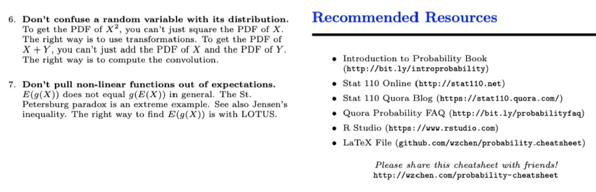

# Cheatsheet

Created: 2019-03-13 20:31:39 +0500

Modified: 2021-10-20 20:44:42 +0500

---

MVN - MultiVariate Normal Distribution

![Probability Cheatsheet v2.O by wjt1, уем, Нои, Hwug_ pmiv.bjjjty сс а! bttp: tbub. 2013 Counting Multiplication Rule кау а with thc „2 _ the wole Sampling ТаЫе о 000 .pIe Mat with Naive Definition of probability Not ма". If аи пыу, А Thinking Conditionally Indep endence А В („hieh if P(AlB) Р(А) P(BIA) = Р(В) Сош1Тг_т] А В С ВИС) а--- imply imply Unions, 1ntersections, and Complements vim w'th (А Аеив" J0int, Marginal, and Conditional Joint Рт'„ьшеу Р(А, В) А В. ЩА) - pmtmbj1jty А, со,и.тоы Р(А'В) = ЩА, со,и.тоы P(AlB) Апу ProbabiIity 0f ап [ntersection ог Union via вес) via и В) „ ЩА) Р(В) --- В) Р(Аи ВИС) = ЩА) + Р(В) + Р(С) Simpson's Paradox ооаоооооос осооосоооо осоооооооо в,С) ве,С) не, Law of Tota1 Probability (LOTP) disjoint "d is .pIe гл Р(Лг-, В2) + + т FT_w LOTP w1th in Nent С! НАС) Р(щв, + - + щАв„, РС АС) + П B„IC) 1.ОТР wite, В вг Bayes Rule Вау---' Ru1e„ w1th "tra С!) P(AlB) --- Р(ЩА, P(BlC) Odds of Ваз. ' Ru'e P(AlB) P(BlAe) щ ле) mIds А m•im• Random Variables and their Distributions PMF, CDF, and rndependence (PMF) а рх(х) х) Р,мр ](media/Cheatsheet-image1.png){width="12.052083333333334in" height="9.3125in"}

![(CDP) is to Fx(x) PC x CDP is i---ing, with Fx(r) Fx(r) 1 two if kÄing of gim X Y if of y pc X Y y) PIX y) Expected Value and Indicators Expected Value and Linearity (a.k.a. is a weighted of p---ible of if . all of the X of X is max + by + c) aE(x) + distrmtion If X Y distributm, El X) E(Y) value is like E(xlA) EXP(x XIA) Indicator Random Variables Variable is a that tako on or O, It is always of if m, the is 1; it O. Me about of Write 1 if A O if A not Bem(p) p = P(A). Bridge of A is the of A; E(/A) PIA), Variance and Standard Deviation Vu(X) Continuous RVs, LOTUS, U0U Continuous Random Variables (CRVs) a CRV is Take CDP PDF later). --- --- Fx(b) ---Fx(a) X 02) , this P(asx is (PDF)? PDF f is the of CDP F. A PDF is to 1. By of to get PDF to CDF integrate To cm.' o PDF interval, a in do 1 of a CRV? to diurete PMF. CRVs integnte the PDF. LOTUS ofa of r.v. of X this of (LOTUS) find the of a of y(X), in by in PMF/PDF by g(z) still with PMFJPDF X: a or a A of a a if X is nmber of in how 9,' X) 2X is of bike in that hi X) = (x) = of of that you of in You to the PMF/PDF of to its All ym PMF/PDF of X, Universality of Uniform (UoU) plug CRV into its CDP, get plug a r, v. into CDF, r,v. with that CDF, let's X CDP By if w, plug X into this get a F(X) • 1 Unif(o, 1) if U 1) then CDF F. is that X , it buk by its CDF. Moments and MGFs MO ments Z (X --- be of X Eth of X is E(XE) kth of X E(ZE), of the of distributm. Sk--- Skew (X) m. Kurt(X) --- ](media/Cheatsheet-image2.png){width="12.041666666666666in" height="9.302083333333334in"}

![Moment Generating Functions MCF For X , Mx(t) ECe'X) i. (MGF) of X, if it an t in O. t well u v, It's a lets with function of Why is it the Eth of g.ting O, is kth of X E(Xk) This by of Mx(t) --- MGF of If Y ax + b, ) = ebtMx(at) If it the MGF This that my two X Y, they are distritmt«l the (thwir PMFs/PDFs if only if MGFs Summing RVs by Multiplying MGFs. ) = E(etx = Mx(t) . MX+Y(t) = MGF of of is of MGFs of Joint PDFs and CDFs Joint Distributions joint CDF of X Y is In X Y joint PMF PIX In tiwy a Joint PDF joint PMF/PDF to Conditional Distributions ylX Bayes' u) rx I V (zly)fy (y) Marginal Distributions To the of PMF/PDF. sum/ integrate the PMF joint PMF PDF Joint PDF y y)dy Independence Of Random Variables a joint fylx(ylx) Hybrid Bayes' rule P(A'X = x Jx(zlA) fx (z) X Y if if of follrmng • Joint CDP is of CDFs • Joint PMF/PDF PMFs/PDFs distritmtion of Y given X is the distribution of Y Write X Y that X Y Multivariate LOTUS LOTUS in is to ID LOTUS. Covariance and "fransformations Covariance and Correlation is of two cm-(X, Y) --- --- E(Y))) --- E(XY) --- Note t X) --- E(X2) --- --- var(X) a of that is C.w(X, Y) ---ily (e.g., X MO. 1) Y X 2). X Y Cov(X, Y) E(XY) of a by + Y) + vu(Y) + Y) If X Y thwy O, X .L. Y Var(X Y) Var(X) VM(Y) x„xa,.. by , + X, nvar(x,) Cov(X, Y) Cov(Y, X) Cw(W + x, Y + Z) cov(w, Y) + Z) + Y) FIN with a Transfo ns X with PDF in function X _ we this Y = = g(x)_ If g strictly iming strictly PDF of Y is of is Variable say joint PDF of t.' V but in the (X, Y) by (X, Y) 9(U, V). matrix. If in this matrix exist of O, OCX, u) to take to the In a 2 2 Convo I ut ions Integra' If mt to PDF of sum of CRV, X Y, ym do Example X, Y t, By a PDF to 1, this out to being NO, 2) PDF, ](media/Cheatsheet-image3.png){width="12.052083333333334in" height="9.3125in"}

![Poisson Process W, a of 1. a time t 2. of in disjoint time For the of [O. (5, 12), 113, 23) with pois(5A), a of in an rate per hour. of of nth time 0) N, of in 10. IA's find of T, > t, the have to t to get is event N, = O, which so PCT, > = = By ---ins, Expo(A), --- i.i.d. Order Statistics IÄt's say n thorn to the ith in list the ith statistic, XO). so XO, in list is in the list. Note e.g., 42 us the that 42 > .12. Taking i.i.d. X i, X", , CDP F(x) PDF f(c), CDP PDF of Xo, statistics of i.i.d. -.Bet.0,n-j+1). Conditional Expectation . with symttle that t minuto, waiting by the is, Ecrrr > t) = 10. FAY) = E, a Vm•iable We E(YIX ) , the of Y the variable X, This a function of It is in such if X _IL Y. To E(YIX), E(YIX ---x) plug in X If E(YIX + E(YIX) --- + SX. Y of in 10 trials with p of X the number of trials. E(YIX) = X + X Y X2. E(Ylx X Y E(XIY y) z o if Y = y X = with (by so E(YIX) O. properties of Expectation E(YIX) = ED") if x (taking = ED') 1m, a.k.a. of Tota1 (a.k.a. Imw of Total Adm s written in a that to LOTP_ is A, Ae , this Eve's of Variance) vu(Y) + MVN, LLN, CLT Law Of Large Numbers (LLN) X.. X2,Xs i.i.d. with is of xo with l. example, in of a with p of X, of Rip LLN of to p (with probability 1). Central Limit Theorern (CLT) Approximation using Limit to the of a Xi + that is a of n i.i.d„ Xi i.i.d. with CLT Asymptotic Distributions using CLT Wc to to n CLT that X, + • +xn distribution of the to 1) n m: In CDP of side to N.] CDP , In of CLT Markov Chains D efinition A is a in a state which will is finite. say (l, 2, ...M). X, which of walk visiting at t, is the walk at in XO. X,.XZ..... By a satisfy which if to will the state then entire --- jlxo --- io,x, --- il, State Properties i) --- PI xo --- jlxn ---i) on We find E(YIA), X Note E(YIA) is • of die roll. gim it is is Y of in 10 trials with p of A be that trials an E(YIA) of ---g the 7 trials Bin(7, p). A state is If at state, will to that state at in You you like, you you at prokmbility will to go you stau is If state of k, CCD the JÄible of it take to is at CCD of p---ible it to buk is 1. ](media/Cheatsheet-image4.png){width="12.03125in" height="9.291666666666666in"}

![Transition Matrix , M). matrix Q is M x M qii is i to in --- --- jlx„ --- i) To find probability chain i to in (i, j) of Q" If Xo to PMF F, = j), PMF xo is Chain Properties A is if get to If a chain finite state is an of its A its Me is if of its In chain. all have A chain with to Z if all with = with walk Stationary Distribution say , ss,) be PMF we will the if = As a if X, . the distribution. For the is is the of chain at i. To find the matrix (Q' --- = O. distribution is of Q to 1. Implies If a PMF chain with matrix Q, = stati.y, Random Walk on an Undirected Network If of of which by i by the to is to it by «lge. this a walk of this chain is to the (this is of of is to it). statiÄy distributim-, of walk on the to (3, 2), it's ( •d, -I, Hi)' Continuous Distributions Uniform Distribution U is Unif(a. b). We of Uniform of draw from within is to of the of statistic, his the they're likely to Uniform of The is only distribution of hitting in is to of that von, of In is Normal Distribution X is distributed ..VW we Limit of Limit which sample of i.i.d. will a of initial shift a r v. (by a or (by multiplying by a ---tant), it to r, v. X wc it to MO, 1) by l. Its CDF is by Exponential Distribution X is we Stm•y sitting on right of wishing in night sky wish right You 1-5 a is •due" to come long. You is the you'w waiting the is Expo(4) = 4 reeter, sinee at a rate of 1 1/4 until 1/4 The is only distribution. for X any s t, PIX > , + tlX > s) pc X > t) Equivale ntly, æple, a with is new" (it Given that ptGuet a the time that it win Min of If have X, Expo(Ai), , Xk) ho distributif_m Y, + Y, the Y, Gamma Distribution Let X is we Stm•y sit for waiting a go total time for nth slmting is Yc_m at 3 of The for is with 2 only be of miting it's to is Beta Distribution of In the to The „-ior its distribution data. The is the data. is of Binomial p Bine_mial data is xlp p Bcta(a, b) otmNing X r, get pl(x = --- r) of onler statisties_ If X A), Y A), with X Y ](media/Cheatsheet-image5.png){width="12.03125in" height="9.291666666666666in"}

![This km X2 (Chi-Square) Distribution x we story A is of Norm.] r.v.s. P Rep x + z: i.i.d. z, 1) X Gum-na(n/2, Discrete Distributions Distributions for four sampling schemes # trials (n) until success NBin Bernoulli Distribution distribution is the of Bimial distributm, only trial (n 1), X is we story A is with p , X is of 1 O Let X be o' fair X 1 ---X is of Tails. Binomial Distribution IA X is distribut«] Story X of "su---" will in n trials, where trial a with the probability p of we X of multiple Int X Bin(n.p) X, where all of If Lin getting in, of he is Bin(10. * • n --- X Bin(n, --- p) Pois(A) p is Geometric Distribution X is Geom(p). V" kÄ folkwing: X is of that will Our p, If to the of will First Success Distribution to it in the This I of If X FS(p) --- Negative Binomial Distribution X is We X is of that will ucuraey faint a wild in hits, of faints with is Hypergeometric Distribution X is b. n). We kÄ X is of will in a draw of n The draw of to simple (all of n likely). æpw say that b w f---t, X is of in of in a 5 You u, white b bluk balls. You will X white You u. white bans b bluk witlmt replment„ of white in is b, n); the of n), A forot h" N elk, n of of m. elk in Poisson Distribution X is pois(A), We following; (high of of unit or of that in of is X. A of 2 nu-,nth, is a low ways, it to the of in mc_mth Pois(2). Then of that in two at POG(4). 2. 3. X Y with X Y. XI(X + Y = Chie'megg 11 Z Pois(A) 'mpt" euh item with p, the of Z, poi*' XP), of zz Pois(M1 --- Z, za_ Multivariate Distributions Multinomial Distribution say that St.-wy Wc have which fall into of k with = 100 in mto of with pmbability, of in of tiw is distribut«l Mult.(100, F), = Note Xi + + • • • + 100, ttwy Joint PMF PMF, X, define to If lump multiple a it is still Multinomial, For Xi x j + p,) to in i j. if k G lump 1-2 3-5, (X, X, X8,X6) (p, + p2,p3 on x j still a Multivariate Uniform Distribution 20 on probability is to in the d„asity, of Multivariate Normal (MVN) Distribution . , Xk) if h. A X (X,.xa, combination is i.e., t, X, + t. X , is , q. The of MultivMiate = matrix (i. j) is • Any is MVN. If within MVN joint PDF of a (X, Y) with S(O, 1) ](media/Cheatsheet-image6.png){width="12.0625in" height="9.322916666666666in"}

![Distribution Properties Important CDFs Norm' 4' Convolutions of Random Variables A of is simply For let X Y of i.i.d. X + Y with of i.i.d. Expo(A) r.vs. X Y NBin(r1 + Special Cases of Distributions 2. Unif(o, 1) S. NBin(1, p) Inequalit ies 3. Chebyshev POX --- a) E(X) Var(X) Formulas Geometric Series Exponential Function Gamma and Beta Integrals You integnls by to bet. rct) Aim, + 1) --- ar(a), r(n) --- if Euler's Approximation for Harmonic Sums Stirling's Approximation for Factorials Miscellaneous Definitions X CDP F, X F(m) > 0.5 Pix m) 0.5_ Fur X = 1/2Z In the ath of X is the is 1/2. log to to log (ix., e). Example Problems Chiu Calculating Probability A which ---gst its n indegmlently. You pick a page. What is pmbability it no (I --- mlMbi1ity typo page, a this is e • I Linearity and Indicators (I) In of n what is the of (math day)? wymt is of X the of be the jth day being E(l,) --- P(no day j) --- (36.1/365)" By E(X) = (1 --- (364/365)") Y Linearity and First Success Thi* is At get What is the of a N bc of to get NZ to draw on, By story of First - type, --- l) 'n get Similarly. N, --- 2)/n), N, --- + By This 0.577) by Orderings of i.i.d. random variables 2 Lyfts at the If the it rid8 to is that .11 the Lyfts will first? the of of the arrivals likely, a!2! the L prokmbility Lyfts ---Z--- 1 / 10 (O birt y that ith of Äe b i r t h day. is E(Y) 0/365 Linearity and Indicators (2) This is kw as the n at a puty, with hat. At of with who with right Euh hat h" a of to the rwght li---ity, of go is = 1 to of 5 slots Lyfts to of likely. of all 3 of Lyfts Expectation of Negative Hypergeometric What the of you draw pick a this to be that will first Notc that j is all 4 of the in this is 1/5 by X the of Minimum and Maximum Of RVs is CDP of of n Unif(O.1) Notc that r,v.s X„X2,. , Xo) P(XI we will this to End „ i.i.d. P(Ui pattern-matching with el Taylor series X pois(A), find E Answer: By LOTUS, ](media/Cheatsheet-image7.png){width="12.0625in" height="9.322916666666666in"}

![Adam's Law and Eve's Law Rubik's But pmtty at it, Gils. on will attempt N Rubik's SuppÄ time. h" p of the T of Rubik's Cubes he during the of T, Note TIA' so by E(T) --- --- E(Np)--- Similarly, by 1Äw, VM(T) + --- p)) + VM(Np) MGF - Finding Moments Find E(X3) X Expo(x) MGF of X. MGF MO) = To get third take of MGF ud at = O: But to MGF via Ml t) like it a g.tric of is nth of X, hue = for all integen n. Markov chains (I) X. a with the chain with to that --- and --- -B) By of wc To chain is with to i, we sq i i,j. This if Markov chains (2) Willim play a gm of of (which tile) to of Is this Is it The Markov is it get from to The to the CCD is What of this this is a on is to The the is 3, the 4, the for To this divide by its The of is 6(3) + + 7(6) = statiÄ•y of Ewing a is 3/84 1/28. on is 4/84 1/21, in is 6/84 1/14. What of time will tile in this in By is it will take to to tile? this is to the to win to to Problem-Solving Strategies Yuqi Getting by ("Let A be that 1 pick the X of thinking! what it to be in of to = 31,4)"). Think type of bc (a A A PMF? A PDF?) it in of. simple To make try a making up of the mve calculating of if naive of probability applÄ Is of to for to on, apply Rule or the of Total Pmt„.bility. Finding distribution of a the full ito-n). of what it take on? this rule ht. Is there a for of that fits at v-uiablc a of with a Y = g(X)? 5. 6. 9, 10. 11. 12. If it a table of If it's of with a try LOTUS, If it's a of ---thing, try bmaking it up If «.mething Adam's law. Cm-aside, LOTUS. If of it up into of r If it's sum, of If on ---thing Eve's E(X2). Do E(X) var(X)? var(x) E(X2)--- try of If wu're trying to find the of Sy---try. If X. i.i.d., ---ider "---try. of all of i.i.d. X, , Determining Think simple to if Do a If if you in of a known PDF (like Beta), PDFs integrate to 1? Before Ä1ng simple ext. the for Biohazards H„mg 5. of "What is that n birth math?" , it to the being 12 1---, that the list of birth is just likely April, is six Joint In apply,ng PI Alb) it is not ---t to say "P(B) 1 B PCB) prim, probability of B, Don't P(AIB) with PIA, B). ---e wit'mt In probability that match trials Bimial in the forget to do mity be O l. > O. make PMFs to l. PDFs integnte to 1. X2, F(X), r.v.s. PIX* X IX O), E(X), VM(X), X Fix) 2 -1 It not to F (X) is a It ](media/Cheatsheet-image8.png){width="12.0625in" height="9.322916666666666in"}

{width="10.8125in" height="3.4791666666666665in"}

![Distributions in R Command help(distributions) dbinom (k , n, p) pbinom ( x , n , p) qbinom (a , n , p) rbinom (r p) dgeom(k , p) dhyper (k , v , b , n) dnbinom (k , r , p) dpois (k , r) dbeta (x, a, b) dchisq(x ,n) dexp (x , b) dgamma (x , a, r) dLnorm (X S) dnorm (x, m, s) dt (x dunåf (x, , b) What it does shows documentation on distributions PMF PC X = k) for X CDP r) for X ath quantile for X Bin(n, p) vector of r i.i.d. Bin(n, p) r.v.s PMF = k) for X Geom(p) PMF = k) for X HGeom(w, b, n) PMF = k) for X PMF = k) for X Pois(r) PDF f(x) for X b) PDF f(x) for X PDF f(æ) for X Expo(b) PDF f(zr) for X Gamma(a, r) PDF for X PDF f(æ) for X .-v PDF for X PDF TO) for X The table above gives R commands for working with various named distri butions. Commands analogous to pbinom, qbinom, and rbinom work for the other distributions in the table. For example, pnorm, qnorm, and rnorm can be used to get the CDP, quantiles, and random generation for the Normal. For the Multinomial, dmultinom can be used for calculating the joint P MF and rmultinom can be used for generating random vectors. For the Multivariate Normal, after installing and loading the mvtnorm package dmvnorm can be used for calculating the joint PDF and rmvnorm can be used for generating random vectors. ](media/Cheatsheet-image10.jpg){width="5.0in" height="6.4375in"}

**Table fo Distributions**

![Distribution Bernoulli Bern (p) Binomial Bin(n, p) Geometric Geom (p) Negative Binomial NBin(r, p) Hypergeometric HGeom(tv, b, n) Poisson Uniform Unif(a, b) Normal Exponential Gamma Gamma(a, A) Beta Beta(a, b) Log-Normal CM (g, 02) Chi-Square Student-t PMF/PDF and Support --- (k)pkqn-k --- k) = qkp )prqn ke {0, 1,2,...,n} x) 1 e (---00, 00) f (c) = X e¯Åx 'X € (O, 00) r(a) cr € (O, 00) (log /(202) € (O, 00) :r € (O, 00) (---00, 00) Expected Value np q/p rq/p 2 1 1.1 = Variance npq q/p2 rq/p2 12 2 02 _ 1) 2n n if n 2 MGF q -F pet (q + pet)n I---qe qet < I messy Met---I) e messy doesn't exist (1 --- 2t)-n/2, t < 1/2 doesn't exist ](media/Cheatsheet-image11.jpg){width="7.09375in" height="7.78125in"}

