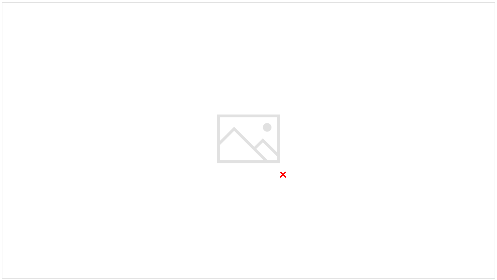

# 11. Derived Distributions

Created: 2018-06-29 22:39:33 +0500

Modified: 2021-10-04 23:28:36 +0500

---

{width="15.21875in" height="8.604166666666666in"}

1.  Derived distributions - how to find the distribution, that is the PMF or the PDF of a random variable that is defined as a function of other random variables known as distributions

2.  Covariance and correlation - which help us describe in easily quantifiable manner the strength of the relation between two dependent random variables

3.  Conditional expectation - Can be viewed as a special kind of random variable.

{width="15.21875in" height="8.604166666666666in"}

{width="15.21875in" height="8.604166666666666in"}

{width="15.21875in" height="8.604166666666666in"}

{width="15.21875in" height="8.604166666666666in"}

{width="15.21875in" height="8.604166666666666in"}

{width="15.21875in" height="8.604166666666666in"}

{width="15.21875in" height="8.604166666666666in"}

![Example: Y = X3; (7) = 1 ( M 47) _ X uniform on [O, 2] (x3s 7) (x y'/ 3) ](media/Intro---Syllabus_11.-Derived-Distributions-image9.png){width="15.21875in" height="8.604166666666666in"}

{width="15.21875in" height="8.604166666666666in"}

{width="15.21875in" height="8.604166666666666in"}

![Example: Y X 2; X uniform on [O, 1] fy (y) f x (y) dy ](media/Intro---Syllabus_11.-Derived-Distributions-image12.png){width="15.21875in" height="8.604166666666666in"}

![An intuitive explanation for the monotonic case dg slope [y, !J+ö2] fxcæ)Sl f, (z) oca ](media/Intro---Syllabus_11.-Derived-Distributions-image13.png){width="15.21875in" height="8.604166666666666in"}

{width="15.21875in" height="8.604166666666666in"}

{width="15.21875in" height="8.604166666666666in"}

**Joint Effects**

If you believe that your dependent variable is affected by interactions between independent variables, you can capture the cross effects by looking at products of the independent variables. Thus, if you are regression PE ratios against market cap and expected growth rates, you can do the following:

PE = a + b Growth Rate + c Mkt Cap + d (Growth Rate * Mkt Cap)

Derivative of a CDF is a PDF

Discrete Formula

Continuous Random Variable Formula

