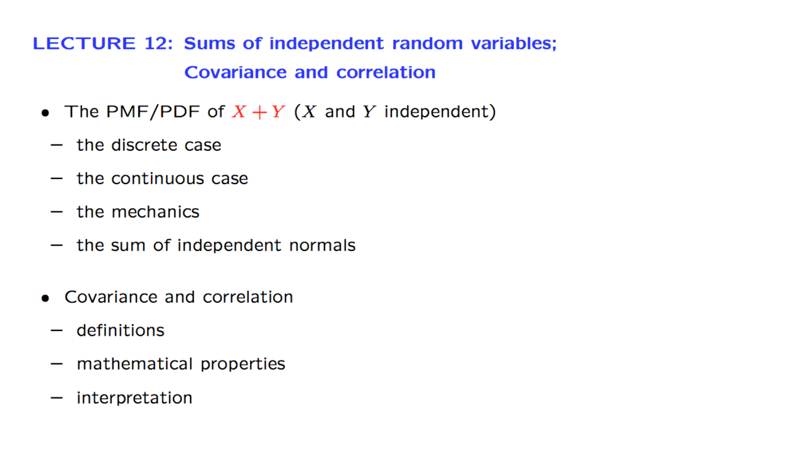

# 12. Sums of independent r.v.'s; Covariance and Correlation

Created: 2018-07-19 02:24:22 +0500

Modified: 2018-07-19 02:46:27 +0500

---

{width="8.572916666666666in" height="4.822916666666667in"}

{width="17.28125in" height="9.770833333333334in"}

{width="17.28125in" height="9.770833333333334in"}

{width="17.28125in" height="9.770833333333334in"}

{width="17.28125in" height="9.770833333333334in"}

![Covariance Zero-mean, discrete X and --- if independent: E[XY] = xy<O Definition for ge cov(x, Y) = E (X -E • independent (converse is not ti (0,1) ](media/Intro---Syllabus_12.-Sums-of-independent-r.v.'s;-Covariance-and-Correlation-image6.png){width="17.28125in" height="9.770833333333334in"}

Covariance in general tells us whether two random variables tend to move together, both being high or both being low, in some average or typical sense.
{width="17.28125in" height="9.770833333333334in"}

{width="17.28125in" height="9.770833333333334in"}

{width="17.28125in" height="9.770833333333334in"}

{width="17.28125in" height="9.770833333333334in"}

![Proof of key properties of the correlation coefficient p(x, Y) ax • Assume, for simplicity, zero means and unit variances, so that pY)2 --- ECK 2] -2 p + p 2 If Ipl = 1, then 92 X = Y ](media/Intro---Syllabus_12.-Sums-of-independent-r.v.'s;-Covariance-and-Correlation-image8.png){width="17.28125in" height="9.770833333333334in"}

{width="17.28125in" height="9.770833333333334in"}

{width="17.28125in" height="9.770833333333334in"}
