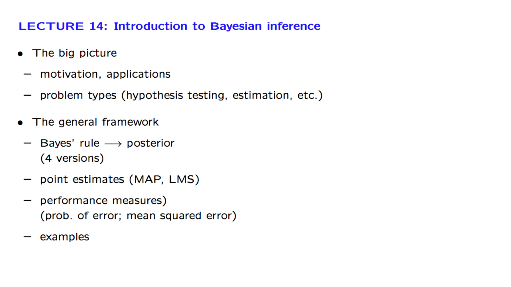
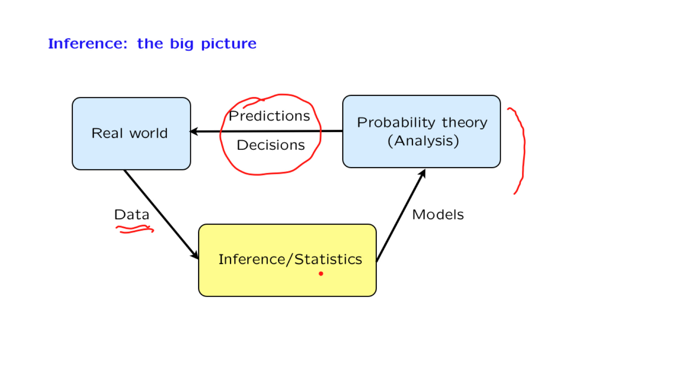
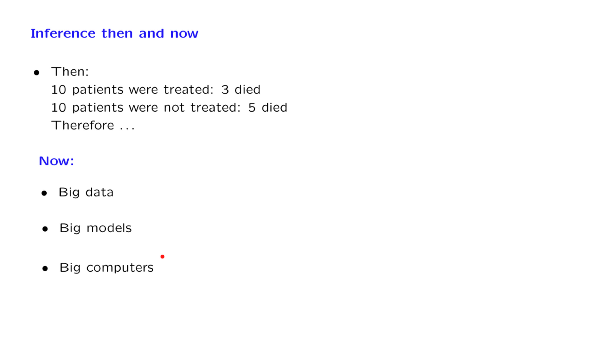
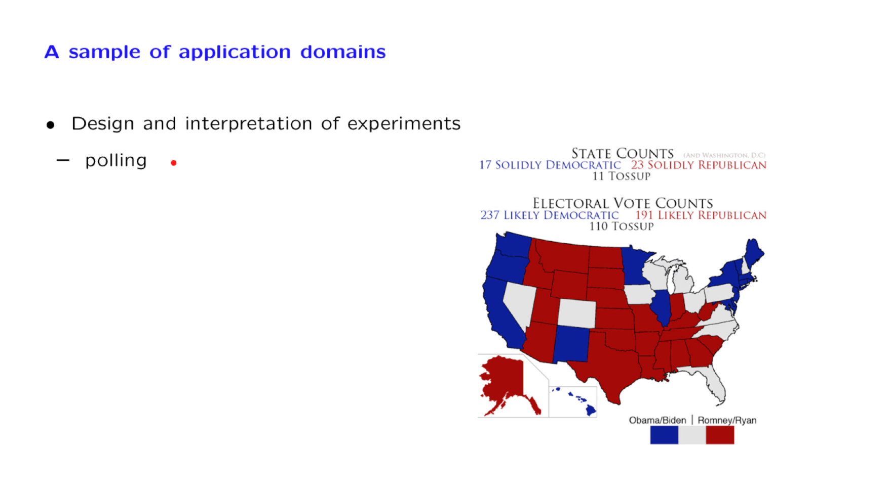
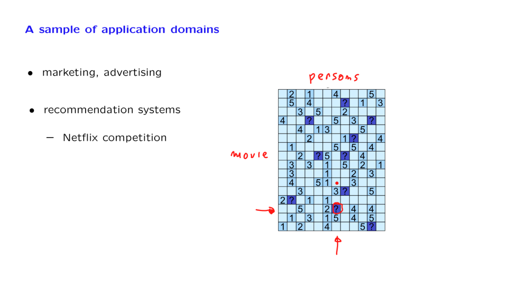
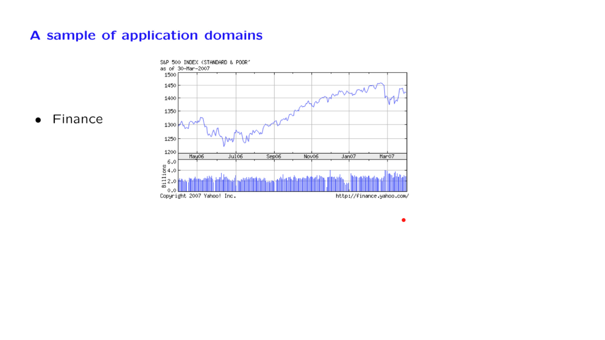
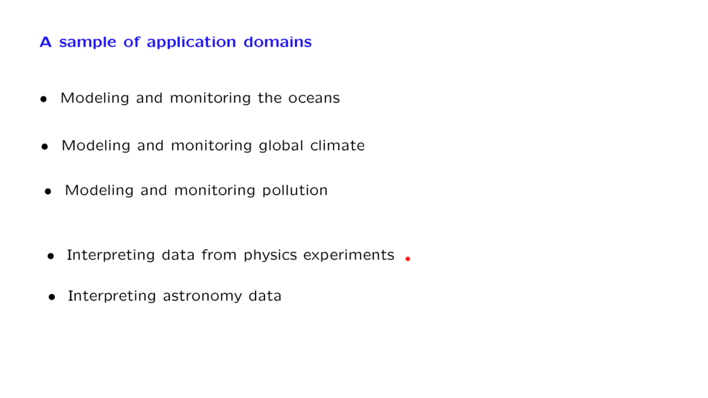
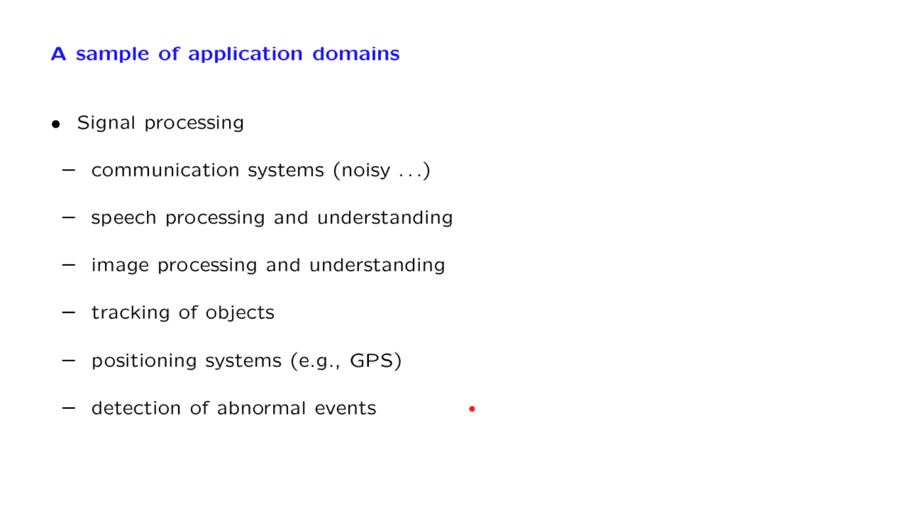

# 14. Intro to Bayesian Inference

Created: 2018-08-17 20:32:04 +0500

Modified: 2022-04-07 21:18:39 +0500

---

**The power of Bayesian statistics**
-   Outcome characterization - This is the distribution of things that happened
-   Latent factor analysis - These are the things affect your outcome
-   Decision making - Given all the potential outcomes here's the most optimal choice we should make today

<https://www.youtube.com/watch?v=pJH_2y9J9-I>
a.  We apply the Bayes rule to find the posterior distribution of an unknown random variable given one or multiple observations of related random variables.

b.  We discuss the most common methods for coming up with a point estimate of the unknown random variable (Maximum a Posteriori probability estimate, Least Mean Squares estimate, and Linear Least Mean Squares estimate).

c.  We consider the question of performance analysis, namely, the calculation of the probability of error in hypothesis testing problems or the calculation of the mean squared error in estimation problems.

d.  To illustrate the methodology, we pay special attention to a few canonical problems such as linear normal models and the problem of estimating the unknown bias of a coin.

![Inferring the unknown bias of a coin and the Beta distribut Standard example: --- coin with bias e; prior fe(•) fix n; K =number of heads Assume fe(.) is uniform in [O, 1] felK(0 1 k) 1 0 d(n, k) 01 k PFC k) "Beta 1 felK(0 1 k) = PK(k) = fe( distribution, with parameters (3 ](media/Intro---Syllabus_14.-Intro-to-Bayesian-Inference-image18.png)

![Inferring the unknown bias of a coin: Standard example: --- coin with bias e; prior fe(•) fix n; K =number of heads Assume fe(.) is uniform in [O, 1] 1 Ok (1 --- O) feuc(0 1 k) d(n, k) MAP estimate: 0M A p = point estimates 0 ](media/Intro---Syllabus_14.-Intro-to-Bayesian-Inference-image19.png)

[Bayes theorem, and making probability intuitive](https://www.youtube.com/watch?v=HZGCoVF3YvM)-   Bayes' theorem describe the probability of an event occurring, based upon prior knowledge of other variables related to that event
    -   In effect, it is a conditional probability, with the probability of an event conditioned on the information/knowledge you have
    -   Since the information/knowledge that different individuals can have about an event can vary, Bayes' thorem allows for differences in probability estimates for the same event across individuals
-   In Bayesian Inference, you update the probability of an event happening as you receive new evidence or information
    -   The probability that you assign to an event before you receive the new information represent your priors
    -   The probability that you assign to that same event after receiving and processing new information represent your posterior estimate

