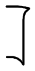

# 3. Independence

Created: 2018-06-03 18:16:38 +0500

Modified: 2018-06-05 01:24:30 +0500

---

Introduces the concepts of independence of two events, independence of multiple events, and pairwise independence, together with examples related to coin tossing and system reliability.

In the above example, the probability of the first coin toss didn't effect the probabilities what might happen in the second coin toss. This is called independence.

In the above set example, the two disjoint sets A and B are dependent on each other, because if A occured than we are sure that B doesn't occurred and vice-versa.

In the last image, if C occurred, then A and B are disjoint, therefore we know that if A occurred after C than B definitely didn't occur and vice-versa. Therefore A and B are not independent.

Both are disjoint, therefore using additivity axiom

