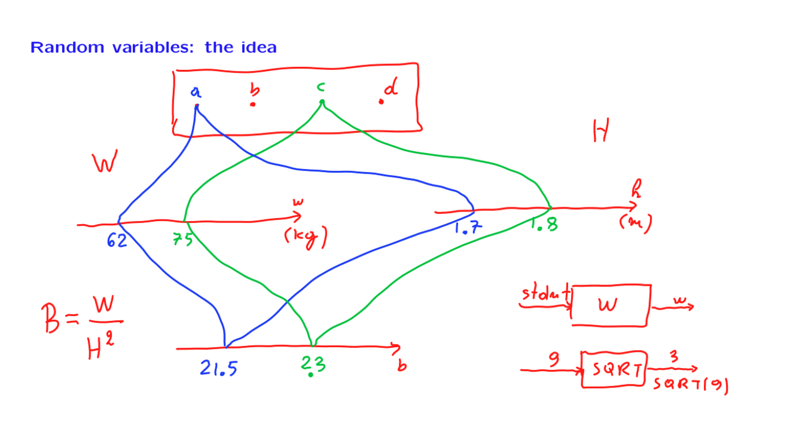
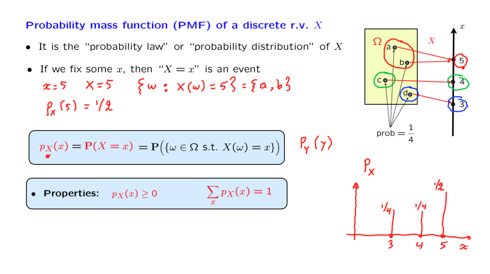

# 5. Probability Mass Functions and Expectations

Created: 2018-06-09 14:45:43 +0500

Modified: 2018-06-13 23:39:51 +0500

---

{width="5.979166666666667in" height="3.3541666666666665in"}

{width="5.979166666666667in" height="3.3541666666666665in"}

{width="5.979166666666667in" height="3.3541666666666665in"}

{width="5.979166666666667in" height="3.3541666666666665in"}

{width="12.09375in" height="6.84375in"}
A random variable that takes a value of 0 or 1, with certain probabilities. Such a probability is called a Bernoulli random variable.

{width="12.09375in" height="6.84375in"}
Some useful random variable -

1.  Discrete uniform random variable

It takes a value in a certain range, and each one of the values in that range has the same probability

2.  Binomial random variable

3.  Geometric random variable
{width="12.09375in" height="6.84375in"}

{width="12.09375in" height="6.84375in"}

{width="12.09375in" height="6.84375in"}

{width="12.09375in" height="6.84375in"}

In the above experiment where P(no heads ever) is extremely unlikely since (1-p)^k^ tends to 0 for k tends to infiinity.
Mean of a random variable is a single number that provides some kind of summary of a random variable by telling us what it is on the average

![Expectation/ mean of a random variable Motivation: Play a game 1000 times. Random gain at each play described by: "Average" gain: ) * 2004 2.5004 9-300 1000 1, 2, 4, w.p. z w.p. w.p. 2.110 • 10 Definition: E[x] 10 ¯ XPx(X) Interpretation: of independent repetiti ](media/Intro---Syllabus_5.-Probability-Mass-Functions-and-Expectations-image11.png){width="12.09375in" height="6.84375in"}
{width="12.09375in" height="6.84375in"}

{width="12.09375in" height="6.84375in"}

Whenever we have a PMF which is symmetric around a certain point, then the expected value will be the center of symmetry.
{width="12.09375in" height="6.84375in"}

![Elementary properties of expectations If X 0, then E[x] 2 0 for w: If a < x < b, Soc w: a E[x] then Definition: -Q > px(æ) ](media/Intro---Syllabus_5.-Probability-Mass-Functions-and-Expectations-image15.png){width="12.09375in" height="6.84375in"}
-   If X >= 0, then E[X] >= 0. If a random variable is non-negative, it's expected value is non-negative
-   Expectation has a linearity property
![The expected value rule, for calculating E[g(X)] • Let X be a r.v. and let Y = g(X) • Averaging over y: E[Y] = 3, (0.1+0.2) + q prob 3-0.) q •0.5 Averaging over Proof: E[x2] 0.4 0.3 0.2 0.1 2, ](media/Intro---Syllabus_5.-Probability-Mass-Functions-and-Expectations-image16.png){width="12.09375in" height="6.84375in"}

![Linearity of expectation: E[aX + b] = aE[X] + b aver Q oje SQ Q '7 +100 Intuitive • Derivation, based on the expected value rule: ELY | 2 cc) ](media/Intro---Syllabus_5.-Probability-Mass-Functions-and-Expectations-image17.png){width="12.09375in" height="6.84375in"}

{width="0.23958333333333334in" height="0.4583333333333333in"}{width="0.3229166666666667in" height="0.3229166666666667in"}{width="0.3020833333333333in" height="0.2708333333333333in"}

No reason to believe that one value

is more likely than the other
PMF notation instead of simple probability notation