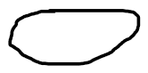

# 8. Probability density functions

Created: 2018-06-27 00:41:39 +0500

Modified: 2018-06-27 02:11:47 +0500

---

{width="12.09375in" height="9.375in"}

{width="12.09375in" height="6.84375in"}

{width="12.09375in" height="6.84375in"}

PDF's are not probabilities, they are densities. Their unit is *probability per unit length*

{width="12.09375in" height="6.84375in"}

{width="12.09375in" height="6.84375in"}

{width="12.09375in" height="6.84375in"}

![Properties of expectations then E[X] 0 a E[x] then Expected value rule: (x)dx ](media/Intro---Syllabus_8.-Probability-density-functions-image7.png){width="12.09375in" height="6.84375in"}

![Variance and its properties var(X) - „)2] • Definition of variance: Calculation using the expected value rule, = var(X) --- Standard deviation: OX = var(aX + b) a2var(X) var(X) ](media/Intro---Syllabus_8.-Probability-density-functions-image8.png){width="12.09375in" height="6.84375in"}

![Continuous uniform random variable; fx@) 1 a :rfx (x) dx b . oltX 22.--1---- - E[x21 --- 1 parameters a, b E[x] 2 3 var(X) 1 12 ](media/Intro---Syllabus_8.-Probability-density-functions-image9.png){width="12.09375in" height="6.84375in"}

IMP, used for many real world applications

{width="12.09375in" height="6.84375in"}

{width="12.09375in" height="6.84375in"}

{width="12.09375in" height="6.84375in"}

{width="12.09375in" height="6.84375in"}

{width="12.09375in" height="6.84375in"}

{width="12.09375in" height="6.84375in"}

{width="12.09375in" height="6.84375in"}

![Linear functions of a normal random variable X 02) Let ELY] = + b Fact (will prove later in this course): Special ca ](media/Intro---Syllabus_8.-Probability-density-functions-image17.png){width="12.09375in" height="6.84375in"}

![Standard normal tables No closed form available for CDF but have tables, for the standard normal 9 ( ) C) (2.9) ( 0.0 0.1 0.2 0.3 0.4 0.5 0.6 0.7 0.8 0.9 1.0 1.1 1.2 1.3 1.5 1.6 1.7 1.8 1.9 2.0 2.1 2.2 .00 300 .5398 .5793 .6179 .6554 .6915 47257 .7580 .7881 .8159 .8643 .8849 49032 .9192 49332 .9452 , 9554 49641 .9713 .9772 S .9861 .01 .5040 .5438 .5832 -6217 .6591 .6950 .7291 .7611 .7910 .8186 .8438 .8665 .8869 -9049 .9207 .9345 -9463 .9564 -9649 -9719 .9778 -9826 -9864 .02 -5080 .5478 .5871 -6255 -6628 .6985 .7324 .7642 .7939 -8212 .8461 .8686 .8888 -9066 .9222 -9357 -9474 .9573 , 9656 -9726 .9783 -9830 -9868 .03 -5120 .5517 .5910 .6293 .6664 .7019 .7357 .7673 .7967 .8238 .8485 .8708 .8907 .9082 .9236 .9370 .9484 .9582 .9664 .9732 .9788 -9834 .9871 -5160 .5557 .5948 .6331 .6700 .7054 -7389 .7704 .7995 .8264 .8508 .8729 .8925 .9251 -9382 -9495 .9591 .9671 -9738 .9793 -9838 .9875 ](media/Intro---Syllabus_8.-Probability-density-functions-image18.png){width="12.09375in" height="6.84375in"}

![Standardizing a random variable • • Let X have mean and variance > O Let ELY] o VQQ (y) - ](media/Intro---Syllabus_8.-Probability-density-functions-image19.png){width="12.09375in" height="6.84375in"}

![Calculating normal probabilities Express an event of interest in terms of standard normal 2 2 o.o o.l 0.2 0.3 0.4 0.5 0.6 0.7 0.8 0.9 l.o 1.1 1.2 1.3 1.5 1.6 1.7 1.8 1.9 2.0 2.1 2.2 .oo .3000 .5398 .3793 .6179 .6534 .6915 .7237 .75S0 .78S1 .S 39 .sn:g .S(i43 .9032 .9192 .9332 .9432 ,9534 „9641 .9713 .9772 .9861 .01 .5040 .5438 .5832 .6217 .6591 .6950 .7291 .7611 .7910 .SIS6 -8438 -8665 .9049 .9207 .9345 .9463 .9564 .9649 .9719 .9778 .9826 .9864 .02 .5080 .5478 .5871 .6255 .6628 .6985 .7324 .7642 .7939 „8212 .8461 .8686 .8888 .9066 .9222 .9337 .9474 .9573 .9656 .9726 .9783 .9830 .9868 .03 .3120 .5517 .5910 .6293 .6664 .7019 .7357 .7673 .7967 .S238 .8485 .8708 .S907 .9082 .9236 .9370 .9484 .9582 .9664 .9732 .9788 .9834 .9871 .5160 .5557 .5948 .6331 .6700 .7054 .7389 .7704 .7995 .8264 .8508 .8729 .8925 .9251 .9382 .9495 .9591 .9671 .9738 .9793 .9838 .9875 ](media/Intro---Syllabus_8.-Probability-density-functions-image20.png){width="12.09375in" height="6.84375in"}

Key step is to take the event of interest and by subtracting the mean and dividing by the standard deviation express the same event in an equivalent form, but which now involves a standard normal random variable. And then we can finally use the standard normal tables.

{width="1.7291666666666667in" height="0.8541666666666666in"}

**0**

This formula tells us that if we have the CDF, we can calculate the PDF and vice-versa

Special degenerate discrete random variable

