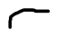

# 9. Conditioning on an event; Multiple continuous r.v.'s

Created: 2018-06-27 00:42:03 +0500

Modified: 2018-07-19 01:13:41 +0500

---

![Conditional expectation Expected value rule: of X, given an event E[X] Ixfx(x) dx xfxIA(x) clx E[g(X)] dx ](media/Intro---Syllabus_9.-Conditioning-on-an-event;-Multiple-continuous-r.v.'s-image4.png)

Used light bulb does not remember and it is not affected by how long it has been running. And this is the memorylessness property of exponential random variables.

![Mixed distributions uniform on [O, 2], 1, Y discrete Z continuous with probability 1/2 with probability 1/2 Y, with probability p Z, with probability 1 ---p + (1-12) F? (z) Is X discrete Is X continu X is ](media/Intro---Syllabus_9.-Conditioning-on-an-event;-Multiple-continuous-r.v.'s-image10.png)

![Mixed distributions uniform on [O, 2], 1, 1 2 with probability 1/2 4 with probability 1/2 A Fx(x) + Fx(x) 112 ](media/Intro---Syllabus_9.-Conditioning-on-an-event;-Multiple-continuous-r.v.'s-image11.png)

![Functions of multiple random variables Expected value rule: Y)] E Ego, y) Linearity of expectations Efx + Yl Efxl + EfYl lg(x, y)) E[ax + b] aE[X] + b ](media/Intro---Syllabus_9.-Conditioning-on-an-event;-Multiple-continuous-r.v.'s-image18.png)

Green PDF is the form of a conditional PDF

Total area under green curve is 1.
Here Conditional probability of event X occuring in a conditional universe where A occurred is 0, since event A and x are disjoint (x lies outside A)

Case when x lies outside A

Case when x lies inside A
Sums become integrals, and PMFs are replaced by PDFs
