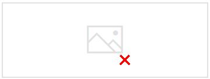
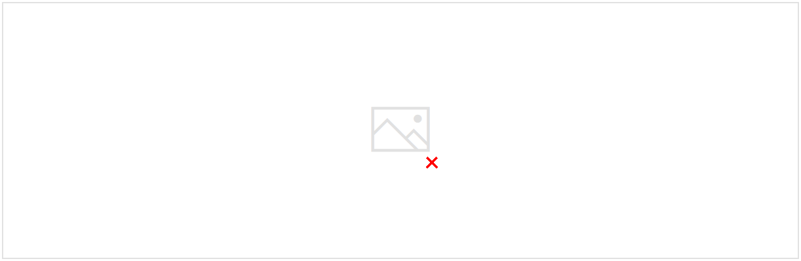

# Additional Theoretical Material

Created: 2018-06-26 23:35:45 +0500

Modified: 2018-06-27 00:38:25 +0500

---

# Functions

{width="12.947916666666666in" height="7.333333333333333in"}
-   Every element of A is mapped to exactly one element of B, not more.
-   It is possible that some elements of B, do not correspond to any elements of A

{width="12.947916666666666in" height="7.333333333333333in"}

# The Variance of the geometric PMF

**The variance of the geometric PMF.**IfXis a geometric random variable with parameterp>0, show that

{width="3.75in" height="1.4166666666666667in"}

![The variance of the geometric PMF X: geometric with parameter p Given X > 1, X --- 1 has the same geometric PMF (unconditional PMF of X) Given X > 1, conditional PMF of X: same as uncondtional PMF of X + 1 pod +0 -p) ( cc 72] var(X) = 2 P ](media/Intro---Syllabus_Additional-Theoretical-Material-image4.png){width="12.84375in" height="7.104166666666667in"}

The way to think about X is the number of coin flips that it takes until we obtain heads for the first time, where p is the probability of heads at each toss.

Memorylessness property - If I tell you that X is bigger than 1 which means that the first trial was a failure (we obtained tails). Given that event, the remaining number of tosses has the same geometric PMF as if we were just starting at this time. So it has the same geometric PMF as the unconditional PMF of X.

Variance of a random variable is equal to the expected value of the square of that random variable minus the square of the expected value

# The inclusion-exclusion formula

{width="12.75in" height="4.166666666666667in"}

{width="12.947916666666666in" height="7.333333333333333in"}

{width="12.947916666666666in" height="7.333333333333333in"}

# 

# Independence of random variable vs independence of events

LetAandBbe two events, and letIAandIBbe the associated indicator variables. Show that eventsAandBare independent if and only if the random variablesIAandIBare independent.

{width="12.96875in" height="7.052083333333333in"}

**Meaning of Independence of two events -** The probability of their intersection is the product of their individual probabilities

This should not be used, *the function f* should be called, because *the function f(x)* is a number that is the output of *the function f*

Memorylessness property

Using Demorgan's law on above function

