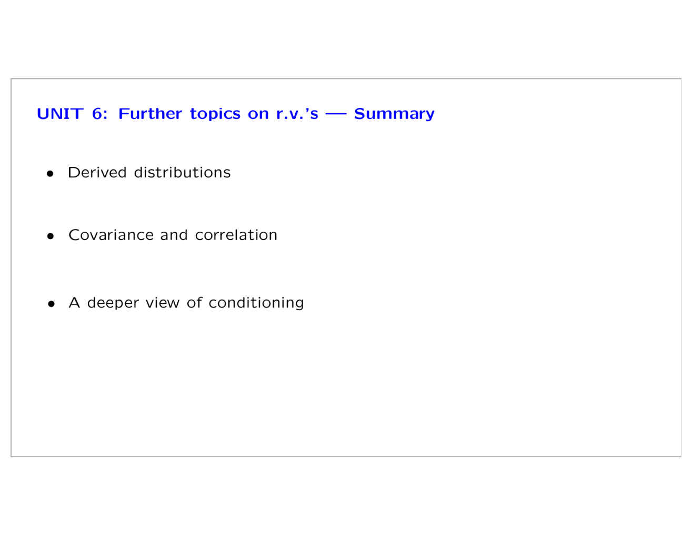
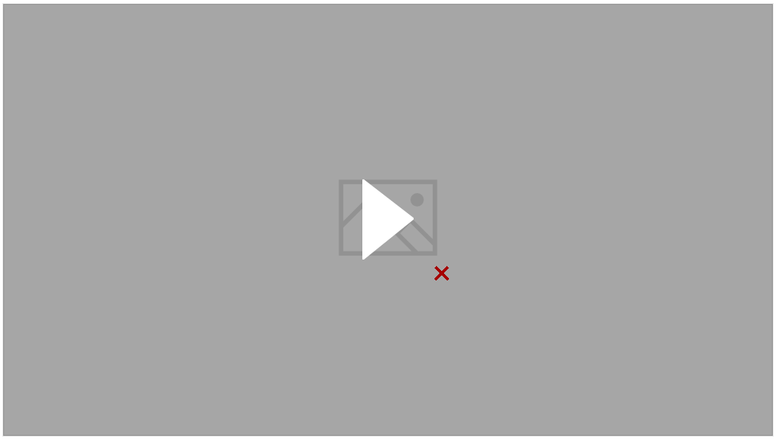

# Summary - Unit 6

Created: 2018-08-17 20:26:07 +0500

Modified: 2018-08-17 20:26:59 +0500

---

{width="5.979166666666667in" height="4.614583333333333in"}

{width="12.09375in" height="9.375in"}

![UNIT 6: Further topics on r.v.'s --- Summary Covariance and correlation cov(x, Y) = E (X - E[x]) • (Y - E[Y]) p(x, Y) --- Ipl linearity properties used to find var(X1 + ](media/Intro---Syllabus_Summary---Unit-6-image3.png){width="12.09375in" height="9.375in"}

![UNIT 6: Further topics on r.v.'s --- Summary • A deeper view of conditioning ly], var(x ly) as random variables Law of iterated expectations: E E[X I Y]] = E[X] Law of total variance: var(X) I Y)) + I • Sum of a random number of independent r.v.'s: E[Y] = ELN] • E[x] var(Y) = E[N] var(X) + var(N) ](media/Intro---Syllabus_Summary---Unit-6-image4.png){width="12.09375in" height="9.375in"}**References**

[MIT6041XT114-US0601_100](https://www.youtube.com/watch?v=-hVAAv2khAs)
{width="10.083333333333334in" height="5.708333333333333in"}