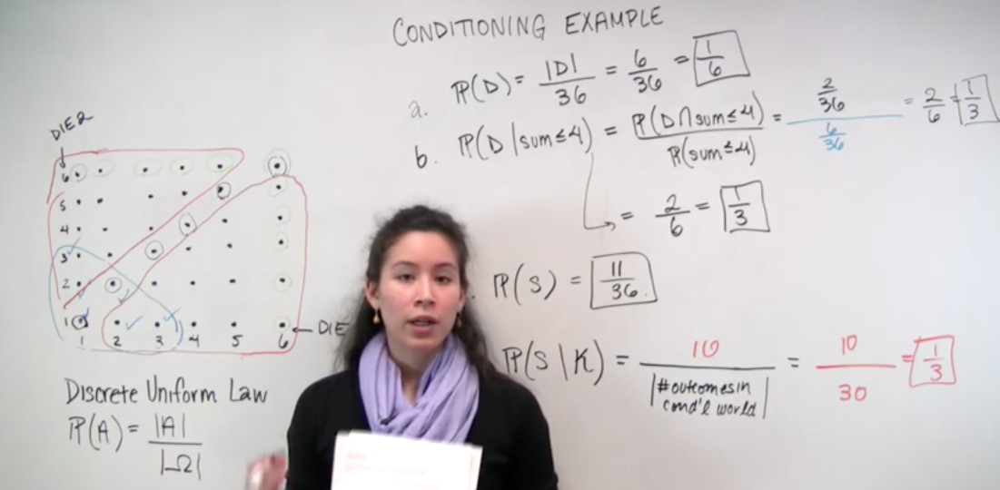
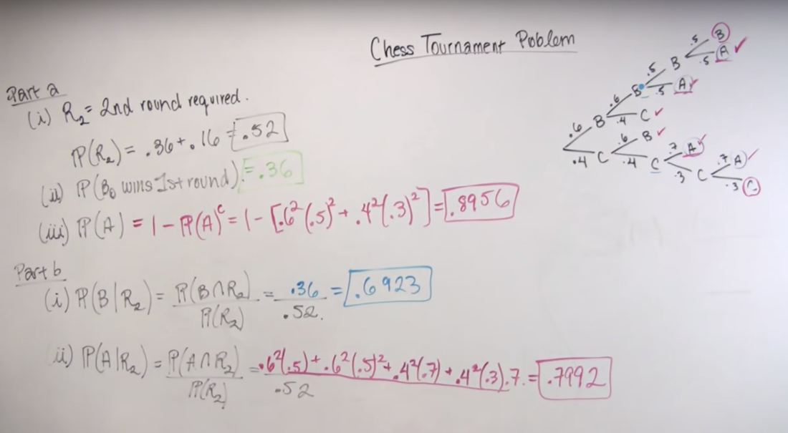
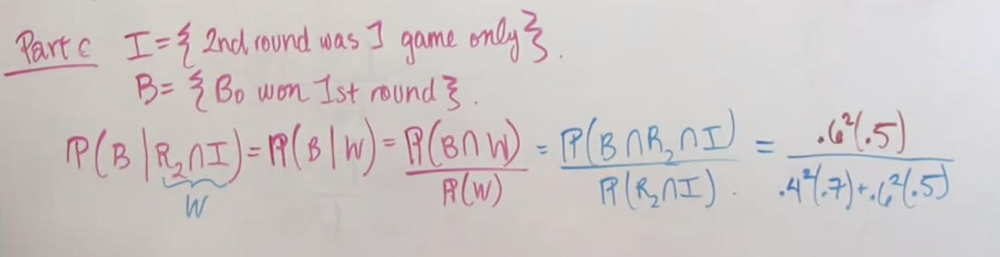

# Unit 2 - Solved Problems

Created: 2018-06-05 01:37:56 +0500

Modified: 2018-06-06 00:26:42 +0500

---

# Conditional probability example

We roll two fair 6-sided dice. Each one of the 36 possible outcomes is assumed to be equally likely.

(a) Find the probability that doubles are rolled (i.e., both dice have the same number).

(b) Given that the roll results in a sum of 4 or less, find the conditional probability that doubles are rolled.

(c) Find the probability that at least one die roll is a 6.

(d) Given that the two dice land on different numbers, find the conditional probability that at least one die roll is a 6.

{width="5.0in" height="2.4583333333333335in"}

# A chess tournament problem

This year's Belmont chess champion is to be selected by the following procedure. Bo and Ci, the leading challengers, first play a two-game match. If one of them wins both games, he gets to play a two-game*second round*with Al, the current champion. Al retains his championship unless a second round is required and the challenger beats Al in both games. If Al wins the initial game of the second round, no more games are played.

Furthermore, we know the following:

∙The probability that Bo will beat Ci in any particular game is 0.6.

∙The probability that Al will beat Bo in any particular game is 0.5.

∙The probability that Al will beat Ci in any particular game is 0.7.

Assume no tie games are possible and all games are independent.

1. Determine the a priori probabilities that

(a) the second round will be required.

(b) Bo will win the first round.

(c) Al will retain his championship this year.

2. Given that the second round is required, determine the conditional probabilities that

(a) Bo is the surviving challenger.

(b) Al retains his championship.

3. Given that the second round was required and that it comprised only one game, what is the conditional probability that it was Bo who won the first round?

{width="5.0in" height="2.75in"}

{width="5.0in" height="1.2916666666666667in"}

# A coin tossing puzzle

A coin is tossed twice. Alice claims that the event of getting two Heads is at least as likely if we know that the first toss is Heads than if we know that at least one of the tosses is Heads. Is she right? Does it make a difference if the coin is fair or unfair? How can we generalize Alice's reasoning?

{width="10.083333333333334in" height="4.989583333333333in"}

Solution - We can see that Alice claim is true without ever considering the probability of Head if it is biased or not.

Also P ( A intersection B | A ) = 1/2 and P ( A intersection B | A U B ) = 1/3, for a fair coin, where

A = 1st toss is head and B = 2nd toss is head

{width="10.083333333333334in" height="5.552083333333333in"}

# The Monty Hall problem

This is a much discussed puzzle, based on an old American game show. You are told that a prize is equally likely to be found behind any one of three closed doors in front of you. You point to one of the doors. A friend opens for you one of the remaining two doors, after making sure that the prize is not behind it. At this point, you can stick to your initial choice, or switch to the other unopened door. You win the prize if it lies behind your final choice of a door. Consider the following strategies:
-   Stick to your initial choice.
-   **Switch to the other unopened door.**
-   You first point to door 1. If door 2 is opened, you do not switch. If door 3 is opened, you switch.

Which is the best strategy?

{width="10.083333333333334in" height="4.854166666666667in"}

# A random walker

Imagine a drunk tightrope walker, who manages to keep his balance, but takes a step forward with probabilitypand takes a step back with probability(1−p).

(a) What is the probability that after two steps, the tightrope walker will be at the same place on the rope as where he started?

(b) What is the probability that after three steps, the tightrope walker will be one step forward from where he started?

(c) Given that after three steps he has managed to move ahead one step, what is the probability that the first step he took was a step forward?

{width="10.083333333333334in" height="5.083333333333333in"}

{width="10.083333333333334in" height="7.770833333333333in"}

# Communication over a noisy channel

A source transmits a message (a string of symbols) over a noisy communication channel. Each symbol is0or1with probabilitypand1−p, respectively, and is received incorrectly with probabilityϵ0andϵ1, respectively (see the figure below). Errors in different symbol transmissions are independent.

{width="8.416666666666666in" height="3.6770833333333335in"}

(a) What is the probability that thekth symbol is received correctly?

(b) What is the probability that the string of symbols1011is received correctly?

(c) In an effort to improve reliability, each symbol is transmitted three times and the received string is decoded by majority rule. In other words, a0(or1) is transmitted as000(or111, respectively), and it is decoded at the receiver as a0(or1) if and only if the received three-symbol string contains at least two0's (or1's, respectively). What is the probability that a0is correctly decoded?

(d) For what values ofϵ0is there an improvement in the probability of correct decoding of a0when the scheme of part (c) is used?

(e) Suppose that the scheme of part (c) is used. What is the probability that a symbol was0given that the received string is101?

{width="11.90625in" height="6.84375in"}

# Network reliability

An electrical system consists of identical components, each of which is operational with probabilityp, independent of other components. The components are connected in three subsystems, as shown in the figure. The system is operational if there is a path that starts at pointA, ends at pointB, and consists of operational components. What is the probability of this happening?

{width="8.416666666666666in" height="2.7395833333333335in"}

{width="10.083333333333334in" height="6.375in"}

{width="10.083333333333334in" height="4.208333333333333in"}

{width="12.104166666666666in" height="6.864583333333333in"}

{width="10.083333333333334in" height="1.21875in"}

