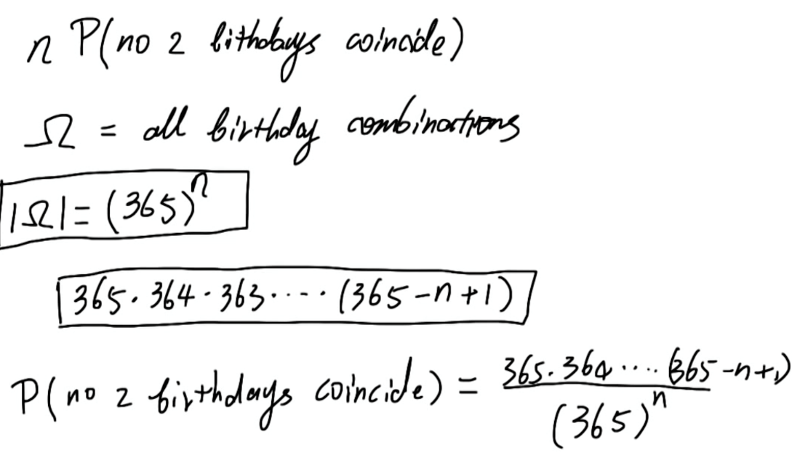
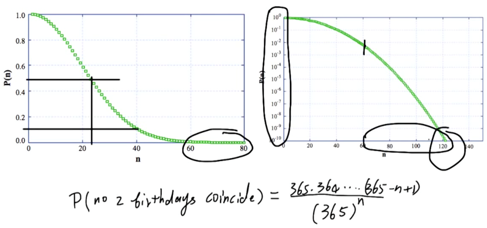
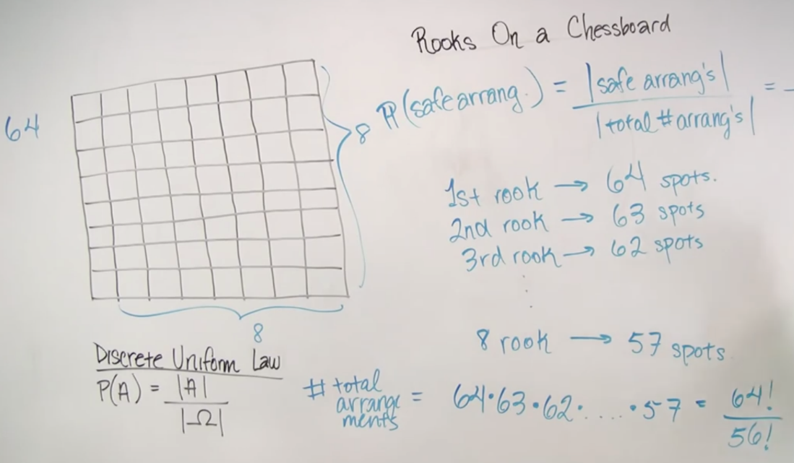
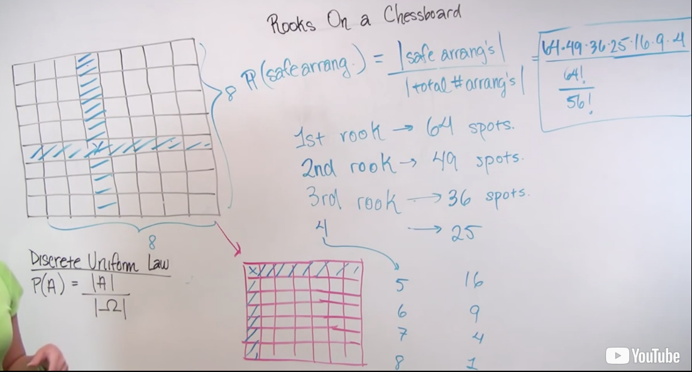

# Unit 3 - Solved Problems

Created: 2018-06-09 13:28:06 +0500

Modified: 2018-06-09 14:38:22 +0500

---

# The birthday problem

Considernpeople who are attending a party. We assume that every person has an equal probability of being born on any day during the year, independently of everyone else, and ignore the additional complication presented by leap years (i.e., nobody is born on February 29). What is the probability that each person has a distinct birthday?
{width="5.0in" height="2.8854166666666665in"}
{width="5.0in" height="2.34375in"}
# Rooks on a chessboard

Eight rooks are placed in distinct squares of an8×8chessboard, with all possible placements being equally likely. Find the probability that all the rooks are safe from one another, i.e., that there is no row or column with more than one rook.
{width="5.0in" height="2.9166666666666665in"}
{width="5.0in" height="2.6979166666666665in"}
1.  Counting Principle

2.  Discrete Uniform Law
# Hypergeometric probabilities

An urn containsnballs, out of which exactlymare red. We selectkof the balls at random, without replacement (i.e., selected balls are not put back into the urn before the next selection). What is the probability thatiof the selected balls are red?
{width="10.083333333333334in" height="4.3125in"}
{width="10.083333333333334in" height="6.364583333333333in"}
# Multinomial probabilities

An urn contains balls ofrdifferent colors. We drawnballs, with different draws being independent. For any given draw, there is a probabilitypi,i=1,...,r, of getting a ball of colori. Here, thepi's are nonnegative numbers that sum to 1.

(For such independence to be possible, you may think of an urn that has infinitely many balls, so that removing one does not change the probabilitiespi, or you can think about drawing "with replacement": the chosen ball is put back into the urn before the next draw.)

Letn1,...,nrbe nonnegative integers that sum ton. What is the probability that we obtain exactlyniballs of colori, for eachi=1,...,r?
{width="10.083333333333334in" height="5.239583333333333in"}

This is the multinomial probability for the special case where we are dealing with two colors.
{width="10.083333333333334in" height="5.489583333333333in"}