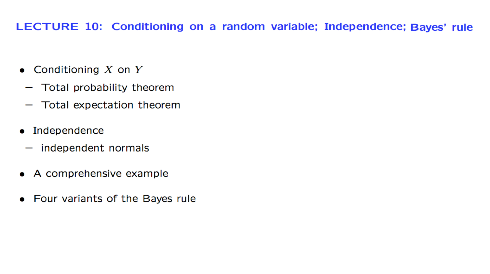
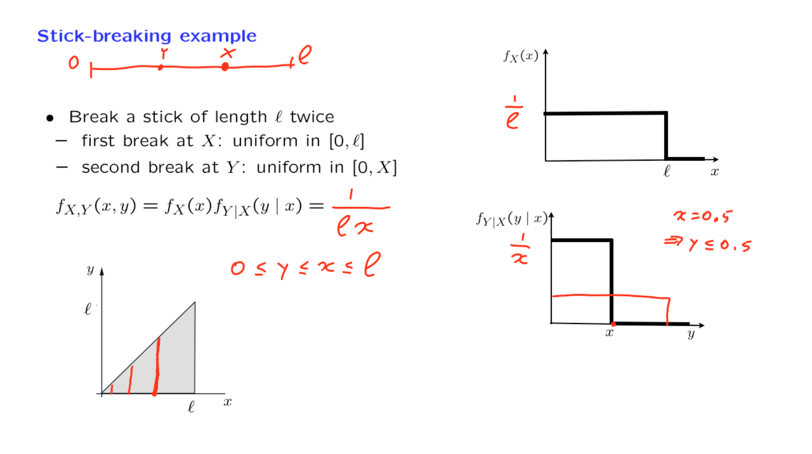
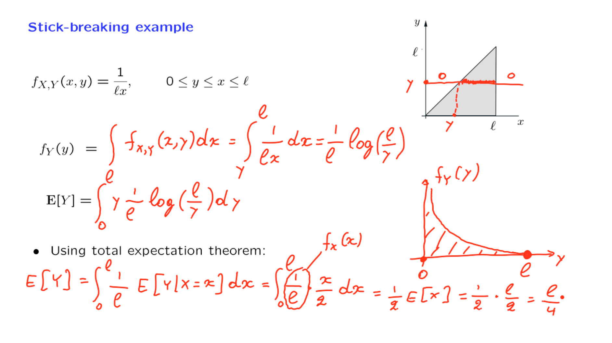
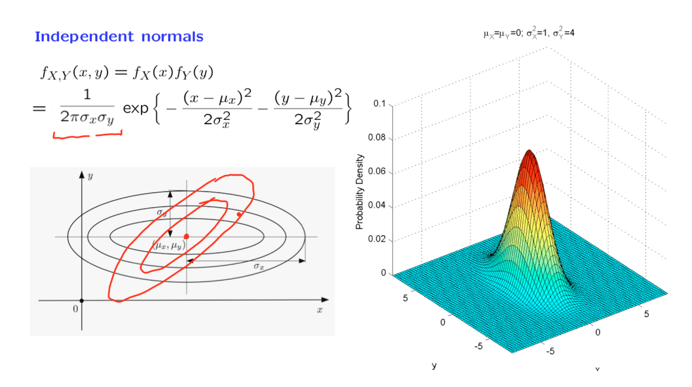
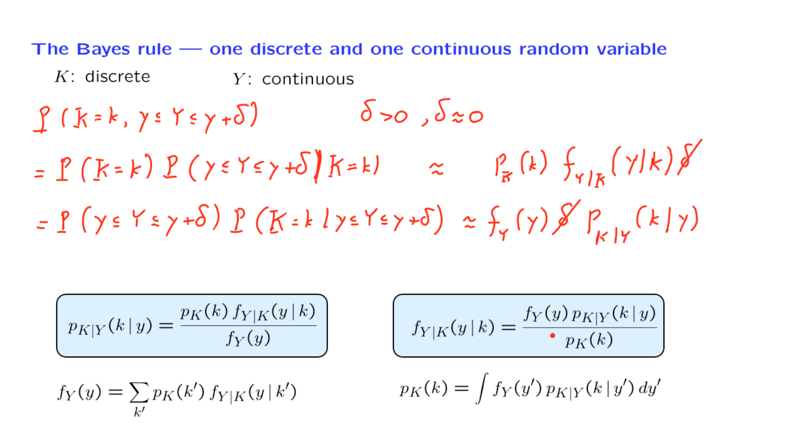
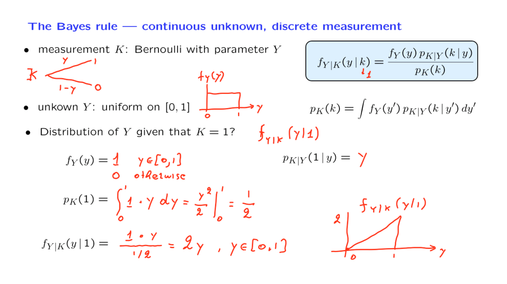

# 10. Conditioning on a random variable; Independence; Bayes' rule

Created: 2018-06-27 00:42:16 +0500

Modified: 2018-06-29 22:11:16 +0500

---

By analogy with the discrete case, we will say that two jointly continuous random variables are independent if the joint PDF is equal to the product of the marginal PDFs

Intuition - If we break a stick once, the expected value or what we're left with is half of what we started with. But if we break it once more, then we expect it on the average to be cut by a factor again of 1/2. And so we expect to be left with a stick that has length 1/4 of what we started with.

To conclude, the joint PDF of two independent normals has the shape of a bell. The center of the bell is determined by the means. Furthermore, the bell is stretched in the x and y directions by an amount that is determined by the variances of x and y. However, the stretching is always along the coordinate axes.

If you wanted a bell that stretches in some diagonal direction, or if you have contours that are ellipses but with some different kind of axes, then you will have dependence between the two random variables. In that case, we will be dealing with a so-called bivariate normal distribution.

The joint PMF

The Conditional PMF given an event

Conditional PMF of one random variable given another
Joint PDF of X and Y
