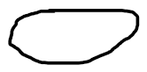

# 8. Probability density functions

---

PDF's are not probabilities, they are densities. Their unit is *probability per unit length*

IMP, used for many real world applications

Key step is to take the event of interest and by subtracting the mean and dividing by the standard deviation express the same event in an equivalent form, but which now involves a standard normal random variable. And then we can finally use the standard normal tables.

## 0

This formula tells us that if we have the CDF, we can calculate the PDF and vice-versa
Special degenerate discrete random variable
