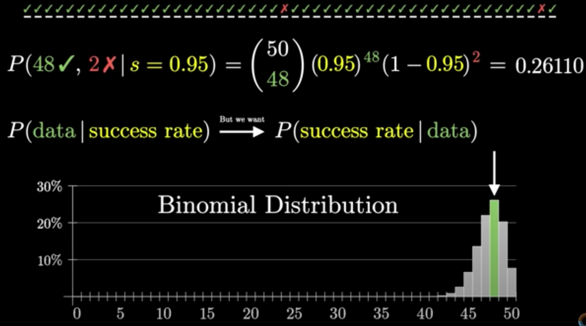
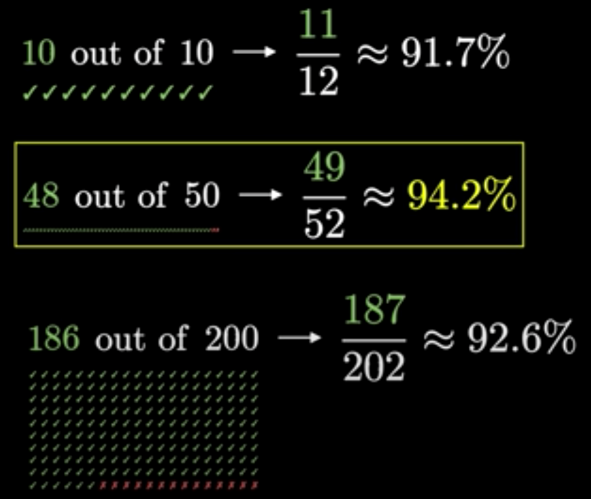
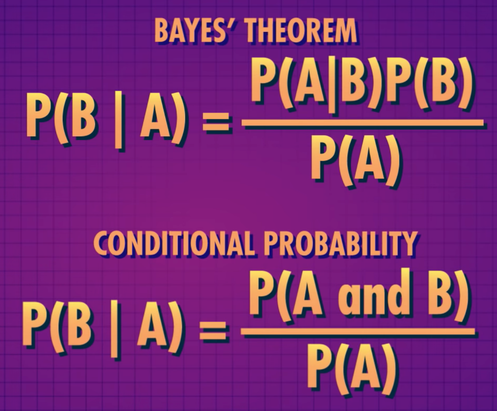
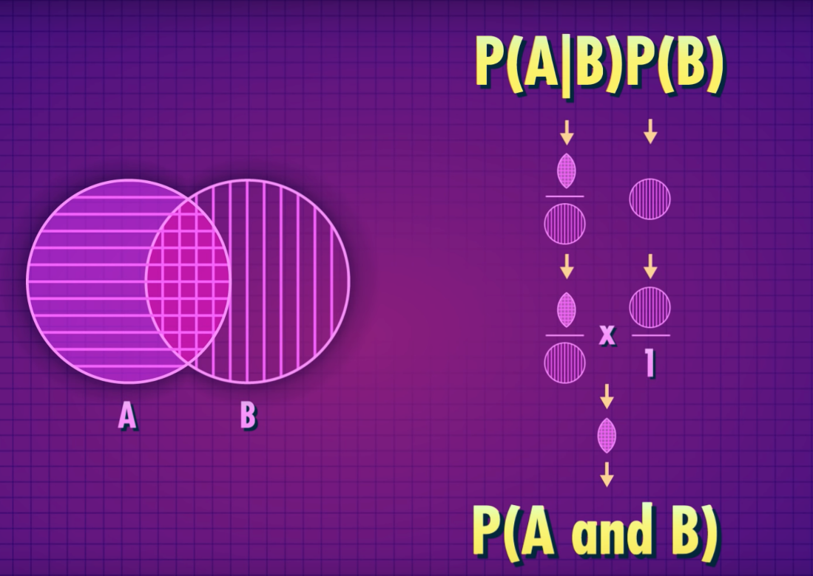

# Intro

Created: 2018-08-06 16:05:35 +0500

Modified: 2021-10-24 18:17:43 +0500

---

## Two types of probability

1. Empirical probability

Something we observer in actual data

2. Theoratical probability

More of an ideal or truth out there that we can't directly see-  Binomial distributions

-  Bayesian updating

- Probability density functions
- Beta distribution

## Laplace's rule of succession

To any count add 1 positive and 1 negative number and calculate the new probability.

Ex - Amazon reviews

Ex - 2 defects found in a test of 100 cars. What is the probability of getting a defect? (2% ?)
In [probability theory](https://en.wikipedia.org/wiki/Probability_theory), therule of successionis a formula introduced in the 18th century by [Pierre-Simon Laplace](https://en.wikipedia.org/wiki/Pierre-Simon_Laplace) in the course of treating the [sunrise problem](https://en.wikipedia.org/wiki/Sunrise_problem).
The formula is still used, particularly to estimate underlying probabilities when there are few observations, or for events that have not been observed to occur at all in (finite) sample data. Assigning events a [zero probability](https://en.wikipedia.org/wiki/Zero_probability) contravenes [Cromwell's rule](https://en.wikipedia.org/wiki/Cromwell%27s_rule); such contravention can never be strictly justified in physical situations, albeit sometimes must be assumed in practice.
<https://en.wikipedia.org/wiki/Rule_of_succession>

## Probability part 1 - Rules and Patterns**

- Pareidolia - A product of our brains that causes us to see the pattern of a face in a non-face objects

- Empirical probability

- Theoratical probability

- Conditional probability

## Probability part 2 - Updating your beliefs with Bayes

- Naive bayes filters

-  Bayesian Statistics

- Simulation
- Law of large numbers (applies to almost any distribution as long as the distribution doesn't have an infinite variance)

## Geometric Distributions and The Birthday Paradox

- Geometric probability formula

- Geometric distribution

- Cumulative geometric distribution
[Binomial distributions | Probabilities of probabilities, part 1](https://www.youtube.com/watch?v=8idr1WZ1A7Q)

[Why "probability of 0" does not mean "impossible" | Probabilities of probabilities, part 2](https://www.youtube.com/watch?v=ZA4JkHKZM50)

## Probability Density Function

In [probability theory](https://en.wikipedia.org/wiki/Probability_theory), aprobability density function(PDF), ordensityof a [continuous random variable](https://en.wikipedia.org/wiki/Continuous_random_variable), is a [function](https://en.wikipedia.org/wiki/Function_(mathematics)), whose value at any given sample (or point) in the [sample space](https://en.wikipedia.org/wiki/Sample_space)(the set of possible values taken by the random variable) can be interpreted as providing arelative likelihoodthat the value of the random variable would equal that sample.
<https://en.wikipedia.org/wiki/Probability_density_function>

## Two views of probability

- Frequentist view

In the frequentist view, probability measures the frequency with which an event will occur, if it is repeated many times

- In theory, you want to measure the frequency of an outcome if an experiment is repeated an infinite number of times
- While it is objective, it requires that an event be repeatable, and is thus narrow-  Subjectivist (Bayesian) view

In the subjectivist view, probability is the value that a rational agent would assign to the likelihood of an event happening

- You can assign probabilities to events, even if they are not repeatable
- Unlike the frequentist view, rational individuals can disagree on the probability of an event occuring

## Cumulative and Conditional Probabilities

- When you have sequential events, the cumulative probability measures the likelihood of a specific series of outcomes. To compute cumulative probabilities, each event in the sequence has to be independent of the others in that sequence
  - Thus you can estimate the probability that an investor will beat the market ten years in a row, even if he or she is picking stocks randomly
- A conditional probability measures the likelihood of an event or outcome, based upon the occurrence of a prior event or outcome
  - For instance, you can estimate the probability that the market will be up tomorrow, given that it was up today

## Probability Rules

- It is **bounded**: For any event X, 0 <= P(X) <= 1
- It **covers the universe of outcomes**: The sum of the probabilities of all possible outcomes is one
- The **Complement Rule** states that P(not X) = 1 - P(X)
- The **General Addition Rule** states that for any two events, P(X or Y) = P(X) + P(Y) - P(X and Y) is the probability of both X and Y occuring at the same time. If they are mutually exclusive, the rule simplifies to P(X or Y) = P(X) + P(Y)
- The **Multiplication Rule** states that for two independent events to occur together, P(X and Y) = P(X)*P(Y). If they are not independent, P(X and Y) = P(X)* P(Y). If they are not independent, P(X and Y) = P(X) * P(Y/X), where P(Y/X) is the conditional probability of Y happening, given that X has happened
