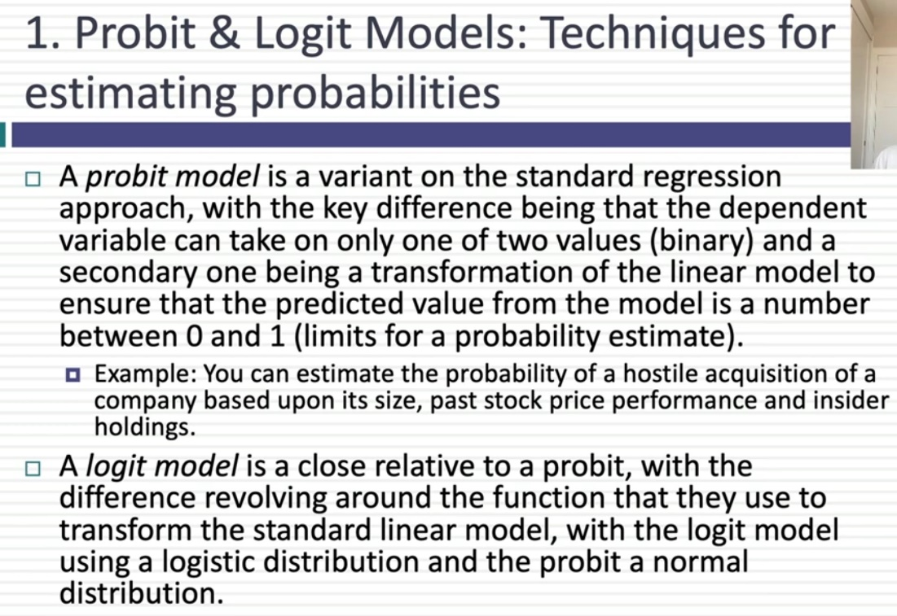
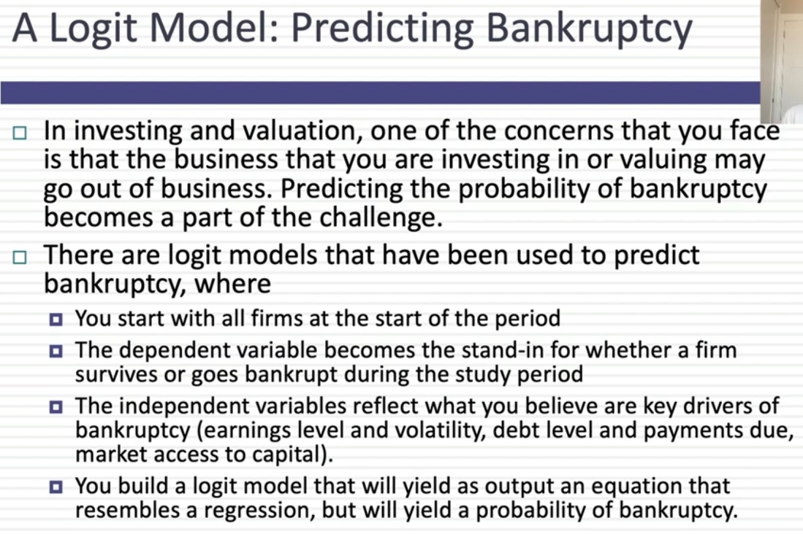
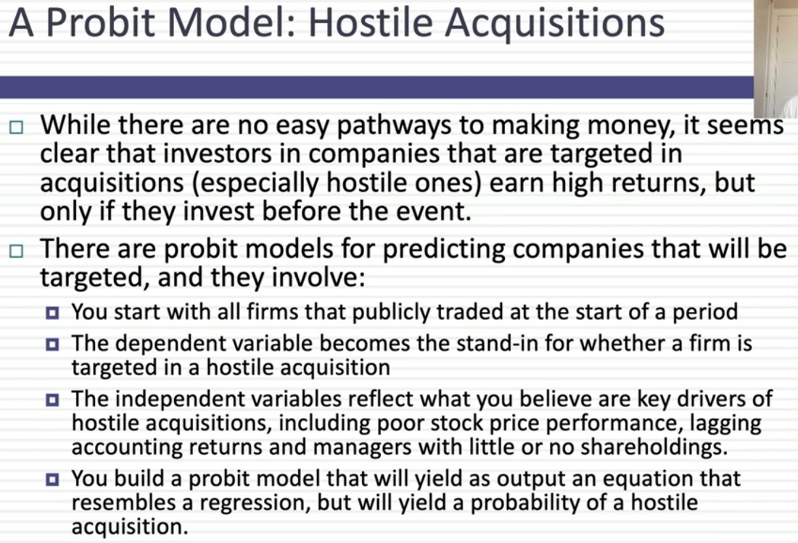

# Others

Created: 2018-06-16 20:31:57 +0500

Modified: 2021-10-24 21:00:08 +0500

---

## Quantile

Each of any set of values of a variate which divide a frequency distribution into equal groups, each containing the same fraction of the total population.
In statistics and probability**quantiles**are cut points dividing the range of a[probability distribution](https://en.wikipedia.org/wiki/Probability_distribution)into contiguous intervals with equal probabilities, or dividing the observations in a sample in the same way. There is one less quantile than the number of groups created. Thus[quartiles](https://en.wikipedia.org/wiki/Quartiles)are the three cut points that will divide a dataset into four equal-sized groups. Common quantiles have special names: for instance quartile, decile (creating 10 groups: see below for more). The groups created are termed halves, thirds, quarters, etc., though sometimes the terms for the quantile are used for the groups created, rather than for the cut points.

## Decile

- each of ten equal groups into which a population can be divided according to the distribution of values of a particular variable.
- each of the nine values of the random variable which divide a population into ten deciles.

## Law of Large Numbers (LLN)

In[probability theory](https://en.wikipedia.org/wiki/Probability_theory), the**law of large numbers**(**LLN**) is a[theorem](https://en.wikipedia.org/wiki/Theorem)that describes the result of performing the same experiment a large number of times. According to the law, the[average](https://en.wikipedia.org/wiki/Average)of the results obtained from a large number of trials should be close to the[expected value](https://en.wikipedia.org/wiki/Expected_value), and will tend to become closer as more trials are performed, if the observations are independent and identically distributed
Few exceptions to the law of large numbers

- The first is if the sample observatoins are not independent or identically distributed
- The other is for distributions with fat tails (higher chance of extreme outcomes)

## The Weak Law of Large Numbers

Even when observations are not independent or identically distributed, the sample average will approach the population average, albeit slower and only if the variance is finite

## Kullback-Leibler Divergence (KL Divergence)

In[mathematical statistics](https://en.wikipedia.org/wiki/Mathematical_statistics), the**Kullback--Leibler divergence**(also called**relative entropy**) is a measure of how one[probability distribution](https://en.wikipedia.org/wiki/Probability_distribution)diverges from a second, expected probability distribution.Applications include characterizing the[**relative**(Shannon)**entropy**](https://en.wikipedia.org/wiki/Entropy_(information_theory))in information systems,**randomness**in continuous[time-series](https://en.wikipedia.org/wiki/Time_series), and**information gain**when comparing statistical models of[inference](https://en.wikipedia.org/wiki/Inference). In contrast to[variation of information](https://en.wikipedia.org/wiki/Variation_of_information), it is a distribution-wise*asymmetric*measure and thus does not qualify as a statistical*metric*of spread. In the simple case, a Kullback--Leibler divergence of 0 indicates that we can expect similar, if not the same, behavior of two different distributions, while a Kullback--Leibler divergence of 1 indicates that the two distributions behave in such a different manner that the expectation given the first distribution approaches zero. In simplified terms, it is a measure of surprise, with diverse applications such as applied statistics,[fluid mechanics](https://en.wikipedia.org/wiki/Fluid_mechanics),[neuroscience](https://en.wikipedia.org/wiki/Neuroscience)and[machine learning](https://en.wikipedia.org/wiki/Machine_learning).

## Continuous probability distribution

A**continuous probability distribution**is a probability distribution that has a cumulative distribution function that is continuous. Most often they are generated by having a[probability density function](https://en.wikipedia.org/wiki/Probability_density_function). Mathematicians call distributions with probability density functions**absolutely continuous**, since their[cumulative distribution function](https://en.wikipedia.org/wiki/Cumulative_distribution_function)is[absolutely continuous](https://en.wikipedia.org/wiki/Absolute_continuity)with respect to the[Lebesgue measure](https://en.wikipedia.org/wiki/Lebesgue_measure)*λ*. If the distribution of*X*is continuous, then*X*is called a**continuous random variable**. There are many examples of continuous probability distributions:[normal](https://en.wikipedia.org/wiki/Normal_distribution),[uniform](https://en.wikipedia.org/wiki/Uniform_distribution_(continuous)),[chi-squared](https://en.wikipedia.org/wiki/Chi-squared_distribution), and[others](https://en.wikipedia.org/wiki/List_of_probability_distributions#Continuous_distributions).

## Entropy

"The entropy of a random variable is a function which attempts to characterize the unpredictability of a random variable." ([Entropy and Mutual Information](https://people.cs.umass.edu/~elm/Teaching/Docs/mutInf.pdf))" It is used for the construction of an automatic decision tree at each step of tree building; feature selection is done such using entropy criteria. Model selection is based on the principle of the maximum entropy, which states from the conflicting models, the one with the highest entropy is the best.
"If a random variable X takes on values in a set χ={x1, x2,..., xn}, and is defined by a probability distribution P(X), then we will write the entropy of the random variable as," ([Entropy and Mutual Information](https://people.cs.umass.edu/~elm/Teaching/Docs/mutInf.pdf))

"If the log in the above equation is taken to be to the base 2, then the entropy is expressed in bits. If the log is taken to be the natural log, then the entropy is expressed in nats. More commonly, entropy is expressed in bits."

## Softmax Function

## Softmax turns arbitrary real values into probabilities

In[mathematics](https://en.wikipedia.org/wiki/Mathematics), thesoftmax function,also known as**softargmax**or**normalized exponential function**,is a function that takes as input a vector ofKreal numbers, and normalizes it into a[probability distribution](https://en.wikipedia.org/wiki/Probability_distribution)consisting of K probabilities proportional to the exponentials of the input numbers. That is, prior to applying softmax, some vector components could be negative, or greater than one; and might not sum to 1; but after applying softmax, each component will be in the[interval](https://en.wikipedia.org/wiki/Interval_(mathematics))(0, 1), and the components will add up to 1, so that they can be interpreted as probabilities. Furthermore, the larger input components will correspond to larger probabilities. Softmax is often used in[neural networks](https://en.wikipedia.org/wiki/Artificial_neural_network), to map the non-normalized output of a network to a probability distribution over predicted output classes.

<https://en.wikipedia.org/wiki/Softmax_function>

## Probabilistic Tools**

- **Probit/Logit:** A probit/logit measures the likelihood or probability of an event happening, based upon observable variables
  - Example: Measuring the probability that a company will be acquired, given variables that you believe are correlated
- **Decision Trees:** When you have a series of discrete events that are sequential, a decision tree allows you to compute the likelihood of events happening, condidtional on events leading up to it
  - Example: The process by which an FDA drug works its way through the drug approval pipeline, from research to commercial development
- **Monte Carlo Simulations:** When you have multiple inputs that determine an output variable, a simulation allows you specify probabilistic distributions for each input variable and get a distribution for the output variable
  - Example: Valuing a company, given its cash flows, growth and risk characteristics

