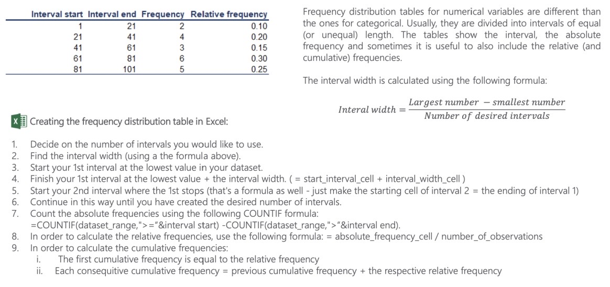
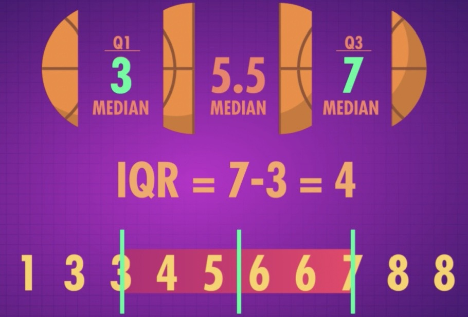
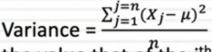
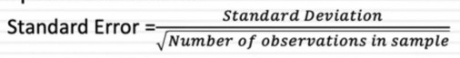

# Descriptive Statistics

Created: 2021-09-15 23:20:16 +0500

Modified: 2021-10-04 22:38:47 +0500

---

Levels of measurement

Categorical variables. Visualization techniques

Numerical variables. Frequency distribution table

The histogram

Cross table and scatter plot

Mean, median, mode

Skewness

Variance

Standard deviation and coefficient of variation

**Descriptive Statistics (Summarizing Data)**
-   Itrefer to methods for summarizing raw observations into information that we can understand and share.
-   Usually include things like where the middle of the data is - what statisticians call measure of central tendency - and measures of how spread out the data are

{width="5.0in" height="5.072916666666667in"}
-   Descriptive statistics are mostly used to summarize values and may not be sufficient to make conclusions about the entire population or to infer or predict data patterns

**Graphs and tables that represent categorical variables**

![Frequency distribution tables Frequency 100 Audi BMW Mercedes Total 124 98 113 Bar charts Sales BMW Mercedes Bar charts are very common. Each bar represents a category. On the y-axis we have the absolute frequency. Pie charts Merced BMW 29% Pie charts are used when we want to see the share of an item as a part of the total. Market share is almost always represented with a pie chart. E Frequency distribution tables show the category and its corresponding frequency. absolute Pareto diagrams Sales 100% 50 Audi Mercedes BMW The Pareto diagram is a special type of bar chart where the categories are shown in descending order of frequency, and a separate curve shows the cumulative frequency. ](media/Descriptive-Statistics-image2.jpg){width="6.791666666666667in" height="3.1458333333333335in"}

**Excel formulas**

![Frequency distribution tables Frequency Audi BMW Mercedes Total 124 98 113 Bar charts Sales 100 50 BMW Bar charts are Me rcedes also called Pie charts Merced Aud i 37% BMW 29% Pie charts are created in the following way: Choose your data, Insert -> Charts -> Pie chart Pareto diagrams 80% 100 60% 0 Audi Mercedes BMW Next slide. In Excel, we can either hard code the frequencies or count them with a count function. This will come up later on. Total formula: -SUMO Il clustered column charts in Excel. Choose your data, Insert -> Charts -> Clustered column or Bar chart. l] ](media/Descriptive-Statistics-image3.jpg){width="6.635416666666667in" height="3.1041666666666665in"}

**Pareto diagrams in Excel**

![1] Creating Pareto diagrams in Excel: Sales 90% 80% 50% 30% 20% 10% 2. 3. 4. 5. 6. 7. 8. 9. 10. 11. 12. 13. 14. Order the data in your frequency distribution table in descending order. Create a bar chart. Add a column in your frequency distribution table that measures the cumulative frequency. Select the plot area of the chart in Excel and Right click Choose Select series. Click Add Series name doesn't matter. You can put 'Line' For Series values choose the cells that refer to the cumulative frequency. Click OK. You should see two side-by-side bars Select the plot area of the chart and Right click. Choose Change Chart Type. Select Combo. Choose the type of representation from the dropdown list. Your initial categories should be 'Clustered Column'. Change the second series, that you called 'Line', to 'Line'. Done. ](media/Descriptive-Statistics-image4.jpg){width="6.541666666666667in" height="3.3333333333333335in"}

**Numerical variables. Frequency distribution table and histogram**

{width="6.833333333333333in" height="3.2083333333333335in"}

![Histogram (41, 611 Histograms are the one of the most common ways to represent numerical data. Each bar has width equal to the width of the interval. The bars are touching as there is continuation between intervals: where one ends -> the other begins. (21, 411 11, 211 (41, 611 (61, 811 (81, 1011 Histogram relative frequency 2. 3. Creating a histogram in Excel: Choose your data Insert -> Charts -> Histogram To change the number of bins (intervals): Select the x-axis 2. Click Chart Tools - > Format -> Axis options 3. You can select the bin width (interval width), number of bins, etc. (21, 411 (61, 811 (81, 1011 ](media/Descriptive-Statistics-image6.jpg){width="6.802083333333333in" height="2.8958333333333335in"}

**Graphs and tables for relationships between variables. Cross tables**

![Type of investment  Investor Real E swe Of Investor Investor A Investor B Investor C Tota 29 21 210 91 Investor A "westor 8 Investor C Total Cross tables (or contingency tables) are used to represent categorical variables. One set of categories is labeling the rows and another is labeling the columns. We then fill in the table with the applicable data. It is a good idea to calculate the totals. Sometimes, these tables are constructed with the relative frequencies as shown in the table below. 010 010 017 037 004 0 003 0 016 042 023 t A common way to represent the data from a cross table is by using a side-by-side bar chart. Creating a side-by-side chart in Excel: 1. Choose your data 2. Insert -> Charts -> Clustered Column Selecting more than one series ( groups of data ) will prompt Excel to create a side-by-side bar (column) chart. automatically Side-by-side bar chart Investor A • Stocks In vestor B • Bonds • Real Estate ](media/Descriptive-Statistics-image7.jpg){width="6.614583333333333in" height="2.9375in"}

**Scatter plots**

![100 21.5 200 40 300 60 400 80 500 120 600 140 700 160 800 180 When we want to represent two numerical variables on the same graph, we usually use a scatter plot. Scatter plots are useful especially later on, when we talk about regression analysis, as they help us detect patterns (linearity, homoscedasticity). Scatter plots usually represent lots and lots of data. Typically, we are not interested in single observations, but rather in the structure of the dataset. Creating a scatter plot in Excel: 1. Choose the two datasets you want to plot. 2. Insert Charts -Y Scatter A scatter plot that looks in the following way (down) represents data that doesn't have a pattern. Completely vertical 'forms' show no association. Conversely, the plot above shows a linear pattern, meaning that the observations move together. 100 ](media/Descriptive-Statistics-image8.jpg){width="6.75in" height="3.2395833333333335in"}

**Levels of measurement**

![Levels of measurement Qualitative Nominal Ordinal Quantitative Interval Ratio There are two qualitative levels: nominal and ordinal. The nominal level represents categories that cannot be put in any order, while ordinal represents categories that can be ordered. Examples: Nominal: four seasons (winter, spring, summer, autumn) Ordinal: rating your meal (disgusting, unappetizing, neutral, tasty, and delicious) There are two quantitative levels: interval and ratio. They both represent "numbers", however, ratios have a true zero, while intervals don't. Examples: Interval: degrees Celsius and Fahrenheit Ratio: degrees Kelvin, length ](media/Descriptive-Statistics-image9.jpg){width="6.364583333333333in" height="3.1458333333333335in"}

**When faced with sample data, data descriptives try to summarize the data with metrics. Those metrics can include**
-   **Measures of location (Measures of centrality):** Measures of location try to identify the number or numbers around which the data is centered or is most likely to take
-   **Measures of dispersion:** Measures of dispersion measure how much divergence there is on a data item, across a sample
-   **Measures of skewness (Measures of symmetry):** Measures of skewness look at whether how symmetric or asymmetric the data is around the central value
-   **Measures of extremes:** Measure the likelihood of extreme values (the fatness of distributional tails)

**Mean, Median, and Mode: Measure of Central Tendency**

![Mean The mean is the most widely spread measure of central tendency. It is the simple average of the dataset. Note: easily affected by outliers The formula to calculate the mean is: or XI X2 X3 XN---I XN Il In Excel, the mean is calculated by: -AVERAGE() Median The median is the midpoint of the ordered dataset. It is not as popular as the mean, but is often used in academia and data science. That is since it is not affected by outliers. In an ordered dataset, the median is the number at position n+l 2 If this position is not a whole number, it, the median is the simple average of the two numbers at positions closest to the calculated value. r In Excel, the median is calculated by: Mode The mode is the value that occurs most often. A dataset can have O modes, 1 mode or multiple modes. The mode is calculated simply by finding the value with the highest frequency. Il In Excel, the mode is calculated by: =MODE.SNGLO -> returns one mode =MODE.MULT() -> returns an array with the modes. It is used when we have more than 1 mode. ](media/Descriptive-Statistics-image10.jpg){width="6.875in" height="3.125in"}

a.  Normal distribution

b.  Mode - The value that appears most in our dataset

c.  Bimodal Data is an example of Multimodal data which has many values that are similarly common. Usually multimodal data results from two or more underlying groups all being measured together

d.  The fact that the median and mean are the same tells us that the distibution is symmetric: that there's equal amount of data on either side of the median, and equal amounts on either side of the mean

e.  If the mean and median are different that the distribution is skewed

**Measures of Spread**

a.  Range takes the largest number in our dataset and subtracts the smallest number in the set to give us the distance between the two extremes. The larger the distance, the more spread out our data is.

b.  Interquartile range - Doesn't consider extreme values, the IQR looks at the spread of the middle 50% of your data

{width="5.0in" height="3.3854166666666665in"}

**Measures of Dispersion**
-   **Ranges and variants:** With the range, you look at the difference between the highers and lowest values for a variable, across a sample. In variants, you can look at the difference between the first and third quartile of the data (interquartile range) or between the first and the ninth decile of the data
-   **Standard deviation/Variance:** With the standard deviation, you estimate the difference between each value of a variable and its mean and arrive at a measure of dispersion
-   **Coefficient of variation:** With the coefficient of variation, you divide the standard deviation of a data series by its mean, to provide a measure of comparision with data series of different levels

**Variance and standard deviation**

![Point 1 Point 2 Point 3 Mean Point 4 Point 5 Point 6 Variance and standard deviation measure the dispersion of a set of data points around its mean value. There are different formulas for population and sample variance & standard deviation. This is due to the fact that the sample formulas are the unbiased estimators of the population formulas. More on the mathematics behind it. Sample variance formula: Population variance formula: Sample standard deviation formula: Population standard deviation formula: s 2 n---l Calculating variance in Excel: Sample variance: = VAR.SO Population variance: =VAR.P() Sample standard deviation : = STDEV.SO Population standard deviation: =STDEV.PO ](media/Descriptive-Statistics-image12.jpg){width="6.875in" height="3.1979166666666665in"}

**Standard Deviation/Variance & Coefficient of Variation**
-   The standard deviation is a measure of dispersion which uses all of the observations, computes the difference between each one and the mean, and summing up the squared differences:
-   Variance

{width="2.3229166666666665in" height="0.5729166666666666in"}

Where μ is the average across the n observations, and X~j~ is the value that of the j^th^ observation; The sum of the squared differences is divided by n, if your data comprises the entire population, or n-1, if it is a sample
-   The standard deviation is the square root of the variance
-   When there is more divergence from the mean, the standard deviation will be higher, but it will be in the same units as the base data. Thus, if the base data is in dollars, the standard deviation will be in dollars, and if it is in percent, it will be in percent
-   Since standard deviations cannot be compared across two samples with different units or levels, you can compute a standidized version of the measure
    -   **Coefficient of Variation = Std deviation in value / average value**

**Standard Deviation and Standard Error**
-   The standard deviation measures the amount of variability, or dispersion from the individual data values to the mean
-   The standard error of the mean measures how far the sample mean (average) of the data is likely to be from the true population mean. It is computed as follows

{width="4.5in" height="0.5625in"}
-   As sample size increases, there will be no discernible effect on the former, but the latter will always decrease
-   When you are extrapolating from sample findings to the population, the standard errors become useful because they can be used to provide ranges for estimates. Thus, if your averate is μ, and your standard error is SE, drawing on the central limit theorem, you can estimate the population mean:
    -   With 67% confidence: μ ± SE
    -   With 95% confidence: μ ± 2*SE

**Measures of Asymmetry**
-   When the data is symmetric, the deviations from the mean fall equally or roughly equally on either side of the mean
-   When the data is asymmetric, deviations on one side of the mean are much more pronounced than deviations on the other side. This deviation is measured with skewness
    -   If the deviations are more pronounced/extreme for the observations that have values higher than the average, the distribution is positively skewed
    -   If the deviations are more pronounced/extreme for the observations that have values lower than the average, the distribution is negatively skewed
-   When data is asymmetric, the average will be skewed in the same direction as the asymmetry, and in some cases the skew can be large enough to make it unrepresentative of the sample

**Skewness**

{width="6.8125in" height="3.0833333333333335in"}

**Measures of extreme values**
-   You can measure of how much, and how frequently, data takes extreme values, relative to its central value. That measure is called kurtosis
-   While variance and kurtosis are both affected by the presence (or absence) of extreme values, they measure different phenomenon
    -   You can have high variance and low kurtosis, low variance and high kurtosis or high variance and high kurtosis
    -   Distributions that have more frequent occurrences of extreme values are referred to as having fat tails or **leptokurtic.** Distribution that have less frequent occurrences of extreme values are referred to as **platykurtic**

**Randomness**

a.  Expectation

b.  Variance (2nd moment)

c.  Skeweness (3rd moment)

d.  Kurtosis (4th moment)

e.  The mean of the sum is the sum of the means

f.  The variance of the sum of the two independent variables is the sum of their variances.

