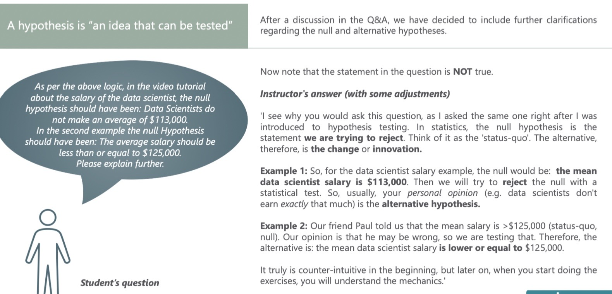
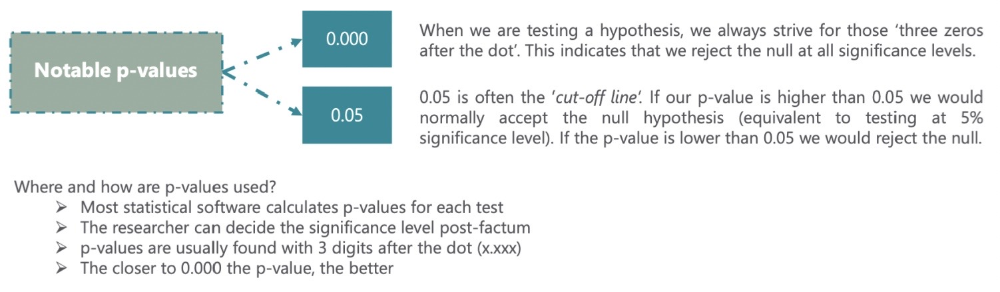

# Hypothesis Testing

Created: 2021-09-15 23:22:40 +0500

Modified: 2021-09-15 23:57:09 +0500

---

Null vs Alternative

Rejection region and significance level

Type I error vs type II error

Test for the mean. Population variance known

p-value

Test for the mean. Population variance unknown

Test for the mean. Dependent samples

Test for the mean. Independent samples (Part1)

Test for the mean. Independent samples (Part2)
**Scientific Method**

![The 'scientific method' is a procedure that has characterized natural science since the 17th century. It consists in systematic observation, measurement, experiment, and the formulation, testing and modification of hypotheses. Since then we've evolved to the point where most people and especially professionals realize that pure observation can be deceiving. Therefore, business decisions are increasingly driven by data. That's also the purpose of data science. While we don't 'name' the scientific method in the videos, that's the underlying idea. There are several steps you would follow to reach a data-driven decision (pictured). STEPS Formula-I-e a Find righ•i- exea*e Make a decision ](media/Hypothesis-Testing-image1.jpg){width="6.520833333333333in" height="3.0416666666666665in"}
**Hypotheses**
-   A hypothesis is "an idea that can be tested"
-   It is a supposition or proposed explanation made on the basis of limited evidence as a starting point for further investigation

![Null hypothesis (Ho) The null hypothesis is the hypothesis to be tested. It is the status-quo. Everything which was believed until now that we are contesting with our test. The concept of the null is similar to: innocent until proven guilty We assume innocence until we have enough evidence to prove that a suspect is guilty. Alternative hypothesis (HI or HA) The alternative hypothesis is the change or innovation that is contesting the status-quo. Usually the alternative is our own opinion. The idea is the following: If the null is the status-quo (i.e., what is generally believed), then the act of performing a test, shows we have doubts about the truthfulness of the null. More often than not the researcher's opinion is contained in the alternative hypothesis. ](media/Hypothesis-Testing-image2.jpg){width="6.46875in" height="1.71875in"}
**Examples of hypotheses**

{width="6.4375in" height="3.09375in"}
**Decisions you can take**

![When testing, there are two decisions that can be made: to accept the null hypothesis QC to reject the null hypothesis. To accept the null means that there isn't enough data to support the change or the innovation brought by the alternative. To reject the null means that there is enough statistical evidence that the status-quo is not representative of the truth. rejechon region nccÉpr reje& Different ways of reporting the result: Accept rejechon region rejec+ At x% significance, we accept the null hypothesis At x% significance, A is not significantly different from B At x% significance, there is not enough statistical evidence that... At x% significance, we cannot reject the null hypothesis Given a two-tailed test: Graphically, the tails of the distribution show when we reject the null hypothesis ('rejection region'). Everything which remains in the middle is the 'acceptance region'. The rationale is: if the observed statistic is too far away from 0 (depending on the significance level), we reject the null. Otherwise, we accept it. Reject At x% significance, we reject the null hypothesis At x% significance, A is significantly different from B At x% significance, there is enough statistical evidence... At x% significance, we cannot say that *restate the null* ](media/Hypothesis-Testing-image4.jpg){width="6.5in" height="3.125in"}
**Level of significance and types of tests**
-   Level of significance (α) - The probability of rejecting a null hypothesis that is true; the probability of making this error.

{width="6.53125in" height="2.46875in"}
**Statistical errors (Type I and Type II Error)**

![In general, there are two types of errors we can make while testing: Type I error (False positive) and Type Il Error (False negative). Statisticians summarize the errors in the following table: : Så-a+vs quo (sYaåvs quo) gejecY The is -Hue Type I eyyor (false pos*iue) is false Type 11 en-ov- (False nega-hue) Here's the table with the example from the lesson: : She doesn'+ like you The She doesn'+ like you She likes you Type Il eryov (False negahue) (s}-aåvs quo) She doesn'•}• like (you inui+e RejecF her (Inui-Ye hen Type I evyov (f•alse pos-hue) The probability of committing Type I error (False positive) is equal to the significance level (a). The probability of committing Type Il error (False negative) is equal to the beta (ß) and is called 'power of the test'. ](media/Hypothesis-Testing-image6.jpg){width="6.708333333333333in" height="2.8958333333333335in"}
**P-value**
-   The p-value is the smallest level of significance at which we can still reject the null hypothesis, given the observed sample statistic

{width="6.270833333333333in" height="1.8333333333333333in"}
**Formulae for Hypothesis Testing**

![# populations One One Two Two Two Population variance known unknown Known unknown, assumed equal Samples Statistic dependent independent independent z t t z t Variance 2 2 S difference 2 (nx --- I)sk + (ny --- I)s} Formula for test statistic S d/ vrfi nx ny 2 2 Decision rule There are several ways to phrase the decision rule and they all have the same meaning. Reject the null if: 1) Itest statisticl > lcritical valuel 2) The absolute value of the test statistic is bigger than the absolute critical value 3) p-value < some significance level most often 0.05 Usually, you will be using the p-value to make a decision. 2 ](media/Hypothesis-Testing-image8.jpg){width="6.604166666666667in" height="2.5208333333333335in"}