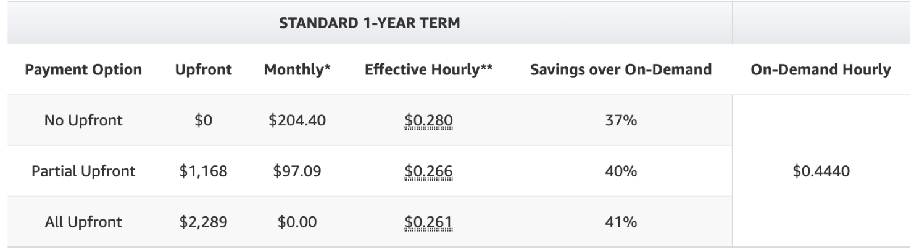
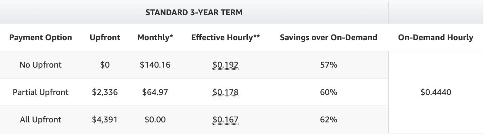

# EC2 Instance types

Created: 2020-02-06 11:33:07 +0500

Modified: 2021-06-09 23:27:02 +0500

---

<https://aws.amazon.com/blogs/compute/it-just-got-easier-to-discover-and-compare-ec2-instance-types>

<https://github.com/aws/amazon-ec2-instance-selector>

## AMI

Ubuntu 16.04 LTS AMI - ami-2757f631

Ubuntu 16.10 AMI - ami-b374d5a5

Ubuntu Server 18.04 LTS (HVM), SSD Volume Type- ami-0620d12a9cf777c87 (64-bit x86) / ami-06b0afcb36d2e27ef (64-bit Arm)

Ubuntu Server 16.04 LTS (HVM), SSD Volume Type- ami-0c28d7c6dd94fb3a7 (64-bit x86) / ami-08f567e9a6f67fbee (64-bit Arm)

<table>
<colgroup>
<col style="width: 14%" />
<col style="width: 8%" />
<col style="width: 11%" />
<col style="width: 12%" />
<col style="width: 16%" />
<col style="width: 15%" />
<col style="width: 10%" />
<col style="width: 10%" />
</colgroup>
<thead>
<tr class="header">
<th><strong>Instance Size</strong></th>
<th><strong>vCPU</strong></th>
<th><strong>Memory (GiB)</strong></th>
<th>
<strong>Instance Storage</strong>

<strong>(GiB)</strong>
</th>
<th><strong>Network Bandwidth (Gbps)</strong></th>
<th><strong>EBS Bandwidth (Mbps)</strong></th>
<th><strong>Cost per hour</strong></th>
<th><strong>Cost per month</strong></th>
</tr>
</thead>
<tbody>
<tr>
<td>m5.large</td>
<td>2</td>
<td>8</td>
<td>EBS-Only</td>
<td>Up to 10</td>
<td>Up to 4,750</td>
<td>$0.056</td>
<td>$40.32</td>
</tr>
<tr>
<td>m5.xlarge</td>
<td>4</td>
<td>16</td>
<td>EBS-Only</td>
<td>Up to 10</td>
<td>Up to 4,750</td>
<td>$0.111</td>
<td>$79.92</td>
</tr>
<tr>
<td>m5.2xlarge</td>
<td>8</td>
<td>32</td>
<td>EBS-Only</td>
<td>Up to 10</td>
<td>Up to 4,750</td>
<td>$0.222</td>
<td>$159.84</td>
</tr>
<tr>
<td>m5.4xlarge</td>
<td>16</td>
<td>64</td>
<td>EBS-Only</td>
<td>Up to 10</td>
<td>4,750</td>
<td>$0.444</td>
<td>$319.68</td>
</tr>
<tr>
<td>m5a.8xlarge</td>
<td>32</td>
<td>128</td>
<td>EBS-Only</td>
<td></td>
<td></td>
<td>$0.889</td>
<td>$640.08</td>
</tr>
</tbody>
</table>

a - AMD CPUs

## Tips

- **M5a instances** offers up to 10% savings for customers who are looking to further cost optimize their Amazon EC2 compute environments.
- [Kernel Live Patching for Amazon Linux 2 is now generally available](https://aws.amazon.com/about-aws/whats-new/2020/06/announcing-general-availability-kernel-live-patching-amazon-linux-2/)

<https://aws.amazon.com/ec2/pricing/on-demand>

<https://aws.amazon.com/ec2/instance-types>

- **Spot instances (discount upto 90%)**
  - **No bidding**
  - **Ideal for**
    - Fault tolerant
    - Flexible
    - Lossely coupled
    - Stateless workloads

<https://aws.amazon.com/ec2/spot/instance-advisor>

<https://ec2spotworkshops.com/using_ec2_spot_instances_with_eks.html>

<https://aws.amazon.com/blogs/compute/cost-optimization-and-resilience-eks-with-spot-instances>

<https://aws.amazon.com/blogs/containers/amazon-eks-now-supports-provisioning-and-managing-ec2-spot-instances-in-managed-node-groups>

<https://spot.io>

- On-demand instances
- Reserved instances (discount upto 75%)
  - Ex - m5a.4xlarge

<https://aws.amazon.com/ec2/pricing/reserved-instances/pricing>

- Savings plans (discount upto 66%)
- Dedicated hosts

| **General Purpose**       | A1, T3, T3a, T2, M6g, M5, **M5a**, M5n, M4  |
|---------------------------|---------------------------------------------|
| **Compute Optimized**     | C5, C5n, C4                                 |
| **Memory Optimized**      | R5, R5a, R5n, R4, X1e, X1, High Memory, z1d |
| **Accelerated Computing** | P3, P2, Inf1, G4, G3, F1                    |
| **Storage Optimized**     | I3, I3en, D2, H1                            |

| **Instance Family**                      | **Current Generation Instance Types**                                                                                                                                                                                                                                                                                                                                                                                                                                                                                                                                                                                                                                                                                                                                                                                                                                                                                                                                                                                                                                                                                                                                                                                      |
|----|--------------------------------------------------------------------|
| General purpose (a, m, t class)          | a1.medium|a1.large|a1.xlarge|a1.2xlarge|a1.4xlarge|a1.metal|m4.large|m4.xlarge|m4.2xlarge|m4.4xlarge|m4.10xlarge|m4.16xlarge|m5.large|m5.xlarge|m5.2xlarge|m5.4xlarge|m5.8xlarge|m5.12xlarge|m5.16xlarge|m5.24xlarge|m5.metal|m5a.large|m5a.xlarge|m5a.2xlarge|m5a.4xlarge|m5a.8xlarge|m5a.12xlarge|m5a.16xlarge|m5a.24xlarge|m5ad.large|m5ad.xlarge|m5ad.2xlarge|m5ad.4xlarge|m5ad.8xlarge|m5ad.12xlarge|m5ad.16xlarge|m5ad.24xlarge|m5d.large|m5d.xlarge|m5d.2xlarge|m5d.4xlarge|m5d.8xlarge|m5d.12xlarge|m5d.16xlarge|m5d.24xlarge|m5d.metal|m5dn.large|m5dn.xlarge|m5dn.2xlarge|m5dn.4xlarge|m5dn.8xlarge|m5dn.12xlarge|m5dn.16xlarge|m5dn.24xlarge|m5n.large|m5n.xlarge|m5n.2xlarge|m5n.4xlarge|m5n.8xlarge|m5n.12xlarge|m5n.16xlarge|m5n.24xlarge|t2.nano|t2.micro|t2.small|t2.medium|t2.large|t2.xlarge|t2.2xlarge|t3.nano|t3.micro|t3.small|t3.medium|t3.large|t3.xlarge|t3.2xlarge|t3a.nano|t3a.micro|t3a.small|t3a.medium|t3a.large|t3a.xlarge|t3a.2xlarge |
| Compute optimized (c class)              | c4.large|c4.xlarge|c4.2xlarge|c4.4xlarge|c4.8xlarge|c5.large|c5.xlarge|c5.2xlarge|c5.4xlarge|c5.9xlarge|c5.12xlarge|c5.18xlarge|c5.24xlarge|c5.metal|c5d.large|c5d.xlarge|c5d.2xlarge|c5d.4xlarge|c5d.9xlarge|c5d.12xlarge|c5d.18xlarge|c5d.24xlarge|c5d.metal|c5n.large|c5n.xlarge|c5n.2xlarge|c5n.4xlarge|c5n.9xlarge|c5n.18xlarge|c5n.metal                                                                                                                                                                                                                                                                                                                                                                                                                                                                                                                                                                                                                                                                                                                                                                                      |
| Memory optimized (r class)               | r4.large|r4.xlarge|r4.2xlarge|r4.4xlarge|r4.8xlarge|r4.16xlarge|r5.large|r5.xlarge|r5.2xlarge|r5.4xlarge|r5.8xlarge|r5.12xlarge|r5.16xlarge|r5.24xlarge|r5.metal|r5a.large|r5a.xlarge|r5a.2xlarge|r5a.4xlarge|r5a.8xlarge|r5a.12xlarge|r5a.16xlarge|r5a.24xlarge|r5ad.large|r5ad.xlarge|r5ad.2xlarge|r5ad.4xlarge|r5ad.12xlarge|r5ad.24xlarge|r5d.large|r5d.xlarge|r5d.2xlarge|r5d.4xlarge|r5d.8xlarge|r5d.12xlarge|r5d.16xlarge|r5d.24xlarge|r5d.metal|r5dn.large|r5dn.xlarge|r5dn.2xlarge|r5dn.4xlarge|r5dn.8xlarge|r5dn.12xlarge|r5dn.16xlarge|r5dn.24xlarge|r5n.large|r5n.xlarge|r5n.2xlarge|r5n.4xlarge|r5n.8xlarge|r5n.12xlarge|r5n.16xlarge|r5n.24xlarge|u-6tb1.metal|u-9tb1.metal|u-12tb1.metal|u-18tb1.metal|u-24tb1.metal|x1.16xlarge|x1.32xlarge|x1e.xlarge|x1e.2xlarge|x1e.4xlarge|x1e.8xlarge|x1e.16xlarge|x1e.32xlarge|z1d.large|z1d.xlarge|z1d.2xlarge|z1d.3xlarge|z1d.6xlarge|z1d.12xlarge|z1d.metal                                                                            |
| Storage optimized (d, h, i class)        | d2.xlarge|d2.2xlarge|d2.4xlarge|d2.8xlarge|h1.2xlarge|h1.4xlarge|h1.8xlarge|h1.16xlarge|i3.large|i3.xlarge|i3.2xlarge|i3.4xlarge|i3.8xlarge|i3.16xlarge|i3.metal|i3en.large|i3en.xlarge|i3en.2xlarge|i3en.3xlarge|i3en.6xlarge|i3en.12xlarge|i3en.24xlarge|i3en.metal                                                                                                                                                                                                                                                                                                                                                                                                                                                                                                                                                                                                                                                                                                                                                                                                                                                                                    |
| Accelerated computing (f, g, p, i class) | f1.2xlarge|f1.4xlarge|f1.16xlarge|g3s.xlarge|g3.4xlarge|g3.8xlarge|g3.16xlarge|g4dn.xlarge|g4dn.2xlarge|g4dn.4xlarge|g4dn.8xlarge|g4dn.12xlarge|g4dn.16xlarge|p2.xlarge|p2.8xlarge|p2.16xlarge|p3.2xlarge|p3.8xlarge|p3.16xlarge|p3dn.24xlarge|inf1.xlarge|inf1.2xlarge|inf1.6xlarge|inf1.24xlarge                                                                                                                                                                                                                                                                                                                                                                                                                                                                                                                                                                                                                                                                                                                                                                                                                                                    |

<table>
<colgroup>
<col style="width: 21%" />
<col style="width: 14%" />
<col style="width: 64%" />
</colgroup>
<thead>
<tr class="header">
<th><strong>Instance Family</strong></th>
<th><strong>Example</strong></th>
<th><strong>Use Cases</strong></th>
</tr>
</thead>
<tbody>
<tr>
<td>Memory optimized</td>
<td>R5</td>
<td>
Memory-intensive applications

High-performance databases

Distributed in-memory caches
</td>
</tr>
<tr>
<td>Storage optimized</td>
<td>I3</td>
<td>Workloads with high-volume IOPS requiring low-latency, internet-scale nonrelational databases</td>
</tr>
<tr>
<td>Burstable performance</td>
<td>T2</td>
<td>
Consistent cost for unpredictable workloads

Smaller databases with spiky usage
</td>
</tr>
</tbody>
</table>

| **Scenario**                                                                                             | **Possible Instance Choice with Explanation**                                                 |
|-------------------------------------|-----------------------------------|
| Small database in Amazon RDS with moderate activity levels for which cost is more important than latency | db.m5 standard DB instance class offering a balance of compute, memory, and network resources |
| A 12-GB write-heavy workload in Amazon ElastiCache for Redis with 2 shards                               | cache.r5.xlarge memory-optimized instances with 26 GiB of memory                              |
| A memory-intensive workload in Amazon RDS using Oracle under an existing license for 2 CPUs              | db.m4.xlarge with hyperthreading disabled to remain in compliance with licenses               |

## Bottlerocket

Bottlerocket is a Linux-based open-source operating system that is purpose-built by Amazon Web Services for running containers on virtual machines or bare metal hosts. Most customers today run containerized applications on general-purpose operating systems that are updated package-by-package, which makes OS updates difficult to automate. Updates to Bottlerocket are applied in a single step rather than package-by-package. This single-step update process helps reduce management overhead by making OS updates easy to automate using container orchestration services such as Amazon EKS. The single-step updates also improve uptime for container applications by minimizing update failures and enabling easy update rollbacks. Additionally, Bottlerocket includes only the essential software to run containers, which improves resource usage and reduces the attack surface.

<https://aws.amazon.com/bottlerocket>

<https://github.com/bottlerocket-os/bottlerocket>

EC2 Image Builder

## GPU

<https://aws.amazon.com/ec2/instance-types/g4>
