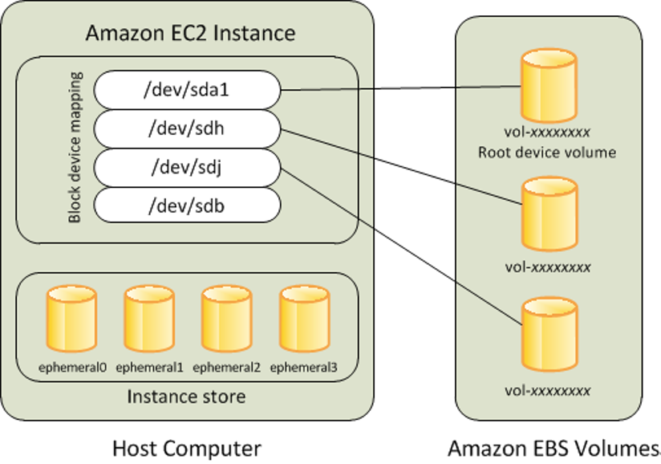

# Amazon EBS

Created: 2020-08-12 15:13:40 +0500

Modified: 2020-12-24 15:53:49 +0500

---

## Amazon EBS Snapshot

You can back up the data on your Amazon EBS volumes to Amazon S3 by taking point-in-time snapshots. Snapshots are *incremental*backups, which means that only the blocks on the device that have changed after your most recent snapshot are saved. This minimizes the time required to create the snapshot and saves on storage costs by not duplicating data. When you delete a snapshot, only the data unique to that snapshot is removed. Each snapshot contains all of the information that is needed to restore your data (from the moment when the snapshot was taken) to a new EBS volume.

<https://docs.aws.amazon.com/AWSEC2/latest/UserGuide/EBSSnapshots.html>

EBS volumes provide durable block-level storage for use with EC2 instances in the AWS cloud. Volumes are automatically replicated withinAvailability Zonesfor high availability and durability.

## Usage

EBS volumes are network-attached storage that persists independently from the running life of a single EC2 instance. After an EBS volume is attached to an EC2 instance, you can use the EBS volume similar to a physical hard drive -- typically by formatting it with the file system of your choice and using the file I/O interface provided by the instance operating system. Multiple EBS volumes can be attached to a single EC2 instance and it allows you to dynamically increase capacity, tune performance, and change the type of any new or existing current generation volume with no downtime or performance impact. Furthermore EBS provides the ability to savepoint-in-time snapshotsof your volumes. Each separate volume can be configured as EBSGeneral Purpose (SSD), Provisioned IOPS (SSD), Throughput Optimized (HDD), or Cold (HDD) as needed

The volumes types fall into two categories:

- SSD-backed volumes optimized for transactional workloads involving frequent read/write operations with small I/O size, where the dominant performance attribute is IOPS
- HDD-backed volumes optimized for large streaming workloads where throughput (measured in MiB/s) is a better performance measure than IOPS

## Durability & availability

Amazon EBS cloud service is designed to be highly available and reliable. As mentioned earlier EBS volumes data is replicated across multiple servers within availability zones. Taking snapshots of your EBS volumes increases the durability of the data stored on your EBS volumes. Furthermore, EBS volumes are designed for anAnnual Failure Rate (AFR)of between0.1 and 0.2 percent, where failure refers to a complete or partial loss of the volume, depending on the size and performance of the volume.

## Security

IAM service enables access to EBS volumes, allowing you to specify who can access which EBS volumes. EBS encryption enables data-at-rest and data-in-motion security. It offers seamless encryption of both EBS boot volumes and data volumes as well as snapshots. Access control plus encryption offers a strong defense-in-depth security strategy for your data.

<table>
<colgroup>
<col style="width: 9%" />
<col style="width: 23%" />
<col style="width: 22%" />
<col style="width: 21%" />
<col style="width: 21%" />
</colgroup>
<thead>
<tr class="header">
<th><strong>Volume type</strong></th>
<th><strong>General Purpose SSD (gp2)</strong></th>
<th><strong>Provisioned IOPS SSD (io1)</strong></th>
<th><strong>Throughput Optimized HDD (st1)</strong></th>
<th><strong>Cold HDD (sc1)</strong></th>
</tr>
</thead>
<tbody>
<tr>
<td><strong>Description</strong></td>
<td>General purpose SSD volume that balances price and performance for a wide variety of workloads</td>
<td>Highest-performance SSD volume for mission-critical low-latency or high-throughput workloads</td>
<td>Low-cost HDD volume designed for frequently accessed, throughput-intensive workloads</td>
<td>Lowest cost HDD volume designed for less frequently accessed workloads</td>
</tr>
<tr>
<td><strong>Use cases</strong></td>
<td><ul class="incremental">
<li>
Recommended for most workloads
</li>
<li>
System boot volumes
</li>
<li>
Virtual desktops
</li>
<li>
Low-latency interactive apps
</li>
<li>
Development and test environments
</li>
</ul></td>
<td><ul class="incremental">
<li>
Critical business applications that require sustained IOPS performance, or more than 16,000 IOPS or 250 MiB/s of throughput per volume
</li>
<li>
Large database workloads, such as:
</li>
<li>
MongoDB
</li>
<li>
Cassandra
</li>
<li>
Microsoft SQL Server
</li>
<li>
MySQL
</li>
<li>
PostgreSQL
</li>
<li>
Oracle
</li>
</ul></td>
<td><ul class="incremental">
<li>
Streaming workloads requiring consistent, fast throughput at a low price
</li>
<li>
Big data
</li>
<li>
Data warehouses
</li>
<li>
Log processing
</li>
<li>
Cannot be a boot volume
</li>
</ul></td>
<td><ul class="incremental">
<li>
Throughput-oriented storage for large volumes of data that is infrequently accessed
</li>
<li>
Scenarios where the lowest storage cost is important
</li>
<li>
Cannot be a boot volume
</li>
</ul></td>
</tr>
<tr>
<td><strong>Pricing</strong></td>
<td>$0.114per GB-month of provisioned storage</td>
<td>$0.131per GB-month of provisioned storage AND$0.068per provisioned IOPS-month</td>
<td>$0.051per GB-month of provisioned storage</td>
<td>$0.029per GB-month of provisioned storage</td>
</tr>
</tbody>
</table>

## EBS Pricing - 100 GB - $11.4 per month

## S3 Pricing - 100 GB - $2.5 per month

S3 Pricing -

First 50 TB / Month - $0.025per GB

S3 Standard - Infrequent Access* - For long lived but infrequently accessed data that needs millisecond access - $0.019per GB

S3 Glacier** - For long-term backups and archives with retrieval option from 1 minute to 12 hours - $0.005per GB

S3 Glacier Deep Archive** - For long-term data archiving that is accessed once or twice in a year and can be restored within 12 hours - $0.002per GB

<https://docs.aws.amazon.com/AWSEC2/latest/UserGuide/ebs-volume-types.html>

Multi-Attach is now available on [Amazon EBS](https://aws.amazon.com/ebs/) Provisioned IOPS volume type, io2. Launched in August 2020, io2 is the newest generation of our Provisioned IOPS volume type designed for 99.999% durability (100x io1) and 500:1 IOPS:GiB (10x io1). Multi-Attach lets you share access to an EBS data volume between up to 16 Nitro-based EC2 instances within the same Availability Zone (AZ). Each attached instance has full read and write permission to the shared volume. Multi-Attach is intended to make it easier to achieve higher application availability for customers that want to deploy applications that manage storage consistency from multiple writers in shared storage infrastructure.

<https://aws.amazon.com/about-aws/whats-new/2020/12/multi-attach-support-now-available-on-amazon-ebs-provisioned-iops-volume-type-io2>
