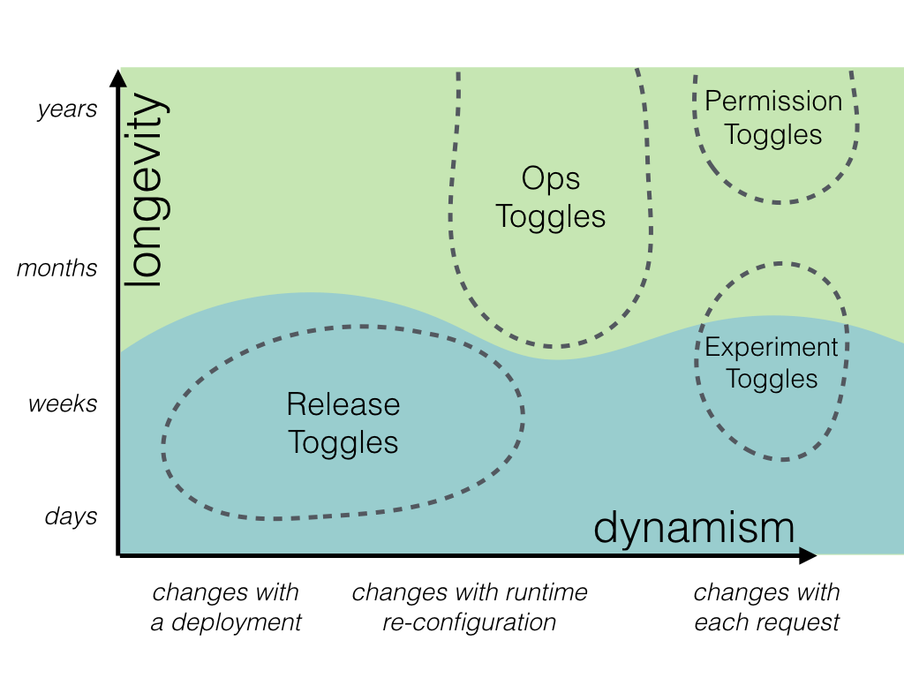

# Feature Toggles / Flags

Created: 2019-09-03 22:06:56 +0500

Modified: 2019-09-04 10:15:32 +0500

---

Afeature toggle(alsofeature switch,feature flag,feature flipper,conditional feature, etc.) is a technique in[software development](https://en.wikipedia.org/wiki/Software_development)that attempts to provide an alternative to maintaining multiple[source-code](https://en.wikipedia.org/wiki/Source_code) branches (known as feature branches), such that a feature can be tested even before it is completed and ready for release. Feature toggle is used to hide, enable or disable the feature during run time. For example, during the development process, a developer can enable the feature for testing and disable it for other users.

Continuous release and[continuous deployment](https://en.wikipedia.org/wiki/Continuous_deployment)provide developers with rapid feedback about their coding. This requires the integration of their code changes as early as possible. Feature branches introduce a bypass to this process.Feature toggles are an important technique used for the implementation of[continuous delivery](https://en.wikipedia.org/wiki/Continuous_delivery).

The technique allows developers to release a[version](https://en.wikipedia.org/wiki/Software_versioning)of a product that has unfinished features. These unfinished features are hidden (toggled) so they do not appear in the[user interface](https://en.wikipedia.org/wiki/User_interface). This allows many small incremental versions of[software](https://en.wikipedia.org/wiki/Software)to be delivered without the cost of constant branching and merging. Feature toggles may allow shorter software integration cycles.A team working on a project can use feature toggle to speed up the process of development, that can include the incomplete code as well.

<https://en.wikipedia.org/wiki/Feature_toggle>

Feature Toggles (often also refered to as Feature Flags) are a powerful technique, allowing teams to modify system behavior without changing code. They fall into various usage categories, and it's important to take that categorization into account when implementing and managing toggles. Toggles introduce complexity. We can keep that complexity in check by using smart toggle implementation practices and appropriate tools to manage our toggle configuration, but we should also aim to constrain the number of toggles in our system.

## Feature Toggling is a set of patterns which can help a team to deliver new functionality to users rapidly but safely.

Feature Toggles are also refered to as Feature Flags, Feature Bits, or Feature Flippers.

## Toggle Routers

## Categories of Toggles

1.  **Release Toggles**

2.  **Experiment Toggles**

3.  **Ops Toggles**

4.  **Permissioning Toggles**

## Static vs Dynamic Toggles

## Long-lived toggles vs transient toggles

## Implementation Techniques

1.  **De-coupling decision points from decision logic**

2.  **Inversion of decision**

3.  **Avoiding conditionals**

## Toggle Configuration

1.  **Dynamic routing vs dynamic configuration**

2.  **Prefer static configuration**

3.  **Approaches for managing toggle configuration**

    a.  **Hardcoded Toggle Configuration**

    b.  **Parametrized Toggle Configuration**

    c.  **Toggle Configuration File**

    d.  **Toggle Configuration in App DB**

    e.  **Distributed Toggle Configuration**

4.  **Overriding Configuration**

    a.  **Per-request overrides**

<https://martinfowler.com/articles/feature-toggles.html>
