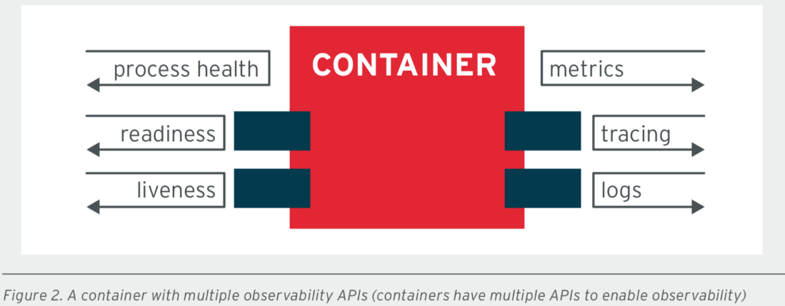
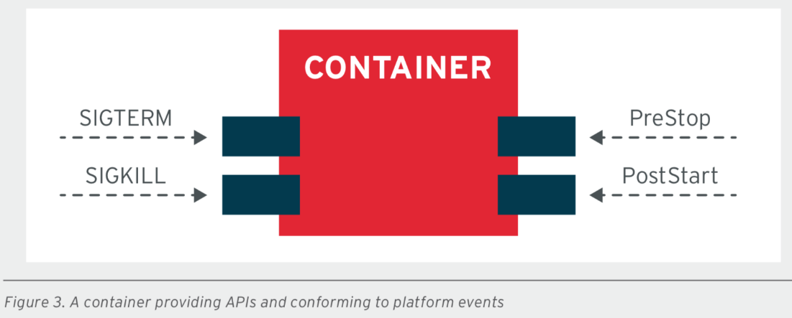
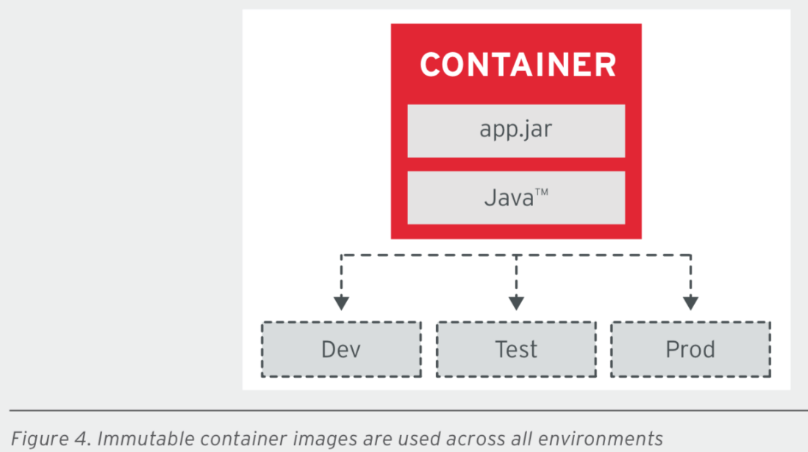
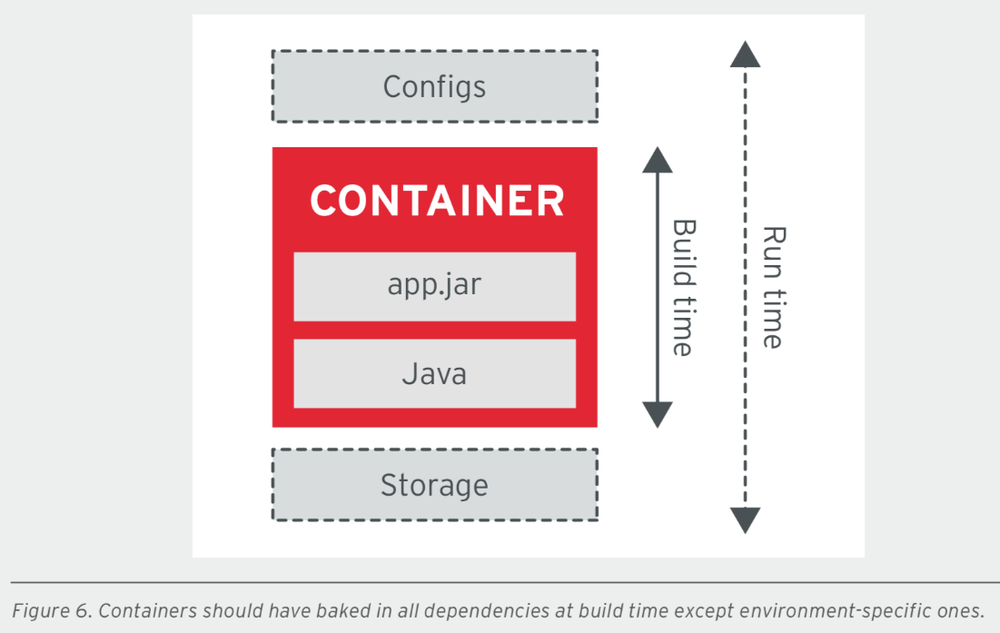
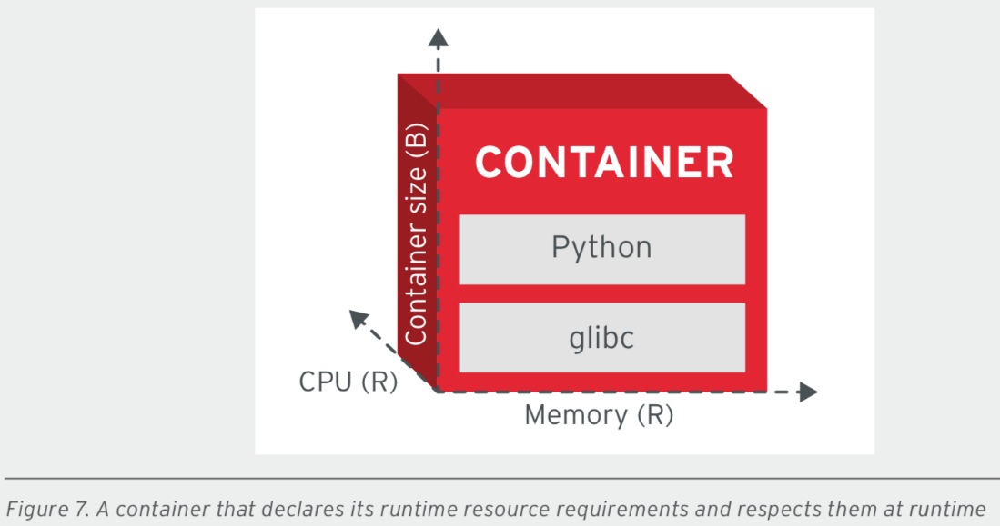

# Containers

Created: 2019-09-22 11:50:02 +0500

Modified: 2022-01-07 12:35:32 +0500

---

A container runtime is the component which runs the containerized application upon request. Docker Engine remains the default for Kubernetes, though CRI-O and others are gaining community support.

The containerized image is moving from Docker to one that is not bound to higher-level tools and that is more portable across operating systems and environments. The Open Container Initiative (OCI) was formed to help with this. Docker donated their libcontainer project to form a new codebase called runC to support these goals. More information about [runC](https://github.com/opencontainers/runc) can be found on GitHub.

## Container Runtime Interface (CRI)

The goal of the Container Runtime Interface (CRI) is to allow easy integration of container runtimes with kubelet. By providing a protobuf method forAPI, specifications and libraries, new runtimes can easily be integrated without needing deep understanding of kubelet internals.

## CRI-O

LIGHTWEIGHT CONTAINER RUNTIME FOR KUBERNETES

CRI-O is an implementation of the Kubernetes CRI (Container Runtime Interface) to enable using OCI (Open Container Initiative) compatible runtimes. It is a lightweight alternative to using Docker as the runtime for kubernetes. It allows Kubernetes to use any OCI-compliant runtime as the container runtime for running pods. Today it supports runc and Kata Containers as the container runtimes but any OCI-conformant runtime can be plugged in principle.

CRI-O supports OCI container images and can pull from any container registry. It is a lightweight alternative to using Docker, Moby or rkt as the runtime for Kubernetes.

This project is currently in incubation as part of Kubernetes. It uses the Kubernetes Container Runtime Interface with OCI-compatible runtimes, thus the name [CRI-O](https://github.com/cri-o/cri-o). Currently, there is support for runC (default) and Clear Containers, but a stated goal of the project is to work with any OCI-compliant runtime.

While newer than Docker or rkt, this project has gained major vendor support due to its flexibility and compatibility.

<https://cri-o.io>

## Containerd

containerd is an industry-standard container runtime with an emphasis on simplicity, robustness and portability. It is available as a daemon for Linux and Windows, which can manage the complete container lifecycle of its host system: image transfer and storage, container execution and supervision, low-level storage and network attachments, etc.

containerd is designed to be embedded into a larger system, rather than being used directly by developers or end-users.

The intent of the containerd project is not to build a user-facing tool;instead, it is focused on exposing highly-decoupled low-level primitives:

- Defaults to runC to run containers according to the OCI Specifications
- Intended to be embedded into larger systems
- Minimal CLI, focused on debugging and development.

With a focus on supporting the low-level, or backend plumbing of containers, this project is better suited to integration and operation teams building specialized products, instead of typical build, ship, and run application.

## podman

a "pod manager" tool, allows for the life cycle management of a container, including creating, starting, stopping and updating. You could consider this a replacement for**docker run**.

## buildah

A tool that focuses on creating Open Container Initiative (OCI) images. It allows for creating images with and without a Dockerfile. It also does not require superuser privilege. A growing golang-based API allows for easy integration with other tools.

## runc

runcis a CLI tool for spawning and running containers according to the OCI specification.

<https://github.com/opencontainers/runc>

## RED HAT APPROACH TO CLOUD-NATIVE CONTAINERS

- Single concern principle (SCP)

SCP principle dictates that every container should address a single concern and do it well.

If your containerized microservice needs to address multiple concerns, it can use patterns such as sidecar and init-containers to combine multiple containers into a single deployment unit (pod), where each container still handles a single concern. Similarly, you can swap containers that address the same concern. For example, replace the web server container, or a queue implementation con- tainer, with a newer and more scalable one.

- High observability principle (HOP)

- Life-cycle conformance principle (LCP)

- Image immutability principle (IIP)

- Process disposability principle (PDP)

One of the primary motivations for moving to containerized applications is that containers need to be as ephemeral as possible and ready to be replaced by another container instance at any point in time. There are many reasons to replace a container, such as failing a health check, scaling down the application, migrating the containers to a different host, platform resource starvation, or another issue.

This means that containerized applications must keep their state externalized or distributed and redundant. It also means the application should be quick in starting up and shutting down, and even be ready for a sudden, complete hardware failure.

- Self-containment principle (S-CP)

- Runtime confinement principle (RCP)

RCP principle suggests that every container declare its resource requirements and pass that information to the platform. It should share the resource profile of a container in terms of CPU, memory, networking, disk influence on how the platform performs scheduling, auto-scaling, capacity management, and the general service-level agreements (SLAs) of the container.

In addition to passing the resource requirements of the container, it is also important that the appli- cation stay confined to the indicated resource requirements. If the application stays confined, the platform is less likely to consider it for termination and migration when resource starvation occurs.

## COMMON CONTAINER- RELATED BEST PRACTICES

- Aim for small images.
- Support arbitrary user IDs.

Avoid using the sudo command or requiring a specific userid to run your container.

- Mark important ports.
- Use volumes for persistent data.

The data that needs to be preserved after a container is destroyed must be written to a volume.

- Set image metadata.
- Synchronize host and image.

Some containerized applications require the container to be synchronized with the host on certain attributes such as time and machine ID.

## Docker Container Registry

- Mirroring and Caching to optmize container registry

<https://www.youtube.com/watch?v=Bm7g0saAC9k>

Is a container a type of virtual machine?

- no, VMs each have a completely seperate OS. Containers share a kernel so they're using the same OS underneath

Can you run a Red Hat container on a Ubuntu system?

- Yes, On linux, your OS has 2 parts

    1. The kernel (like Linux 4.15)

    2. The distribution (like a Red Hat / Ubuntu)
- You can run a different distribution in a container, but not a different kernel

Containers are implemented with Linux-specific system calls. So why can you run Docker on a Mac?

- Because Docker uses a virtual machine. So Docker containers on Mac are actually secretly all running Linux under the hood

## RHEL base image

<https://www.redhat.com/en/blog/introducing-red-hat-universal-base-image>

## Moby

<https://mobyproject.org>

<https://github.com/moby/moby>
