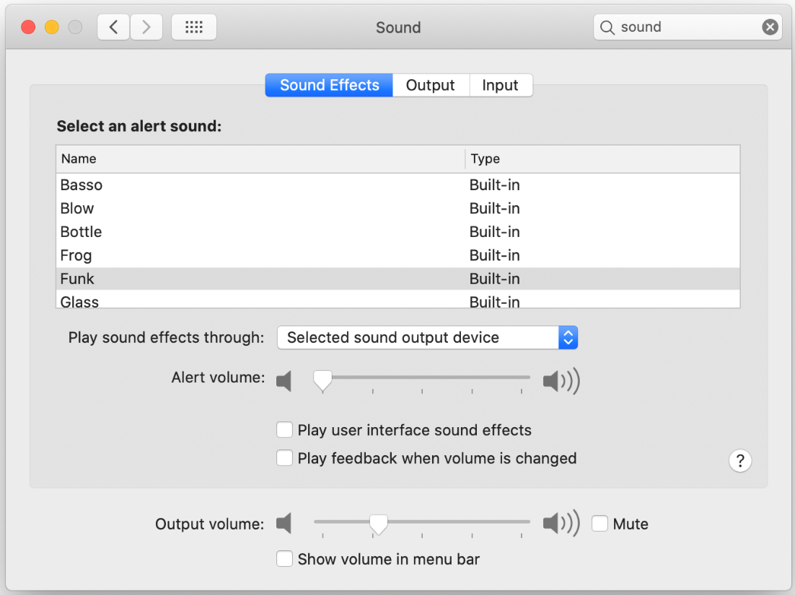
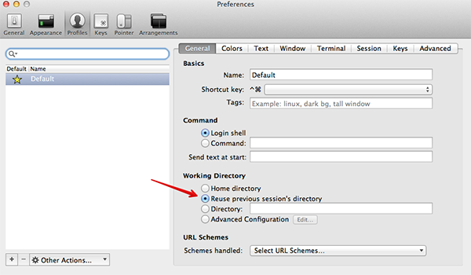

# Mac

Created: 2018-04-09 12:58:07 +0500

Modified: 2022-10-06 19:20:36 +0500

---

## Screenshots

Shift + Ctrl + Cmd + 3 - Copy window -> cmd+v (paste)

Cmd + Shift + 3 - whole window

Cmd + Shift + 4 - selection -> space (selection window)

Force kill - cmd + opt + esc

Exit Full Screen / Full screen - ^ + ⌘ + F (Ctrl + Cmd + F)

^ + ⌘ + q (Lock screen) (Ctrl + Cmd + Q)

## Quicktime player Shortcuts

Hold Option + fast forward button on quicktime player

## Preview pdf shortcuts

Command + 1 - continuous scroll

## Create a new text file

If you have the Finder window open, use Spotlight to open TextEdit. When you're ready to save the file, option+drag the text file icon from the title bar of TextEdit into the Finder window where you want to save it.

Show/hide hidden folders = Command + shift + .

Ctrl + Cmd + space - Character Palette

You can select the file and pressOption+Command+Cto copy the pathname to the clipboard.

RightClick on folder > option (gives more options)

# Terminal Commands

Open two instance of same application - **open -n MQTT.fx.app**

## Screenshots

⌘ + Shift + 4, #selection

⌘ + Shift + 4, + Space #window selection

⌘ + Shift + 3, #whole screen

⌘ + Option + D - show/hide dock

⌘ + Option + ESC - Force Quit Application dialogue

Option + Characters - Special Characters like (µåß∂√ƒç≈Ω)

## Setting up MAC

1.  **Add iterm2**

2.  Add zsh

3.  **Add docker**

4.  ~~Add Anaconda~~

5.  ~~Irvue~~

6.  **Onenote**

7.  **VSCode**

Open theCommand Palette(⇧⌘P) and type 'shell command' to find theShell Command: Install 'code' command in PATHcommand.

8.  **Google chrome**

Cmd + Shift + A + Enter (to cycle between tabs)

<https://www.google.com/inputtools

9.  **Google Chrome apps**

    a.  Keep Desktop app

Go to keep.google.com > go to chrome more tools > create shortcut > check open as new window

2.  Youtube music

10. **Google Drive for mac**

11. bittorrent web

12. ~~Popcorn~~

13. **VLC**

14. brew (/bin/bash -c "$(curl -fsSL <https://raw.githubusercontent.com/Homebrew/install/master/install.sh>)")

15. ~~Anki Flash Cards~~

16. ~~Anaconda navigator~~

~~Channels~~

[~~https://conda.anaconda.org/conda-forge/~~](https://conda.anaconda.org/conda-forge/)

17. **Bombsquad**

18. ~~Alfred~~

19. **Android file transfer**

20. Stashfin

    a.  **OpenVPN**

    b.  **Slack**

    ```{=html}
    <!-- -->
    ```
    c.  dbeaver

    ```{=html}
    <!-- -->
    ```
    d.  **mysql workbench**

    ```{=html}
    <!-- -->
    ```
    e.  Microsoft office

    ```{=html}
    <!-- -->
    ```
    f.  **postman**

    g.  **Android studio**

    h.  **Remote desktop**

## brew

The missing package manager for macOS

brew list

brew install

brew uninstall

brew update

brew upgrade

brew outdated

brew doctor

brew cask upgrade minikube

brew info

brew info git #List versions, caveats, etc

brew info bash-completion

brew cleanup git #Remove old versions

brew list helm --versions

brew services list

List all running services for the current user (or root).

brew services run (formula|--all)

Run the service formula without registering to launch at login (or boot).

brew services start (formula|--all)

Start the service formula immediately and register it to launch at login (or boot).

brew services stop (formula|--all)

Stop the service formula immediately and unregister it from launching at login (or boot).

brew services restart (formula|--all)

Stop (if necessary) and start the service formula immediately and register it to launch at login (or boot).

brew services cleanup

Remove all unused services.

## brew install
-   **tmux**
-   tldr
-   watch
-   **kubectl**
-   **helm**
-   **kubectx**
-   **k9s (brew install derailed/k9s/k9s)**
-   tree (directory tree structure)
-   mysql-client / mysql@5.7
-   bat
-   **neovim**

<https://github.com/neovim/neovim>
-   ~~fzf (A command-line fuzzy finder)~~

<https://github.com/junegunn/fzf>
-   ~~the_silver_searcher (command ag "services")~~

<https://github.com/ggreer/the_silver_searcher>
-   **hstr**

hstr --show-configuration >> ~/.zshrc

vim ~/.zshrc

export HSTR_CONFIG=hicolor,raw-history-view

## ctrl+r

<https://github.com/dvorka/hstr>
-   **awscli**
-   **python3**
-   moreutils
-   thefuck - <https://github.com/nvbn/thefuck>
-   **tldr -** <https://tldr.sh <https://github.com/tldr-pages/tldr>
-   <https://fig.io - brew install --cask fig - <https://github.com/withfig/autocomplete>

fig doctor check if Fig is properly configured

fig settings update preferences (keybindings, UI, and more)

fig tweet share your terminal set up with the world!

fig update check for updates

fig --help a summary of Fig commands with examples

## Settings in mac

## # for stopping bell sound

Unchecking the "User interface sounds" doesn't disable all sound. But sliding the "Alert Volume" option all the way to the left (minimum), together with unchecking the other options does the trick.



## Setting up Shell

## install iterm2

## oh-my-zsh

sh -c "$(curl -fsSL <https://raw.githubusercontent.com/ohmyzsh/ohmyzsh/master/tools/install.sh>)"

## Theme powerlevel10k

<https://gist.github.com/kevin-smets/8568070>

Command - git clone <https://github.com/romkatv/powerlevel10k.git> $ZSH_CUSTOM/themes/powerlevel10k

## Auto Suggestion

git clone <https://github.com/zsh-users/zsh-autosuggestions> ${ZSH_CUSTOM:-~/.oh-my-zsh/custom}/plugins/zsh-autosuggestions

<https://github.com/zsh-users/zsh-autosuggestions/blob/master/INSTALL.md>

## Settings



## Scroll buffer

Preferences > Profiles > Terminal

## Natural Text Editing
-   Go to**Preferences...**>**Profiles**>**Keys**(not Preferences... > Keys)
-   Press**Presets...**
-   Select**Natural Text Editing**
-   Then, you can move a word backwards usingOption ⌥+←and a word forwards usingOption ⌥+→, move to the start of the line usingfn+←and to the end of the line withfn+→. Also you can delete a word backwards usingOption ⌥+⌫, delete the whole line usingCommand ⌘+⌫.

## ~/.zshrc

ZSH_THEME="powerlevel10k/powerlevel10k"

plugins=(git osx docker docker-compose common-aliases zsh-autosuggestions)

# source profile and aliases

. ~/.bash_profile

. ~/.profile

. ~/.aliases

# Autocompletion kubectl

source <(kubectl completion zsh)

# Autocompletion helm

source <(helm completion zsh)

# kubectl aliases

[ -f ~/.kubectl_aliases ] && source ~/.kubectl_aliases

function kubectl() { echo "+ kubectl $@">&2; command kubectl $@; }


-   **run command - setopt auto_cd**

Set autocd, which means that rather than typingcd <foldername>you just type<foldername>

## ~/.profile

export SHELL=/usr/local/bin/zsh

#Color Terminal
export CLICOLOR=1
export LSCOLORS=ExFxBxDxCxegedabagacad

export LC_ALL=en_US.UTF-8
export LANG=en_US.UTF-8

## ~/.kubectl_aliases

<https://github.com/ahmetb/kubectl-aliases/blob/master/.kubectl_aliases>

## ~/.aliases

alias ll='ls -alhtF'

alias cl='clear'

alias v='nvim'

alias vim='nvim'

alias f='v `fzf -i`'

alias f='fuck'

alias d='docker'

alias dc='docker-compose'

alias w='watch ' #remember to add space so other alias can be used

## alias gpom='git pull origin master'

## #Section Docker

alias docker-clean='docker rm $(docker ps -a -f status=exited -q); docker volume rm $(docker volume ls -f dangling=true -q); docker images -qf dangling=true | xargs docker rmi'

alias docker-remove-all-images='docker rmi $(docker images -a -q)'

alias rb12='openssl rand -base64 12'

alias r12='openssl rand -hex 12'

alias rb16='openssl rand -base64 16'

alias r16='openssl rand -hex 16'

alias rb32='openssl rand -base64 32'

alias r32='openssl rand -hex 32'

alias sf='cd ~/Repositories/stashfin/'

alias python=/usr/local/bin/python3.7

alias pip=/usr/local/bin/pip3

alias publicIp="curl wgetip.com"

~/.zshrc for ssh and badge

ssh() {
iterm2_set_user_var title_var $@
/usr/bin/ssh -t $@ tmux new-session -A -s <username>
#creates a named tmux session for the user in the server, which will be created or attached to on request.
iterm2_set_user_var title_var ""

}

ssh-old() {
/usr/bin/ssh $@
}

dockash() {
iterm2_set_user_var title_var $1
docker exec -it $1 /bin/bash
iterm2_set_user_var title_var ""
}

clear-badge() {
iterm2_set_user_var title_var ""
}

## Alias
-   Suffix Alias (-s)
-   Global Alias (-g)

<https://thorsten-hans.com/5-types-of-zsh-aliases>

## References

<https://medium.com/better-programming/6-must-have-tools-for-developers-430fd56933dd>

<https://github.com/trimstray/the-book-of-secret-knowledge>

<https://github.com/jaywcjlove/awesome-mac>

## Cleanup

brew cleanup #Remove old versions

brew services cleanup #Remove all unused services

## Automator

defaults write com.apple.screencapture type JPG

defaults write com.apple.screencapture location "$HOME/Screenshots"

<https://about.gitlab.com/blog/2020/01/30/simple-trick-for-smaller-screenshots

## ipv6 disable

## mac

networksetup -setv6off Wi-Fi

## ubuntu

sudo sysctl -w net.ipv6.conf.all.disable_ipv6=1

sudo sysctl -w net.ipv6.conf.default.disable_ipv6=1

## windows

<https://networking.grok.lsu.edu/article.aspx?articleid=17573>

settings (google search - how to disable ipv6 in windows)


