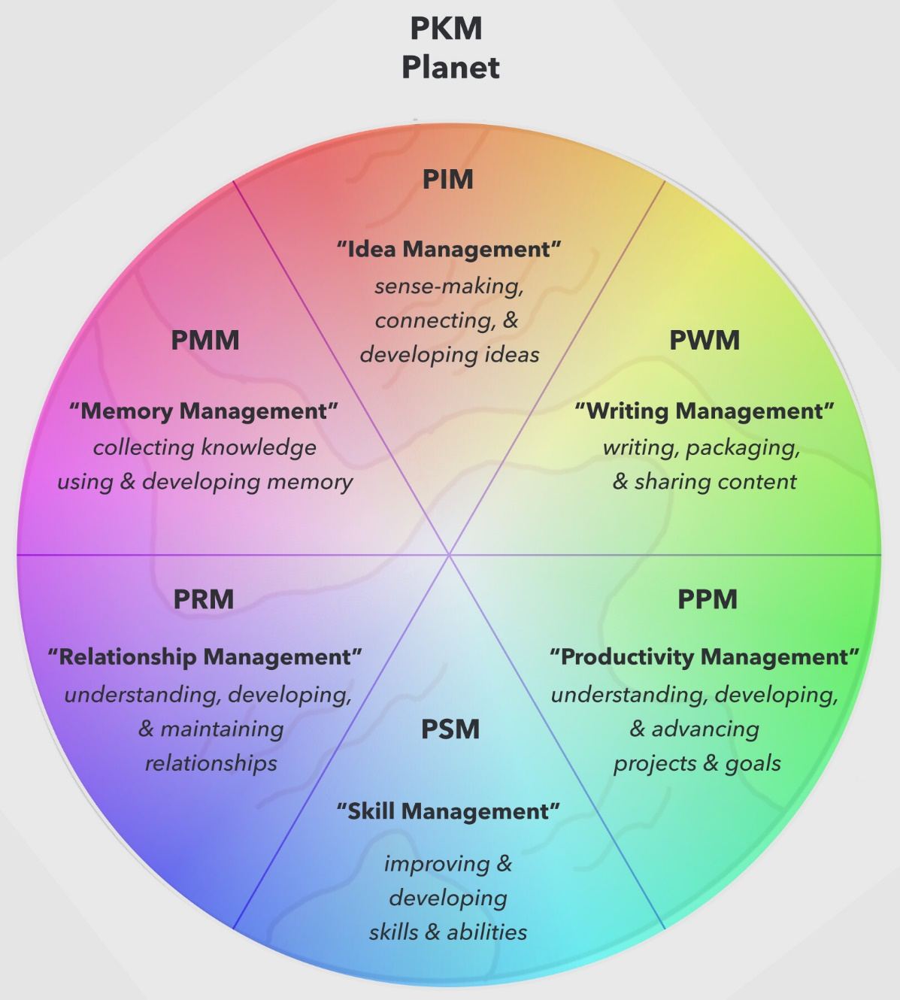

# Obsidian / Note Taking / Second Brain

Created: 2022-02-07 23:19:47 +0500

Modified: 2022-12-11 22:10:12 +0500

---

Your brain is for having ideas not holding them

### Extensions

Extensions that helps make obsidian better

- Advanced Tables
- DataView
- Kanban
- Calendar
- Outliner
- Obsidian Git
- Mind Map
- Natural Language Dates
- Day Planner
- Periodic Notes
- Paste URL into selection
- Recent Files
- Auto Link Title
- Automatically Reveal Active File
- Wikipedia
- Editing Toolbar / Obsidian Markdown formattting Assistant
- Linter
- Reading Time
- Templater
- Spaced Repetition (Flashcards)

## Obsidian Shortcuts

| **Todo**                        | **Shortcut**        |
| --------------------------- | --------------- |
| Search in all files         | `Cmd+Shift+F`   |
| Toggle edit/preview mode    | `Ctrl/Cmd E`    |
| Insert External link        | `Ctrl/Cmd-K`    |
| Indent                      | `Ctrl/Cmd-]`    |
| Unindent                    | `Cmd-[`         |
| Jump into selected backlink | `Alt/Opt-Enter` |
| Navigate forward            | `cmd+ctrl + ->` |
| Naviagte back               | `cmd+ctrl + <-`                |

### Some basics

Make new note---Cmd-n

Create note in new pane---Cmd-shift-n

Open the link you're hovering over in a new pane (while in edit mode)---**Cmd-click**

Toggle edit/preview mode---Cmd-e

Open quick switcher---Cmd-o

Close active pane---Cmd-w

Formatting basics

Undo, cut, copy, paste, bold, italicize---Cmd-z,x,c,v,b,i

### Intermediate

Open command palette---Cmd-p

Search and replace in current file---Cmd-f

Search in all files---Cmd-shift-f

Some faves for outlining

Swap line up--- I mapped this to:Cmd-1

Swap line down--- I mapped this to:Cmd-2

Toggle fold on current line--- I mapped this toCmd-3

Toggle line to bulleted of numbered list† --- I mapped this toCmd-4

†: Requires the plugin "Hotkeys++"

Formatting intermediate

Insert template--- I mapped this to:Cmd-t

### Advanced

Changing the view

Load workspace--- I mapped this to:Shift-Esc

Manage workspaces--- I mapped this to:Control-Esc

Toggle left sidebar--- I mapped this to:Cmd-LeftArrow

Toggle right sidebar--- I mapped this to:Cmd-RightArrow

Some secret weapons

Navigate back--- I mapped this to:Opt-a

Navigate forward--- I mapped this to:Opt-s

Programmed to my mouse

Open previous daily note--- extra mouse button back

Open next daily note--- extra mouse button forward

Open my Home note--- When I click this mouse button, it typesCmd-o, 000, Enter

Setup and File Management

Open settings---Cmd-,

Show in system explorer--- I mapped this to:Cmd-ctrl-opt-i

Reveal active file in navigation--- I mapped this to:Cmd-ctrl-i

Move file to another folder--- I mapped this to:Cmd-shift-i

Open another vault--- I mapped this to:Cmd-ctrl-opt-o

Note Management

Toggle pin--- I mapped this to:Cmd-shift-e

Note Refactor: Extract selection to new note - first line as file name†† --- I mapped this to:Cmd-shift-r

Edit file title--- I mapped this to:Cmd-l(then hitenterto return to the note)

Calendar: Open Weekly Note--- I mapped this to:Cmd-shift-m

††: Requires the plugin "Note Refactor"

†††: Requires the plugin "Calendar"

### Search

## LYT - Linking Your Thinking

<https://obsidian.md>

[My 2020 Comprehensive Obsidian Workflow For Zettelkasten and Evergreen Notes](https://www.youtube.com/watch?v=Ewhfok91AdE)

[Obsidian Plugins (0.9.10) --- My top plugins in the Obsidian app](https://www.youtube.com/watch?v=X61wRmfZU8Y)

<https://github.com/obsidianmd>

<https://github.com/ransurf/obsidian-resources>

<https://forum.obsidian.md/t/example-workflows-in-obsidian/1093>

<https://forum.obsidian.md/t/plugin-for-flashcards-note-level-spaced-repetition-all-inside-obsidian/16498>

<https://github.com/st3v3nmw/obsidian-spaced-repetition>

<https://github.com/theohbrothers/ConvertOneNote2MarkDown>

<https://www.linkingyourthinking.com/lyt-kit-v5-overview>

## Publish Free

[**https://beingpax.medium.com/7-obsidian-publish-alternatives-to-publish-your-notes-online-for-free-33db4fb06f5**](https://beingpax.medium.com/7-obsidian-publish-alternatives-to-publish-your-notes-online-for-free-33db4fb06f5)

<https://github.com/jackyzha0/quartz> - 1.4k

<https://github.com/mathieudutour/gatsby-digital-garden> - 575

<https://github.com/maximevaillancourt/digital-garden-jekyll-template> - 566

<https://github.com/secure-77/Perlite> - 328

<https://github.com/TuanManhCao/digital-garden> - 281

<https://github.com/jobindjohn/obsidian-publish-mkdocs> - 207

<https://github.com/yoursamlan/pubsidian> - 204

<https://github.com/Jekyll-Garden/jekyll-garden.github.io> - 191

<https://github.com/theowenyoung/gatsby-theme-primer-wiki> - 73

<https://github.com/flowershow/flowershow> - 156

<https://forum.obsidian.md/t/obsidian-mkdocs-a-free-publish-alternative-workflow/29540>

<https://forum.obsidian.md/t/pubsidian-free-and-elegant-obsidian-publish-alternative/21825>

## Publish / Examples / Showcases

<https://publish.obsidian.md/chromatically/publish+homepage>

<https://notes.nitinpai.in/Start+Here>

<https://publish.obsidian.md/alexisrondeau/Welcome+to+my+digital+garden>

<https://publish.obsidian.md/myquantumwell/Welcome+to+The+Quantum+Well>

<https://publish.obsidian.md/planet>

<https://publish.obsidian.md/christopher/%2BWelcome+to+Chris's+note-in-use>

[**https://quartz.jzhao.xyz/notes/showcase/**](https://quartz.jzhao.xyz/notes/showcase/)

<https://scalingsynthesis.com>

<https://publish.obsidian.md/andymatuschak/Andy+Matuschak/Evergreen+notes>

<https://filipedonadio.com/a-curated-list-of-obsidian-public-vaults>

<https://forum.obsidian.md/t/the-all-obsidian-publish-s-collection-by-leo-latest-update-20210324/7248>

## Personal Knowledge Management (PKM) / Second Brain

Personal knowledge management(PKM) is a process of collecting information that a person uses to gather, classify, store, search, retrieve and share [knowledge](https://en.wikipedia.org/wiki/Knowledge) in their daily activities ([Grundspenkis 2007](https://en.wikipedia.org/wiki/Personal_knowledge_management#CITEREFGrundspenkis2007)) and the way in which these processes support work activities ([Wright 2005](https://en.wikipedia.org/wiki/Personal_knowledge_management#CITEREFWright2005)). It is a response to the idea that [knowledge workers](https://en.wikipedia.org/wiki/Knowledge_worker) need to be responsible for their own growth and learning ([Smedley 2009](https://en.wikipedia.org/wiki/Personal_knowledge_management#CITEREFSmedley2009)). It is a bottom-up approach to [knowledge management](https://en.wikipedia.org/wiki/Knowledge_management)(KM) ([Pollard 2008](https://en.wikipedia.org/wiki/Personal_knowledge_management#CITEREFPollard2008)).

## Different levels of knowledge

- **Level 1: Having something (Information)**--- a lot of our digital information falls into this category. You have the ability to go find what you're looking for when you need it, but you have to first think about it before you can locate it. If you have a video course that you bought but haven't gone through yet, that would fall into this category.
- **Level 2: Understanding something (Revelation)**--- this is being able to recall something without having to look it up. At this level, you've internalized the information and are starting to make connections, but it hasn't necessarily changed how you act.
- **Level 3: Doing something (Application)**--- this is where you start to see the result of the information you've collected. You don't just have it or understand it, it's changing your day-to-day actions. This is the first level where there is actual, visible output from the information that you've collected.

- Root folder must contain 7 folders +- 3
- Links / Folders / Tags
- MOC - Map Of Content

## Zettlekasten

Thezettelkasten(German: "slip box", pluralzettelkästen) is a system of [note-taking](https://en.wikipedia.org/wiki/Note-taking) and [personal knowledge management](https://en.wikipedia.org/wiki/Personal_knowledge_management) used in research and study.

<https://en.wikipedia.org/wiki/Zettelkasten>

<https://zettelkasten.de/introduction>

a Zettelkasten needs to adhere to the [Principle of Atomicity](https://zettelkasten.de/posts/create-zettel-from-reading-notes/). That means that each Zettel only contains one unit of knowledge and one only.

<https://en.wikipedia.org/wiki/Personal_knowledge_management>

<https://thesweetsetup.com/pkm-intro-for-creatives>

[What is PKM? What is Personal Knowledge Management?](https://www.youtube.com/watch?v=Q2WBHyqRsxA)

[HOW TO TAKE SMART NOTES by Sönke Ahrens | Core Message](https://www.youtube.com/watch?v=JnS3g68zCXw)

1. Two stage filter

- Literature notes and Fleeting notes
- Permanent notes

2. Bottom‐up approach to deepen understanding and generate new insights

## Company Knowledge Base

- **Confluence**
- **Outline**

<https://github.com/outline/outline>

- <https://orgmode.org>
- <https://www.orgroam.com>

## Others

- [**https://github.com/logseq/logseq**](https://github.com/logseq/logseq)

## A privacy-first, open-source platform for knowledge management and collaboration

- [**https://github.com/foambubble/foam**](https://github.com/foambubble/foam)

- <https://wiki.dendron.so>
- <https://github.com/standardnotes/app>
- Roam Research
- <https://www.producthunt.com/posts/heyday-4>

Automatically organize content - without learning a new app

- <https://www.producthunt.com/posts/reflect-notes>

Fast networked note-taking

<https://www.slant.co/topics/4962/~knowledge-base-systems-for-personal-use>

- Notion

[The ULTIMATE Second Brain Setup in Notion](https://www.youtube.com/watch?v=vs8WQh2k-Ow)

- AppFlowy - Open-source alternative to Notion
- <https://anytype.io/en>
